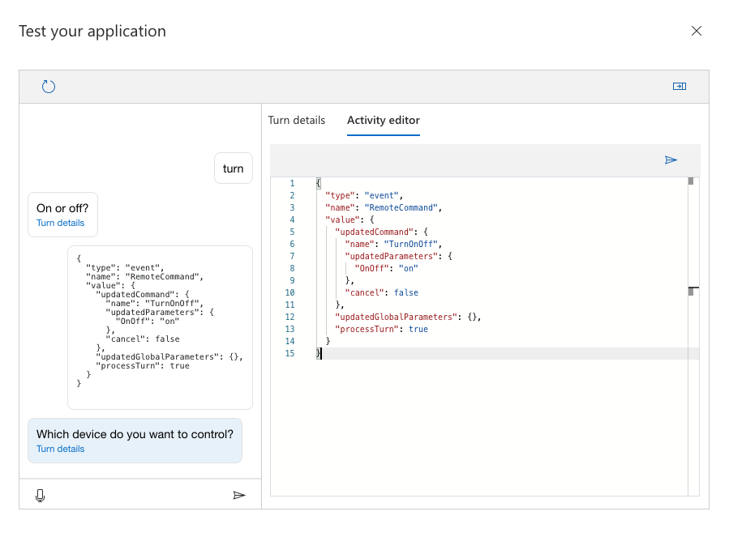

# Update a command from the client

In this article, you will learn how update an ongoing command from a client application.

## Prerequisites
> [!div class = "checklist"]
> * A previously [created Custom Commands app](quickstart-custom-commands-application.md)

## Send a remote command 

For the example application (see prerequisites) if we want to update an ongoing "TurnOnOff" command we need to send an event activity with the following format.

```json
{
  "type": "event",
  "name": "RemoteCommand",
  "value": {
    "updatedCommand": {
      "name": "TurnOnOff",
      "updatedParameters": {
        "OnOff": "on"
      },
      "cancel": false
    },
    "updatedGlobalParameters": {},
    "processTurn": true
  }
}
```

Lets review the key attributes of this activity.

* The activity is of type "event", and the name of the event needs to be "RemoteCommand"
* The attribute "value" contains the attributes required to update the current command
* The attribute "updatedCommand" contains the name of the command, "updatedParameters" is a map with the name of the parameters and their updated values
* If the ongoing command needs to be cancelled, set the attribute "cancel" to true
* The attribute "updatedGlobalParameters" is also a map, just like "updatedParameters" but used for global parameters
* If the turn needs to be processed after the activity is sent set the attribute "processTurn" to true

You can test this in the Custom Commands portal.

1. Open the Custom Commands application you previously created. 
1. Click Train and then Test.
1. Send "turn".
1. Open the side panel and click Activity editor.
1. Type and send the RemoteCommand event specified in the previous section.
    > [!div class="mx-imgBorder"]
    > 

Note how "on" was send using an activity from the client instead of speech or text.

## Next steps

> [!div class="nextstepaction"]
> [Update a command from a web endpoint](./how-to-custom-commands-update-command-from-web-endpoint.md)