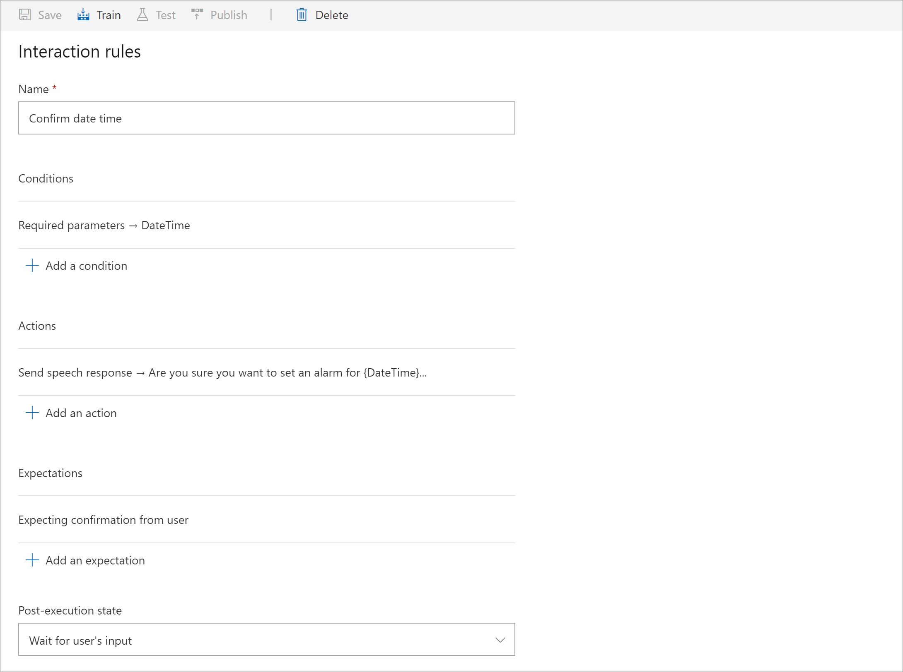

# Add confirmations to a command in a Custom Commands Preview application

In this article, you'll learn how to create confirmations for commands in a Custom Commands Preview app.

## Prerequisites

Complete the steps in the following articles:
> [!div class="checklist"]
> * [Quickstart: Create a Custom Commands Preview app](./quickstart-custom-speech-commands-create-new.md)
> * [Quickstart: Create a Custom Commands Preview app with parameters](./quickstart-custom-speech-commands-create-parameters.md)

## Create a SetAlarm command

To demonstrate confirmations, create a new command that sets an alarm.

1. In [Speech Studio](https://speech.microsoft.com/), open the Custom Commands Preview app that you created.
1. Create a new **SetAlarm** command.
1. Add a **DateTime** parameter that has the following configuration:

   | Setting                           | Suggested value                     |  Description                 |
   | --------------------------------- | -----------------------------------------------------| ------------|
   | **Name**                              | **DateTime**                                | Descriptive name for the parameter                                |
   | **Required**                          | Checked                                 | Check box indicating whether a value for this parameter is required before completing the command |
   | **Response for a required parameter**   | **Simple editor -> What time?**                              | A prompt to ask for the value of this parameter when it isn't known |
   | **Type**                              | **DateTime**                                | Type of parameter, such as Number, String, DateTime, or Geography   |
   | **Date Defaults**                     | If the date is missing, use today's date            | Default value of the variable to use if not provided by the user  |  
   | **Time Defaults**                     | If the time is missing, use the start of day     |  Default value of the variable to use if not provided by user|

1. Add some example sentences.
   
    ```
    set an alarm for {DateTime}
    set alarm {DateTime}
    alarm for {DateTime}
   ```

1. Add a completion rule to confirm the result. Use the following configuration:

   | Setting    | Suggested value                               |Description                                     |
   | ---------- | ------------------------------------------------------- |-----|
   | **Rule Name**  | **Set alarm**                                               |    A name describing the purpose of the rule |
   | **Actions**    | **Send speech response -> OK, alarm set for {DateTime}**    |The action to take when the rule condition is true

## Try it out

1. Select **Train** at the top of the right pane.

1. After training is done, select **Test**, and then try the following interactions:
    - Input: Set alarm for tomorrow at noon
    - Output: OK, alarm set for 2020-05-02 12:00:00
    - Input: Set an alarm
    - Output: What time?
    - Input: 5pm
    - Output: OK, alarm set for 2020-05-01 17:00:00

## Add interaction rules for the confirmation

Create confirmations by adding interaction rules.

1. In your **SetAlarm** command, select **Add** in the middle pane, and then select  **Interaction rules** > **Confirm command**.

    This rule asks the user to confirm the date and time of the alarm. Use these settings:

   | Setting               | Suggested value                                                                  | Description                                        |
   | --------------------- | -------------------------------------------------------------------------------- | -------------------------------------------------- |
   | **Rule Name**             | **Confirm date time**                                                                | A name describing the purpose of the rule          |
   | **Conditions**            | **Required Parameter -> DateTime**                                                    | Conditions that determine when the rule can run    |   
   | **Actions**               | **Send speech response -> Are you sure you want to set an alarm for {DateTime}?**     | The action to take when the rule condition is true |
   | **Expectations**          | **Expecting confirmation from user**                                                 | Expectation for the next turn                      |
   | **Post-execution state**  | **Wait for user's input**                                                            | State for the user after the turn                  |
  
      > [!div class="mx-imgBorder"]
      > 

1. Add an interaction rule for an accepted confirmation (user said "yes"). Use the following configuration:

   | Setting               | Suggested value                                                                  | Description                                        |
   | --------------------- | -------------------------------------------------------------------------------- | -------------------------------------------------- |
   | **Rule Name**             | **Accepted confirmation**                                                            | A name describing the purpose of the rule          |
   | **Conditions**            | **Confirmation was successful & Required Parameter -> DateTime**                      | Conditions that determine when the rule can run    |   
   | **Post-execution state** | **Execute completion rules**                                                          | State of the user after the turn                   |

1. Add an interaction rule for a denied confirmation (user said "no"). Use the following configuration:

   | Setting               | Suggested value                                                                  | Description                                        |
   | --------------------- | -------------------------------------------------------------------------------- | -------------------------------------------------- |
   | **Rule Name**             | **Denied confirmation**                                                                   | A name describing the purpose of the rule          |
   | **Conditions**            | **Confirmation was denied & Required Parameter -> DateTime**                               | Conditions that determine when the rule can run    |   
   | **Actions**               | **Clear parameter value -> DateTime & Send speech response -> No problem, what time then?**  | The action to take when the rule condition is true |
   | **State after execution** | **Wait for input**                                                                   | State of the user after the turn                   |
   | **Expectations**          | **Expecting parameters input from the user -> DateTime**                           | Expectation for the next turn                      |

## Try out the changes

1. Select **Train**.

1. After the training is done, select **Test**, and then try these interactions:

    - Input: Set alarm for tomorrow at noon
    - Output: Are you sure you want to set an alarm for 2020-05-02 12:00:00?
    - Input: No
    - Output: No problem, what time then?
    - Input: 5pm
    - Output: "Are you sure you want to set an alarm for 2020-05-01 17:00:00?"
    - Input: Yes
    - Output: OK, alarm set for 2020-05-01 17:00:00

## Next steps

> [!div class="nextstepaction"]
> [Add a one-step correction to a command in a Custom Commands Preview app](./how-to-custom-speech-commands-one-step-correction.md)
