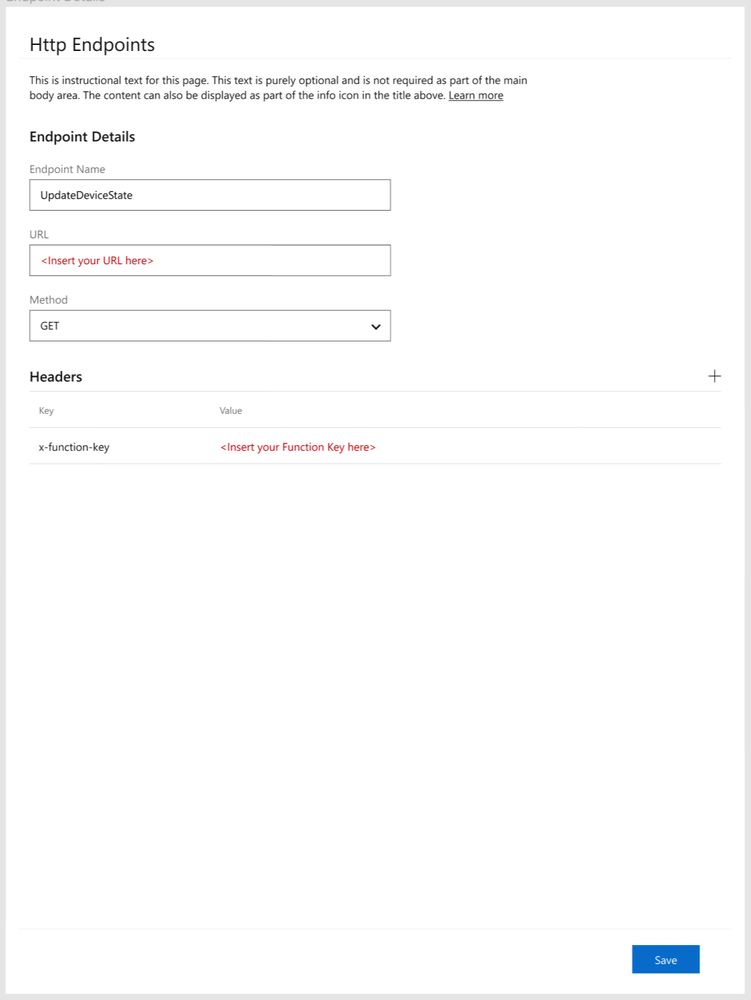
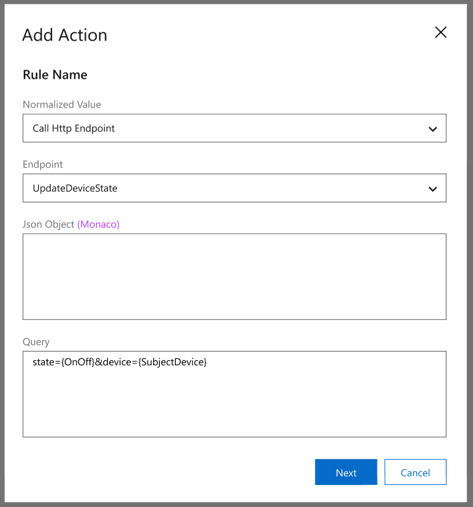
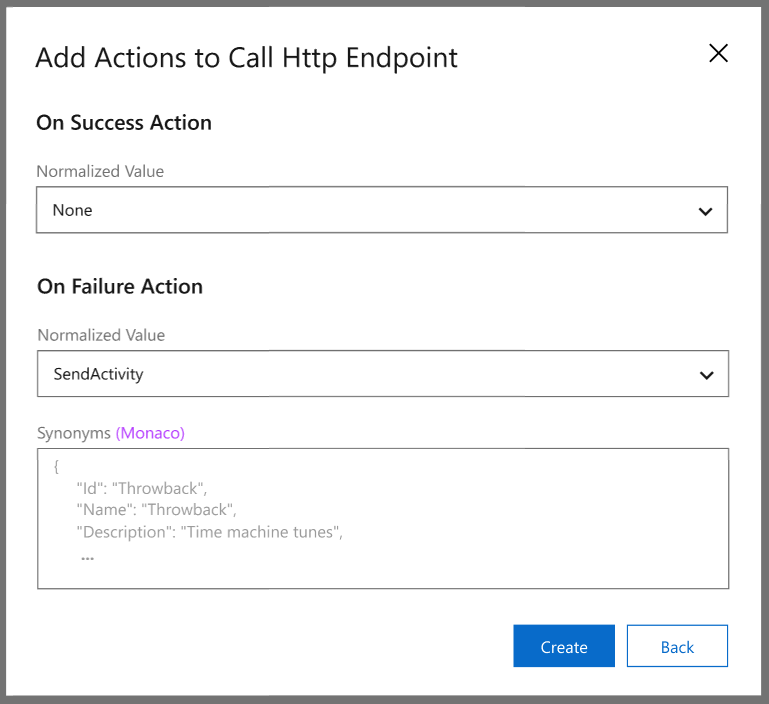

# How To: Fulfill Commands with a REST backend (Preview)

In this article, a sample REST backend will be created using an Azure function.

## Prerequisites


## Create REST backend with an Azure function

> [!TIP]
> Can be any REST enabled backend


https://docs.microsoft.com/en-us/azure/azure-functions/functions-create-first-function-vs-code

To represent the REST backend we can use an Azure Function.

You can find the function project at [Speech SDK Samples](https://aka.ms/csspeech/samples) under the `quickstart` folder.

```C#
[FunctionName("DeviceControlTurnOnOff")]
public static async Task<IActionResult> Run(
    [HttpTrigger(AuthorizationLevel.Function, "get", "post", Route = null)] HttpRequest req,
    ILogger log)
{
    log.LogInformation("C# HTTP trigger function processed a request.");

    string state = req.Query["state"];
    string device = req.Query["device"];

    if(state == null || device == null)
    {
        return new BadRequestObjectResult("Please specify device and state on the query string");
    }

    string msg = $"Turning device: {device} to {state} state";
    log.LogInformation(msg);
    return (ActionResult)new OkObjectResult(msg);
}
```

## Connect REST backend to the Custom Speech Commands app

Go to http endpoints tab add a new http endpoint "Device Control Quickstart Backend"



## Update Completion rules to invoke REST backend




Setting|Suggested value|Description
---|---|---
Rule Name | Turn OnOff Backend |A name describing the purpose of the rule
Conditions|<ul><li>Required Parameter - OnOff</li><li>Required Parameter - SubjectDevice</li></ul>|Conditions that determine when the rule can run
Actions|Http Action|The action to take when the rule condition is true.

For the Http Action you can configure the action taken on success or failure




Setting|Suggested value|Description
---|---|---
On Success |None| A name describing the purpose of the rule
On Failure|Speech Response - "Sorry, unable to complete your request at this time"|Conditions that determine when the rule can run

## Try it out

Open the Test panel try a few commands.

"turn off the tv"


## Next steps
> [!div class="nextstepaction"]
> [How To: Fulfill Commands on the client with the Speech SDK (Preview)](./how-to-custom-speech-commands-fulfill-sdk.md)

