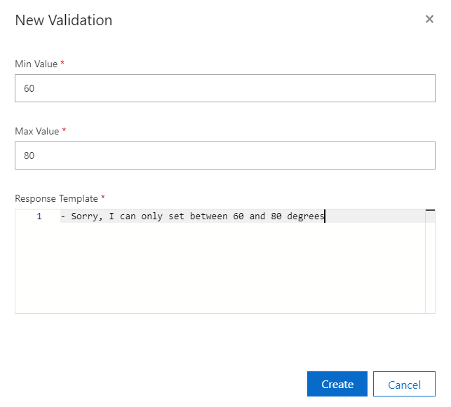

# Add validations to a command parameter in a Custom Commands Preview application

In this article, you'll learn how to add validations to parameters and prompts for correction.

## Prerequisites

Complete the steps in the following articles:

> [!div class="checklist"]
 
> * [Quickstart: Create a Custom Commands Preview app](./quickstart-custom-speech-commands-create-new.md)
> * [Quickstart: Create a Custom Commands Preview app with Parameters](./quickstart-custom-speech-commands-create-parameters.md)

## Create a SetTemperature command

To demonstrate validations, create a new command that allows users to set temperature.

1. In [Speech Studio](https://speech.microsoft.com/), open the Custom Commands Preview app that you created.
1. Create a new **SetTemperature** command.
1. Add a temperature parameter that has the following configuration:

   | Parameter Configuration           | Suggested value    |Description                 |                                    
   | ----------------- | ----------------------------------| -------------|
   | **Name**              | **Temperature**                       | A descriptive name for parameter                                |
   | **Required**          | Checked                           | Checkbox indicating whether a value for this parameter is required before completing the command |
   | **Response for required parameter**     | **Simple editor -> What temperature would you like?**  | A prompt to ask for the value of this parameter when it isn't known |
   | **Type**              | **Number**                            | Type of parameter, such as Number, String, DateTime or Geography   |

1. Add a validation for the temperature parameter.

    1. In the **Parameters** configuration page for the temperature parameter, select **Add a validation** in the **Validations** section.

    1. In the **New validation** pop-up window, configure the validation as follows:
  
       | Parameter Configuration         | Suggested value                                          | Description                                                                        |
       | ----------------- | -------------------------------------------------------- | ------------------------------------------------------------------------------------------------ |
       | **Min Value**        | **60**               | For Number parameters, the minimum value this parameter can assume |
       | **Max Value**        | **80**               | For Number parameters, the maximum value this parameter can assume |
       | **Failure response - Simple editor**| **First Variation - Sorry, I can only set between 60 and 80 degrees**      | Prompt to ask for a new value if the validation fails                                       |

       > [!div class="mx-imgBorder"]
       > 

1. Select **Create**.

1. Add some example sentences.

   ```
   set the temperature to {Temperature} degrees
   change the temperature to {Temperature}
   set the temperature
   change the temperature
   ```

1. Add a completion rule that has the following configuration. This rule confirms the result.

   | Setting    | Suggested value                                           |Description                                     |
   | ---------- | --------------------------------------------------------- |-----|
   | Name       | Confirmation Message                                      |A name describing the purpose of the rule |
   | **Conditions** | **Required Parameters - Temperature**                       |Conditions that determine when the rule can run    |   
   | **Actions**    | **Send speech response - Ok, setting temperature to {Temperature} degrees** | The action to take when the rule condition is true |

> [!TIP]
> This example uses a speech response to confirm the result. For examples on completing the command with a client action, see [How To: Fulfill commands on the client with the Speech SDK](./how-to-custom-speech-commands-fulfill-sdk.md).

## Try it out

1. Select **Train**.

1. After training is done, select **Test**, and then try these interactions:

    - Input: Set the temperature to 72 degrees
    - Output: Ok, setting temperature to 72 degrees
    - Input: Set the temperature to 45 degrees
    - Output: Sorry, I can only set between 60 and 80 degrees
    - Input: make it 72 degrees instead
    - Output: Ok, setting temperature to 72 degrees

## Next steps

> [!div class="nextstepaction"]
> [Add confirmations to a command in a Custom Commands Preview app](./how-to-custom-speech-commands-confirmations.md)
