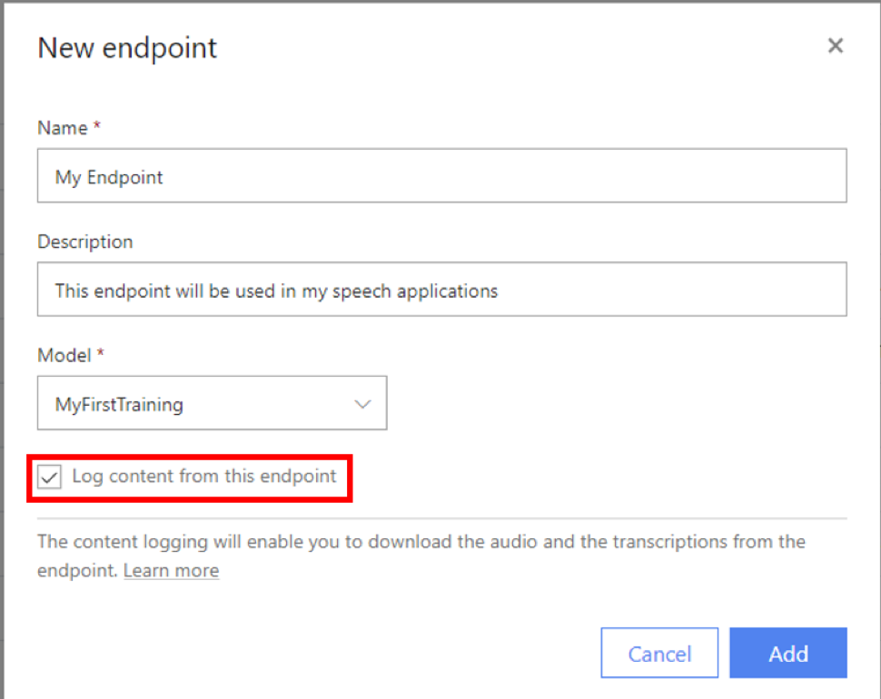

# Deploy a custom model

After you've uploaded and inspected data, evaluated accuracy, and trained a custom model, you can deploy a custom endpoint to use with your apps, tools, and products. In this document, you'll learn how to create and deploy an endpoint using the [Custom Speech portal](https://speech.microsoft.com/customspeech).

## Create a custom endpoint

To create a new custom endpoint, sign in to the [Custom Speech portal](https://speech.microsoft.com/customspeech) and select **Deployment** from the Custom Speech menu at the top of the page. If this is your first run, you'll notice that there are no endpoints listed in the table. After you've created an endpoint, you'll use this page to track each deployed endpoint.

Next, select **Add endpoint** and enter a **Name** and **Description** for your custom endpoint. Then select the custom model that you'd like to associate with this endpoint. From this page, you can also enable logging. Logging allows you to monitor endpoint traffic. If disabled, traffic won't be stored.

> [!NOTE]
> Don't forget to accept the terms of use and pricing details.

Next, select **Create**. This action returns you to the **Deployment** page. The table now includes an entry that corresponds to your custom endpoint. The endpoint’s status shows its current state. It can take up to 30 minutes to instantiate a new endpoint using your custom models. When the status of the deployment changes to **Complete**, the endpoint is ready to use.

After your endpoint is deployed, the endpoint name appears as a link. Click the link to display information specific to your endpoint, such as the endpoint key, endpoint URL, and sample code.

## View logging data

Logging data is available for download under **Endpoint > Details**.

## Next steps

* Learn how to use your custom model [here](how-to-specify-source-language.md).

## Additional resources

* [Prepare and test your data](how-to-custom-speech-test-data.md)
* [Inspect your data](how-to-custom-speech-inspect-data.md)
* [Evaluate your data](how-to-custom-speech-evaluate-data.md)
* [Train your model](how-to-custom-speech-train-model.md)
* [Deploy your model](how-to-custom-speech-deploy-model.md)
