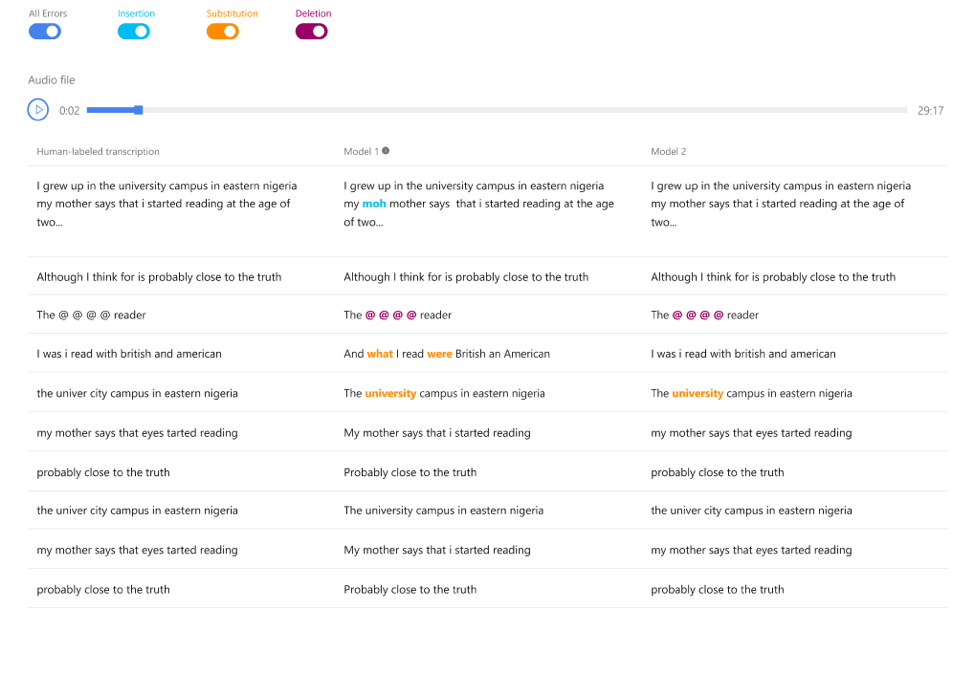

# Evaluate Custom Speech accuracy

In this document you'll learn how to quantitatively measure the quality of Microsoft's speech-to-text model or your custom model. Audio + human-labeled transcription data is required to test accuracy, and 30 minutes to 5 hours of representative audio should be provided.

## What is Word Error Rate (WER)?

The industry standard to measure model accuracy is *Word Error Rate* (WER). WER counts the number of incorrect words identified during recognition, then divides by the total number of word provided in the human-labeled transcript. Finally, that number is multiplied by 100% to calculate the WER.

Incorrectly identified words fall into three categories:

* Insertion (I): Words that are incorrectly added in the hypothesis transcript
* Deletion (D): Words that are undetected in the hypothesis transcript
* Substitution (S): Words that were substituted between reference and hypothesis

Here's an example:

## Resolve errors and improve WER

You can use the WER from the machine recognition results to evaluate the quality of the model you are using with your app, tool, or product. A WER of 5%-10% is considered to be good quality and is ready to use. A WER of 20% is generally acceptable, however you may want to consider additional training. A WER of 30% or more signals poor quality and requires customization and training.

How the errors are distributed is important. When many deletion errors are encountered, it's usually due to weak audio signal strength. To resolve this issue, you'll need to collect audio data closer to the source. Insertion errors mean that the audio was recorded in a noisy environment and crosstalk may be present, causing recognition issues. Substitution errors are usually encountered when an insufficient sample of domain-specific terms have been provided as either human-labeled transcriptions or related text.

Moreover, you may drill down to file details and look at individual files to get a sense which type of errors exist, so that you can pick out some typical cases and get specific targets to improve.

## Create a test

If you'd like to test the quality of Microsoft's speech-to-text baseline model or a custom model that you've trained, you can compare two models side-by-side to evaluate accuracy. The comparison includes WER and recognition results. Typically, a custom model is compared with Microsoft's baseline model.

To evaluate models side-by-side:

1. Navigate to **Speech-to-text > Custom Speech > Testing**.
2. Click **Add Test**.
3. Select **Evaluation accuracy**. Give the test a name, description, and select your audio + human-labeled transcription dataset.
4. Select up to two models that you'd like to test.
5. Click **Create**.

After test creations succeeds, you can compare the results side-by-side.

## Side-by-side comparison

**<<TODO - Erik: THIS NEEDS TO BE CLEANED UP>>**

When the test status changes to *Succeeded*, you'll get the WER number for each model that you selected. Select the test item name to gain more testing insights. You will see all the items in your dataset has been recognized to speech with the model(s) you selected. You can play the audios and side-by-side compare the recognition results against the human transcription, All the error types (insertion, deletion, substitution) have been calculated and displayed with different color.

Similarly, for long audios, you may click in the certain audio item to playback the audio and compare the results, by playing back the audio, the corresponding machine transcript sentence would be floating so that you can listen and see effectively.

If you have selected two models to test, you will see three columns of transcripts (i.e. one column of human-labelled transcripts, and two columns of machine transcripts)

## Next steps

* [Train your model](how-to-custom-speech-train-model.md)
* [Deploy your model](how-to-custom-speech-deploy-model.md)

## Additional resources

* [Prepare and test your data](how-to-custom-speech-test-data.md)
* [Inspect your data](how-to-custom-speech-inspect-data.md)
