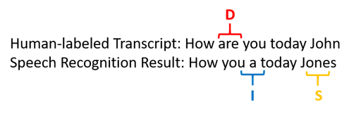

# Evaluate Custom Speech accuracy

In this document, you'll learn how to quantitatively measure the quality of Microsoft's speech-to-text model or your custom model. Audio + human-labeled transcription data is required to test accuracy, and 30 minutes to 5 hours of representative audio should be provided.

## What is Word Error Rate (WER)?

The industry standard to measure model accuracy is *Word Error Rate* (WER). WER counts the number of incorrect words identified during recognition, then divides by the total number of words provided in the human-labeled transcript. Finally, that number is multiplied by 100% to calculate the WER.

Incorrectly identified words fall into three categories:

* Insertion (I): Words that are incorrectly added in the hypothesis transcript
* Deletion (D): Words that are undetected in the hypothesis transcript
* Substitution (S): Words that were substituted between reference and hypothesis

Here's an example:

## Resolve errors and improve WER

You can use the WER from the machine recognition results to evaluate the quality of the model you are using with your app, tool, or product. A WER of 5%-10% is considered to be good quality and is ready to use. A WER of 20% is acceptable, however you may want to consider additional training. A WER of 30% or more signals poor quality and requires customization and training.

How the errors are distributed is important. When many deletion errors are encountered, it's usually because of weak audio signal strength. To resolve this issue, you'll need to collect audio data closer to the source. Insertion errors mean that the audio was recorded in a noisy environment and crosstalk may be present, causing recognition issues. Substitution errors are often encountered when an insufficient sample of domain-specific terms has been provided as either human-labeled transcriptions or related text.

By analyzing individual files, you can determine what type of errors exist, and which errors are unique to a specific file. Understanding issues at the file level will help you target improvements.

## Create a test

If you'd like to test the quality of Microsoft's speech-to-text baseline model or a custom model that you've trained, you can compare two models side by side to evaluate accuracy. The comparison includes WER and recognition results. Typically, a custom model is compared with Microsoft's baseline model.

To evaluate models side by side:

1. Sign in to the [Custom Speech portal](https://speech.microsoft.com/customspeech).
2. Navigate to **Speech-to-text > Custom Speech > [name of project] > Testing**.
3. Click **Add Test**.
4. Select **Evaluate accuracy**. Give the test a name, description, and select your audio + human-labeled transcription dataset.
5. Select up to two models that you'd like to test.
6. Click **Create**.

After your test has been successfully created, you can compare the results side by side.

## Side-by-side comparison

Once the test is complete, indicated by the status change to *Succeeded*, you'll find a WER number for both models included in your test. Click on the test name to view the testing detail page. This detail page lists all the utterances in your dataset, indicating the recognition results of the two models alongside the transcription from the submitted dataset. To help inspect the side-by-side comparison, you can toggle various error types including insertion, deletion, and substitution. By listening to the audio and comparing recognition results in each column, which shows the human-labeled transcription and the results for two speech-to-text models, you can decide which model meets your needs and where additional training and improvements are required.

## Next steps

* [Train your model](how-to-custom-speech-train-model.md)
* [Deploy your model](how-to-custom-speech-deploy-model.md)

## Additional resources

* [Prepare and test your data](how-to-custom-speech-test-data.md)
* [Inspect your data](how-to-custom-speech-inspect-data.md)
