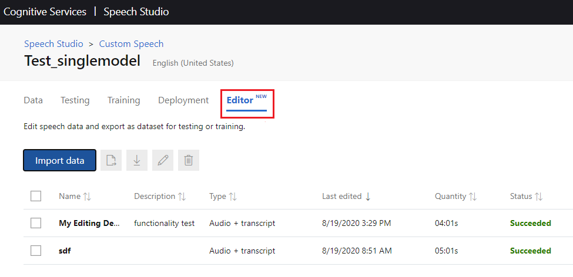
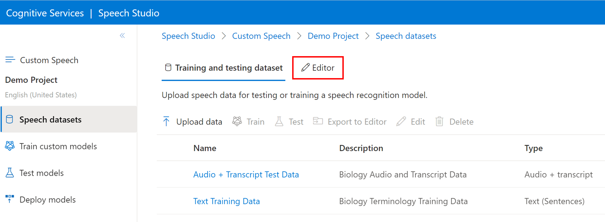
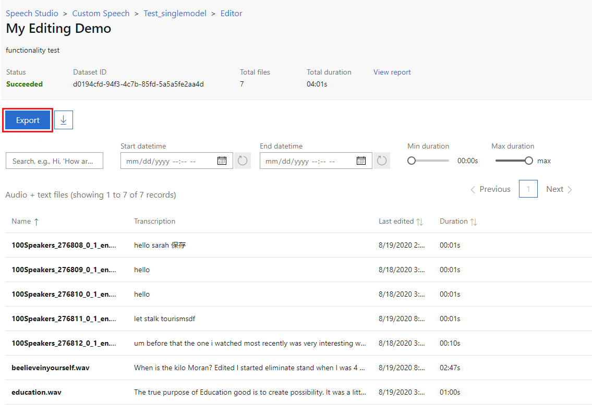

# Inspect Custom Speech data

> [!NOTE]
> This page assumes you've read [Prepare test data for Custom Speech](./how-to-custom-speech-test-and-train.md) and have uploaded a dataset for inspection.

Custom Speech provides tools that allow you to visually inspect the recognition quality of a model by comparing audio data with the corresponding recognition result. From the [Speech Studio](https://speech.microsoft.com/customspeech), you can play back uploaded audio and determine if the provided recognition result is correct. This tool helps you inspect quality of Microsoft's baseline speech-to-text model, inspect a trained custom model, or compare transcription by two models.

In this document, you learn how to visually inspect the quality of Microsoft's baseline speech-to-text model, and/or custom models that you've trained . You also learn how to use the online transcription editor to create and refine labeled audio datasets.

## Create a test

Follow these instructions to create a test:

1. Sign in to the [Speech Studio](https://speech.microsoft.com/customspeech).
2. Navigate to **Speech-to-text > Custom Speech > [name of project] > Testing**.
3. Click **Add Test**.
4. Select **Inspect quality (Audio-only data)**. Give the test a name, description, and select your audio dataset.
5. Select up to two models that you'd like to test.
6. Click **Create**.

After a test has been successfully created, you can see how a model
transcribes the audio dataset you specified, or compare results from two models side by side.

[!INCLUDE [service-pricing-advisory](includes/service-pricing-advisory.md)]

## Side-by-side model comparisons

When the test status is _Succeeded_, click in the test item name to see details of the test. This detail page lists all the utterances in your dataset, and shows the recognition results of the two models you are comparing.

To help inspect the side-by-side comparison, you can toggle various error types including insertion, deletion, and substitution. By listening to the audio and comparing recognition results in each column (showing human-labeled transcription and the results of two speech-to-text models), you can decide which model meets your needs and where improvements are needed.

Side-by-side model testing is useful to validate which speech recognition model is best for an application. For an objective measure of accuracy, requiring transcribed audio, follow the instructions found in [Evaluate Accuracy](how-to-custom-speech-evaluate-data.md).

## Online transcription editor

The online transcription editor allows you to easily work with audio transcriptions in Custom Speech. The main use cases of the editor are as follows: 

* You only have audio data, but want to build accurate audio + human-labeled datasets from scratch to use in model training.
* You already have audio + human-labeled datasets, but there are errors or defects in the transcription. The editor allows you to quickly modify the transcriptions to get best training accuracy.

The only requirement to use the transcription editor is to have audio data uploaded (either audio-only, or audio + transcription).

### Import datasets to Editor

To import data into the Editor, first navigate to **Custom Speech > [Your project] > Editor**.

Next, use the following steps to import data.

1. Click **Import data**
1. Create a new dataset(s) and give it a description
1. Select datasets. Multiple selections is supported, and you can select audio data only, as well as audio + human-labeled data.
1. For audio-only data, you can optionally use the default models to automatically generate machine transcription after importing to the Editor
1. Click **Import**

After data has been successfully imported, you can click into the datasets and start editing.

> [!TIP]
> You can also import datasets into the Editor directly by selecting datasets and clicking **Export to Editor**

### Edit transcription by listening to audio

After the data upload has succeeded, click on each item name to see details of the data. You can also use **Previous** and **Next** to move between each file.

The detail page lists all the segments in each audio file, and you can click into the desired utterance. For each utterance, you can play back the audio and examine the transcripts, and edit the transcriptions if you find any insertion, deletion, or substitution errors. See the [data evaluation how-to](how-to-custom-speech-evaluate-data.md) for more detail on error types.

After you've made edits, click the **Save** button.

### Export datasets from the Editor

To export datasets back to the **Data** tab, navigate to the data detail page and click the **Export** button to export all the files as a new dataset. You can also filter the files by last edited time, audio durations, etc. to partially select the desired files. 

The files exported to Data will be used as a brand-new dataset and will not affect any of the existing data/training/testing entities.

## Next steps

- [Evaluate your data](how-to-custom-speech-evaluate-data.md)
- [Train your model](how-to-custom-speech-train-model.md)
- [Improve your model](./how-to-custom-speech-evaluate-data.md)
- [Deploy your model](./how-to-custom-speech-train-model.md)

## Additional resources

- [Prepare test data for Custom Speech](./how-to-custom-speech-test-and-train.md)