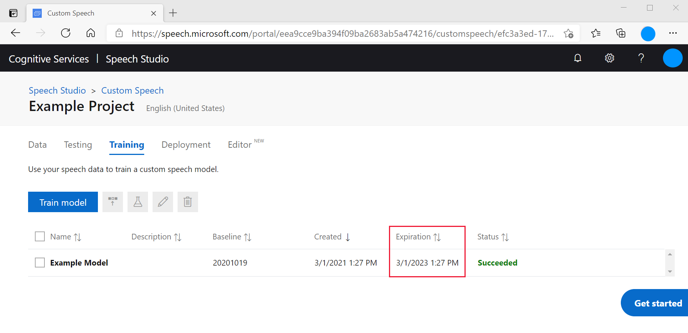

# Model and endpoint lifecycle

Our standard (not customized) speech is built upon AI models that we call base models. In most cases, we train a different base model for each spoken language we support.  We update the speech service with new base models every few months to improve accuracy and quality.  
With Custom Speech, custom models are created by adapting a chosen base model with data from your particular customer scenario. Once you create a custom model, that model will not be updated or changed, even if the corresponding base model from which it was adapted gets updated in the standard speech service.  
This policy allows you to keep using a particular custom model for a long time after you have a custom model that meets your needs.  But we recommend that you periodically recreate your custom model so you can adapt from the latest base model to take advantage of the improved accuracy and quality.

Other key terms related to the model lifecycle include:

* **Adaptation**: Taking a base model and customizing it to your domain/scenario by using text data and/or audio data.
* **Decoding**: Using a model and performing speech recognition (decoding audio into text).
* **Endpoint**: A user-specific deployment of either a base model or a custom model that's accessible *only* to a given user.

### Expiration timeline

As new models and new functionality become available and older, less accurate models are retired, see the following timelines for model and endpoint expiration:

**Base models** 

* Adaptation: Available for one year. After the model is imported, it's available for one year to create custom models. After one year, new custom models must be created from a newer base model version.  
* Decoding: Available for two years after import. So you can create an endpoint and use batch transcription for two years with this model. 
* Endpoints: Available on the same timeline as decoding.

**Custom models**

* Decoding: Available for two years after the model is created. So you can use the custom model for two years (batch/realtime/testing) after it's created. After two years, *you should retrain your model* because the base model will usually have been deprecated for adaptation.  
* Endpoints: Available on the same timeline as decoding.

When either a base model or custom model expires, it will always fall back to the *newest base model version*. So your implementation will never break, but it might become less accurate for *your specific data* if custom models reach expiration. You can see the expiration for a model in the following places in the Custom Speech area of the Speech Studio:

* Model training summary
* Model training detail
* Deployment summary
* Deployment detail

Here is an example form the model training summary:


And also from the model training detail page:


You can also check the expiration dates via the [`GetModel`](https://westus.dev.cognitive.microsoft.com/docs/services/speech-to-text-api-v3-0/operations/GetModel) and [`GetBaseModel`](https://westus.dev.cognitive.microsoft.com/docs/services/speech-to-text-api-v3-0/operations/GetBaseModel) custom speech APIs under the `deprecationDates` property in the JSON response.

Here is an example of the expiration data from the GetModel API call. The **DEPRECATIONDATES** show when the model expires: 
```json
{
    "SELF": "HTTPS://WESTUS2.API.COGNITIVE.MICROSOFT.COM/SPEECHTOTEXT/V3.0/MODELS/{id}",
    "BASEMODEL": {
    "SELF": HTTPS://WESTUS2.API.COGNITIVE.MICROSOFT.COM/SPEECHTOTEXT/V3.0/MODELS/BASE/{id}
    },
    "DATASETS": [
    {
        "SELF": https://westus2.api.cognitive.microsoft.com/speechtotext/v3.0/datasets/{id}
    }
    ],
    "LINKS": {
    "MANIFEST": "HTTPS://WESTUS2.API.COGNITIVE.MICROSOFT.COM/SPEECHTOTEXT/V3.0/MODELS/{id}/MANIFEST",
    "COPYTO": https://westus2.api.cognitive.microsoft.com/speechtotext/v3.0/models/{id}/copyto
    },
    "PROJECT": {
        "SELF": https://westus2.api.cognitive.microsoft.com/speechtotext/v3.0/projects/{id}
    },
    "PROPERTIES": {
    "DEPRECATIONDATES": {
        "ADAPTATIONDATETIME": "2022-01-15T00:00:00Z",     // last date the base model can be used for adaptation
        "TRANSCRIPTIONDATETIME": "2023-03-01T21:27:29Z"   // last date this model can be used for decoding
    }
    },
    "LASTACTIONDATETIME": "2021-03-01T21:27:40Z",
    "STATUS": "SUCCEEDED",
    "CREATEDDATETIME": "2021-03-01T21:27:29Z",
    "LOCALE": "EN-US",
    "DISPLAYNAME": "EXAMPLE MODEL",
    "DESCRIPTION": "",
    "CUSTOMPROPERTIES": {
    "PORTALAPIVERSION": "3"
    }
}
```
Note that you can upgrade the model on a custom speech endpoint without downtime by changing the model used by the endpoint in the deployment section of the Speech Studio, or via the custom speech API.

## What happens when models expire and how to update them
What happens when a model expires and how to update the model depends on how it is being used.
### Batch transcription
If a model expires that is used with [batch transcription](batch-transcription.md) transcription requests will fail with a 4xx error. To prevent this update the `model` parameter in the JSON sent in the **Create Transcription** request body to either point to a more recent base model or more recent custom model. You can also remove the `model` entry from the JSON to always use the latest base model.
### Custom speech endpoint
If a model expires that is used by a [custom speech endpoint](how-to-custom-speech-train-model.md), then the service will automatically fall back to using the latest base model for the language you are using. To update a model you are using, you can select **Deployment** in the **Custom Speech** menu at the top of the page and then click on the endpoint name to see its details. At the top of the details page, you will see an **Update Model** button that lets you seamlessly update the model used by this endpoint without downtime. You can also make this change programmatically by using the [**Update Model**](https://westus.dev.cognitive.microsoft.com/docs/services/speech-to-text-api-v3-0/operations/UpdateModel) Rest API.

## Next steps

* [Train and deploy a model](how-to-custom-speech-train-model.md)

## Additional resources

* [Prepare and test your data](./how-to-custom-speech-test-and-train.md)
* [Inspect your data](how-to-custom-speech-inspect-data.md)
