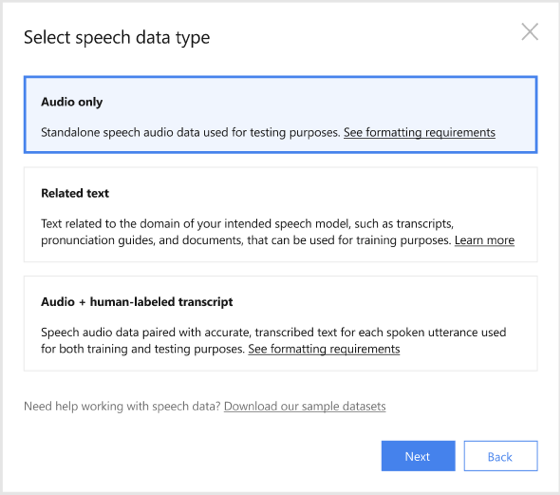
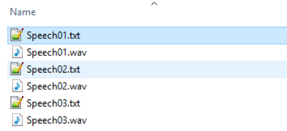

# Prepare data for Custom Speech

Whether you're testing to see how accurate Microsoft speech recognition is or training your own models, you'll need data in the form of audio and text. On this page, we cover the types of data, how they are used, and how to manage them.

## Data types

This table lists accepted data types, when each data type should be used, and the recommended quantity. Not every data type is required to create a model. Data requirements will vary depending on whether you're creating a test or training a model.

| Data type | Used of testing | Quantity | Used for training | Quantity |
|-----------|-----------------|----------|-------------------|----------|
| [Audio](#audio-data-for-testing) | Yes<br>Used for visual inspection | 5+ audio files | No | N/a |
| [Audio + Human-labeled transcripts](#audio--human-labeled-transcript-data-for-testingtraining) | Yes<br>Used to evaluate accuracy | 0.5 - 5 hours of audio | Yes | 1 - 1,000 hours of audio |
| [Related text](##related-text-data-for-training) | No | N/a | Yes | 1-200 MB of related text |

Files should be grouped by type into a dataset and uploaded as a zip file. Each dataset can only contain a single data type.

## Upload data

When you're ready to upload your data, click **Upload data** to launch the wizard and create your first dataset. You'll be asked to select a speech data type for your dataset, before allowing you to upload your data.



Each dataset you upload must meet the requirements for the data type that you choose. It is important to correctly format your data before it's uploaded. This ensures the data will be accurately processed by the Custom Speech service. Requirements are listed in the following sections.

After your dataset is uploaded, you have a few options:

* You can navigate to the **Testing** tab and visually inspect audio only or audio + human-labeled transcription data.
* You can navigate to the **Training** tab and use audio + human transcription data or related text data to train a custom model.

## Audio data for testing

Audio data is optimal for testing the accuracy of Microsoft's baseline speech-to-text model or a custom model. Keep in mind, audio data is used to inspect the accuracy of speech with regards to a specific model's performance. If you're looking to quantify the accuracy of a model, use [audio + human-labeled transcription data](#audio--human-labeled-transcript-data-for-testingtraining).

Use this table to ensure that your audio files are formatted correctly for use with Custom Speech:

| Property | Value |
|----------|-------|
| File format | RIFF (WAV) |
| Sample rate | 8,000 Hz or 16,000 Hz |
| Channels | 1 (mono) |
| Maximum length per audio | 2 hours |
| Sample format | PCM, 16-bit |
| Archive format | .zip |
| Maximum archive size | 2 GB |

If your audio doesn’t satisfy these properties or you want to check if it does, we suggest downloading [sox](http://sox.sourceforge.net) to check or convert the audio. Below are some examples of how each of these activities can be done through the command line:

| Activity | Description | Sox command |
|----------|-------------|-------------|
| Check audio format | Use this command to check the audio file format. | `sox --i <filename>` |
| Convert audio format | Use this command to convert the audio file to single channel, 16-bit, 16 KHz. | `sox <input> -b 16 -e signed-integer -c 1 -r 16k -t wav <output>.wav` |

## Audio + human-labeled transcript data for testing/training

To measure the accuracy of Microsoft's speech-to-text accuracy when processing your audio files, you must provide human-labeled transcriptions (word-by-word) for comparison. While human-labeled transcription is often time consuming, it's necessary to evaluate accuracy and to train the model for your use cases. Keep in mind, the improvements in recognition will only be as good as the data provided. For that reason, it's important that only high-quality transcripts are uploaded.  

| Property | Value |
|----------|-------|
| File format | RIFF (WAV) |
| Sample rate | 8,000 Hz or 16,000 Hz |
| Channels | 1 (mono) |
| Maximum length per audio | 60 s |
| Sample format | PCM, 16-bit |
| Archive format | .zip |
| Maximum zip size | 2 GB |

To address issues like word deletion or substitution, a significant amount of data is required to improve recognition. Generally, it's recommended to provide word-by-word transcriptions for roughly 10 to 1,000 hours of audio. The transcriptions for all WAV files should be contained in a single plain-text file. Each line of the transcription file should contain the name of one of the audio files, followed by the corresponding transcription. The file name and transcription should be separated by a tab (\t).

  For example:
```
  speech01.wav  speech recognition is awesome
  speech02.wav  the quick brown fox jumped all over the place
  speech03.wav  the lazy dog was not amused
```
> [!NOTE]
> Transcription should be encoded as UTF-8 byte order mark (BOM).

The transcriptions are text-normalized so they can be processed by the system. However, there are some important normalizations that must be done by the user _prior_ to uploading the data to the Custom Speech Service. For the appropriate language to use when you prepare your transcriptions, see [How to create a human-labeled transcription](how-to-custom-speech-human-labeled-transcriptions.md)

After you've gathered your audio files and corresponding transcriptions, they should be packaged as a single .zip file before uploading to the Custom Speech portal. This is an example dataset with three audio files and a human-labeled transcription file:



## Related text data for training

If you have product names or features that are unique, and you want to make sure they are recognized correctly, it is important to include related text data for training. Two types of related text data can be provided to improve recognition:

| Data type | How this data improves recognition |
|-----------|------------------------------------|
| Utterances and/or sentences | These can improve accuracy when recognizing product names, or industry-specific vocabulary within the context of a sentence. |
| Pronunciations | These can improve pronunciation of uncommon terms, acronyms, or other words with undefined pronunciations. |

Utterances can be provided as a single or multiple text files. The closer the text data is to what will be spoken, the greater the likelihood that accuracy is improved. Pronunciations should be provided as a single text file. Everything can be packaged as a single zip file and uploaded to the Custom Speech portal.

### Guidelines to create an utterances file

To create a custom model using related text, you'll need to provide a list of sample utterances. These utterances don't need to be complete sentences or grammatically correct, but they must accurately reflect the spoken input you expect in production. If you want certain terms to have increased weight, you can add several sentences to your related data file that include these specific terms.

Use this table to ensure that your related data file for utterances is formatted correctly:

| Property | Value |
|----------|-------|
| Text encoding | UTF-8 BOM |
| # of utterances per line | 1 |
| Maximum file size | 200 MB |

Additionally, you'll want to account for the following restrictions:

* Avoid repeating characters more than four times. For example: "aaaa" or "uuuu".
* Don't use special characters or UTF-8 characters above U+00A1.
* URIs will be rejected.

### Guidelines to create a pronunciation file

If there are uncommon terms without standard pronunciations that your users will encounter or use, you can provide a custom pronunciation file to improve recognition.

> [!IMPORTANT]
> It is not recommended to use this feature to alter the pronunciation of common words.

This includes examples of a spoken utterance, and a custom pronunciation for each:

| Recognized/displayed form | Spoken form |
|--------------|--------------------------|
| 3CPO | three c p o |  
| CNTK | c n t k |
| IEEE | i triple e |

The spoken form is the phonetic sequence spelled out. It can be composed of letter, words, syllables, or a combination of all three.

Customized pronunciation is available in English (en-US) and German (de-DE). This table shows supported characters by language:

| Language | Locale | Characters |
|----------|--------|------------|
| English | en-US | a, b, c, d, e, f, g, h, i, j, k, l, m, n, o, p, q, r, s, t, u, v, w, x, y, z |
| German | de-DE | ä, ö, ü, a, b, c, d, e, f, g, h, i, j, k, l, m, n, o, p, q, r, s, t, u, v, w, x, y, z |

Use this table to ensure that your related data file for pronunciations is formatted correctly. Pronunciation files are  small, and should not exceed a few KBs.

| Property | Value |
|----------|-------|
| Text encoding | UTF-8 BOM (ANSI is also supported for English) |
| # of pronunciations per line | 1 |
| Maximum file size | 1 MB (1 KB for free tier) |

## Next steps

* [Inspect your data](how-to-custom-speech-inspect-data.md)
* [Evaluate your data](how-to-custom-speech-evaluate-data.md)
* [Train your model](how-to-custom-speech-train-model.md)
* [Deploy your model](how-to-custom-speech-deploy-model.md)
