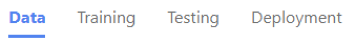

# What is Custom Speech?

[Custom Speech](https://customspeech.ai) is a set of online tools that allow you to evaluate and improve Microsoft's speech-to-text accuracy for your applications, tools, and products. All it takes to get started are a handful of test audio files. Follow the links below to start creating a custom speech-to-text experience.

## What's in Custom Speech?

Before you can do anything with Custom Speech, you'll need an Azure account and a Speech Services subscription. Once you've got an account, you can prep your data, train and test your models, inspect recognition quality, evaluate accuracy, and ultimately deploy and use the custom speech-to-text model.

This diagram highlights the pieces that make up the Custom Speech portal. Use the links below to learn more about each step.

1. [Subscription and Projects](placeholder) - Set up your account by binding it to a subscription, then create a project to begin your custom speech journey.

2. [Data: Training/Test](placeholder)- Upload your test/training audio/text data files to examine and improve the quality of Microsoft's speech recognition.

3. [Testing: Inspect Quality](placeholder) - Visually play back the audio and inspect speech recognition quality to see if you need to improve it. If you want a quantitative measurement, you can do so in the Testing: Evaluate Accuracy.

4. [Testing: Evaluate Accuracy](placeholder) -- Provide human transcripts with your test audio and an accuracy measurement, *Word Error Rate* (WER) will be calculated. If you want to increase accuracy by 5%-20% relative on average go to Training page. If accuracy is good enough, use the Speech Service API directly.

5.  [Training](placeholder) - Improving accuracy by uploading human transcripts with your audio (10-1000 hrs) and/or related text (to capture product jargon) in the 10-500MB range. This will help teach the speech recognition models how to improve. Retest and deploy the model in Deployment if you are satisfied with the level of accuracy improvement.

6. [Deployment](placeholder) - Create a custom endpoint for your newly trained model and use it in your application.

## Set up your Azure account

<<TODO: Erik - Fine tune text >>

A subscription key is a unique string used to associate an Azure API request to a developer’s account.  If you already have one or aren’t sure if you have one, try logging into customspeech.ai.  If you don’t have one, you will need to get one in the Azure portal following instructions here. <this link should open a new tab, not replace it>  

For first time users, you will be instructed to select an existing Speech Services subscription, Connect subscription.  If you would like to modify your subscription at any point, click the cog icon on the top right at any time.

## How to create a project

<<TODO: Erik - Fine tune text >>

Custom Speech Services content are organized into Projects, where a project represents a particular domain (call center, virtual assistant, video, etc) and language+country pair, commonly referred to as locale (en-US would be English+United States).  A single project can, for example, be used for multiple en-US call centers.

Under the Speech-to-text/Custom speech tab, click New Project and go through the wizard to create your first project.  Once completed, you will see 4 tabs Data, Testing, Training, and Deployment in the project.

## Next steps

* [Prepare and test your data](placeholder)
* [Inspect and evaluate your data quality](placeholder)
* [Train your model](placeholder)
* [Deploy your model](placeholder)
