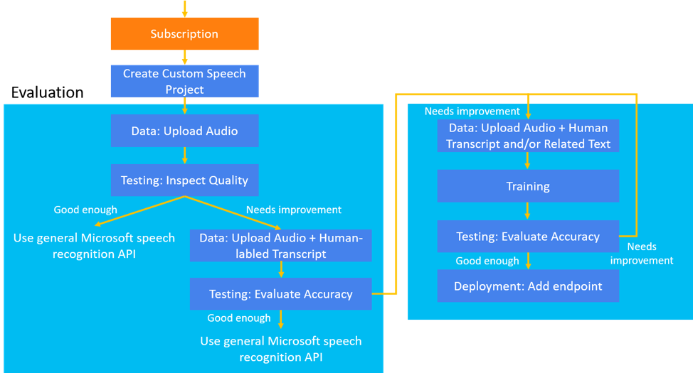

# What is Custom Speech?

[Custom Speech](https://aka.ms/custom-speech) is a set of online tools that allow you to evaluate and improve Microsoft's speech-to-text accuracy for your applications, tools, and products. All it takes to get started are a handful of test audio files. Follow the links below to start creating a custom speech-to-text experience.

## What's in Custom Speech?

Before you can do anything with Custom Speech, you'll need an Azure account and a Speech Services subscription. Once you've got an account, you can prep your data, train and test your models, inspect recognition quality, evaluate accuracy, and ultimately deploy and use the custom speech-to-text model.

This diagram highlights the pieces that make up the Custom Speech portal. Use the links below to learn more about each step.

1. [Subscribe and create a project](#set-up-your-azure-account) - Create an Azure account and subscribe the Speech Services. This unified subscription gives you access to speech-to-text, text-to-speech, speech translation, and the Custom Speech portal. Then, using your Speech Services subscription, create your first Custom Speech project.

2. [Upload test data](how-to-custom-speech-test-data.md) - Upload test data (audio files) to evaluate Microsoft's speech-to-text offering for your applications, tools, and products.

3. [Inspect recognition quality](how-to-custom-speech-inspect-data.md) - Use the Custom Speech portal to play back uploaded audio and inspect the speech recognition quality of your test data. For quantitative measurements, see [Inspect data](how-to-custom-speech-inspect-data.md).

4. [Evaluate accuracy](how-to-custom-speech-evaluate-data.md) - Evaluate the accuracy of the speech-to-text model. The Custom Speech portal will provide a *Word Error Rate*, which can be used to determine if additional training is required. If you're satisfied with the accuracy, you can use the Speech Service APIs directly. If you'd like to improve accuracy by a relative average of 5% - 20%, use the **Training** tab in the portal to upload additional training data, such as human-labeled transcripts and related text.

5. [Train the model](how-to-custom-speech-train-model.md) - Improve the accuracy of your speech-to-text model by providing written transcripts (10-1,000 hours) and related text (<200 MB) along with your audio test data. This data helps to train the speech-to-text model. After training, retest, and if you're satisfied with the result, you can deploy your model.

6. [Deploy the model](how-to-custom-speech-deploy-model.md) - Create a custom endpoint for your speech-to-text model and use it in your applications, tools, or products.

## Set up your Azure account

A Speech Services subscription is required before you can use the Custom Speech portal to create a custom model. Follow these instructions to create a standard Speech Services subscription: [Create a Speech Subscription](https://docs.microsoft.com/azure/cognitive-services/speech-service/get-started#new-azure-account).

> [!NOTE]
> Please be sure to create standard (S0) subscriptions, free trial (F0) subscriptions are not supported.

Once you've created an Azure account and a Speech Services subscription, you'll need to sign in to Custom Speech portal and connect your subscription.

1. Get your Speech Services subscription key from the Azure portal.
2. Sign-in to the [Custom Speech portal](https://aka.ms/custom-speech).
3. Select the subscription you need to work on and create a speech project.
4. If you'd like to modify your subscription, use the **cog** icon located in the top navigation.

## How to create a project

Content like data, models, tests, and endpoints are organized into **Projects** in the Custom Speech portal. Each project is specific to a domain and country/language. For example, you may create a project for call centers that use English in the United States.

To create your first project, select the **Speech-to-text/Custom speech**, then click **New Project**. Follow the instructions provided by the wizard to create your project. After you've created a project, you should see four tabs: **Data**, **Testing**, **Training**, and **Deployment**. Use the links provided in [Next steps](#next-steps) to learn how to use each tab.

## Next steps

* [Prepare and test your data](how-to-custom-speech-test-data.md)
* [Inspect your data](how-to-custom-speech-inspect-data.md)
* [Evaluate your data](how-to-custom-speech-evaluate-data.md)
* [Train your model](how-to-custom-speech-train-model.md)
* [Deploy your model](how-to-custom-speech-deploy-model.md)
