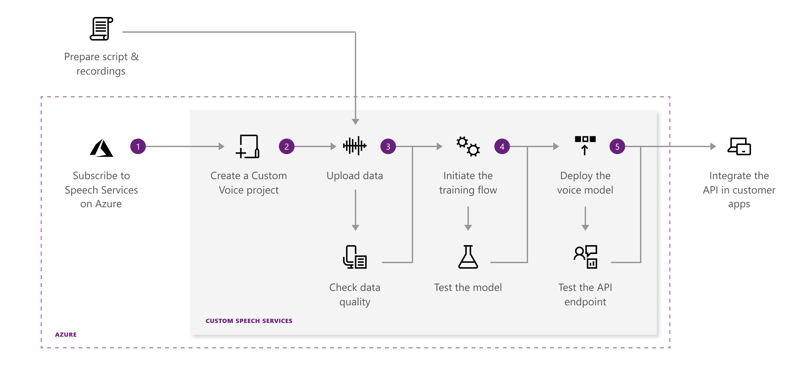

# Get started with Custom Voice

[Custom Voice](https://aka.ms/customvoice) is a set of online tools that allow you to create a recognizable, one-of-a-kind voice for your brand. All it takes to get started are a handful of audio files and the associated transcriptions. Follow the links below to start creating a custom text-to-speech experience.

## What's in Custom Voice?

Before starting with Custom Voice, you'll need an Azure account and a Speech service subscription. Once you've created an account, you can prepare your data, train and test your models, evaluate voice quality, and ultimately deploy your custom voice model.

The diagram below highlights the steps to create a custom voice model using the [Custom Voice portal](https://aka.ms/customvoice). Use the links to learn more.

1. [Subscribe and create a project](#set-up-your-azure-account) - Create an Azure account and create a Speech service subscription. This unified subscription gives you access to speech-to-text, text-to-speech, speech translation, and the Custom Voice portal. Then, using your Speech service subscription, create your first Custom Voice project.

2. [Upload data](how-to-custom-voice-create-voice.md#upload-your-datasets) - Upload data (audio and text) using the Custom Voice portal or Custom Voice API. From the portal, you can investigate and evaluate pronunciation scores and signal-to-noise ratios. For more information, see [How to prepare data for Custom Voice](how-to-custom-voice-prepare-data.md).

3. [Train your model](how-to-custom-voice-create-voice.md#build-your-custom-voice-model) – Use your data to create a custom text-to-speech voice model. You can train a model in different languages. After training, test your model, and if you're satisfied with the result, you can deploy the model.

4. [Deploy your model](how-to-custom-voice-create-voice.md#create-and-use-a-custom-voice-endpoint) - Create a custom endpoint for your text-to-speech voice model, and use it for speech synthesis in your products, tools, and applications.

## Custom Neural voices

The neural voice customization capability is currently in public preview, limited to selected customers. Fill out this [application form](https://go.microsoft.com/fwlink/?linkid=2108737) to get started.

> [!NOTE]
> As part of Microsoft's commitment to designing responsible AI, our intent is to protect the rights of individuals and society, and foster transparent human-computer interactions. For this reason, Custom Neural Voice is not generally available to all customers. You may gain access to the technology only after your applications are reviewed and you have committed to using it in alignment with our ethics principles. Learn more about our [application gating process](https://aka.ms/custom-neural-gating-overview).

## Set up your Azure account

A Speech service subscription is required before you can use the Custom Speech portal to create a custom model. Follow these instructions to create a Speech service subscription in Azure. If you do not have an Azure account, you can sign up for a new one.  

Once you've created an Azure account and a Speech service subscription, you'll need to sign in to the Custom Voice portal and connect your subscription.

1. Get your Speech service subscription key from the Azure portal.
2. Sign in to the [Custom Voice portal](https://aka.ms/custom-voice).
3. Select your subscription and create a speech project.
4. If you'd like to switch to another Speech subscription, use the cog icon located in the top navigation.

> [!NOTE]
> The Custom Voice service does NOT support the 30-day free trial key. You must have a F0 or a S0 key created in Azure before you can use the service.

## How to create a project

Content like data, models, tests, and endpoints are organized into **Projects** in the Custom Voice portal. Each project is specific to a country/language and the gender of the voice you want to create. For example, you may create a project for a female voice for your call center's chat bots that use English in the United States (en-US).

To create your first project, select the **Text-to-Speech/Custom Voice** tab, then click **New Project**. Follow the instructions provided by the wizard to create your project. After you've created a project, you will see four tabs: **Data**, **Training**, **Testing**, and **Deployment**. Use the links provided in [Next steps](#next-steps) to learn how to use each tab.

> [!IMPORTANT]
> The [Custom Voice portal](https://aka.ms/custom-voice) was recently updated! If you created previous data, models, tests, and published endpoints in the CRIS.ai portal or with APIs, you need to create a new project in the new portal to connect to these old entities.

## Next steps

- [Prepare Custom Voice data](how-to-custom-voice-prepare-data.md)
- [Create a Custom Voice](how-to-custom-voice-create-voice.md)
- [Guide: Record your voice samples](record-custom-voice-samples.md)
