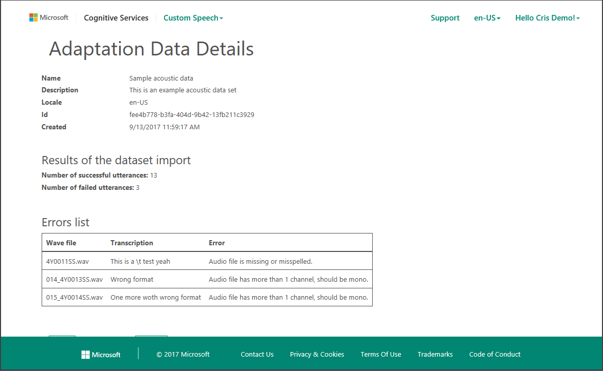
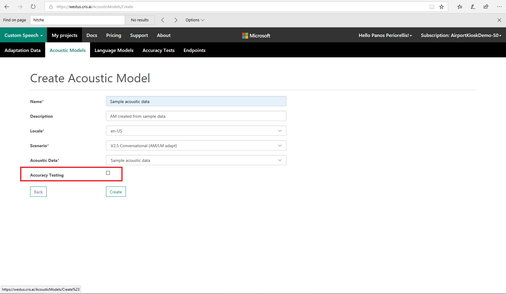
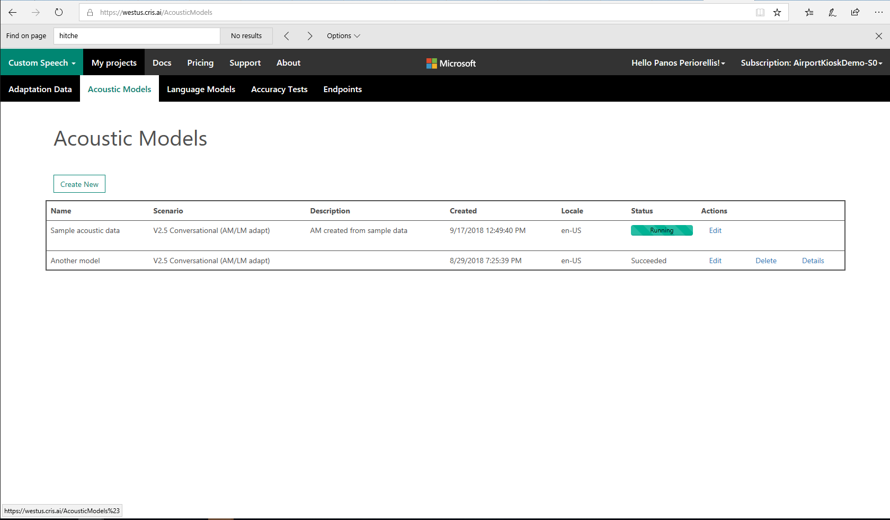

# Tutorial: Create a custom acoustic model

Creating a custom acoustic model is helpful if your application is designed for use in a particular environment, such as a car, with specific recording devices or conditions, or by a particular user population. Examples involve accented speech, specific background noises, or using a specific microphone for recording.

In this article, you learn how to:
> [!div class="checklist"]
> * Prepare the data
> * Import the acoustic dataset
> * Create the custom acoustic model

If you don’t have an Azure Cognitive Services account, create a [free account](https://azure.microsoft.com/try/cognitive-services) before you begin.

## Prerequisites

Ensure that your Cognitive Services account is connected to a subscription by opening the [Cognitive Services Subscriptions](https://cris.ai/Subscriptions) page.

You can connect to a Speech Service subscription that was created in the Azure portal by selecting **Connect existing subscription**.

For information about creating a Speech Service subscription in the Azure portal, see [Try the Speech Service for free](get-started.md).

## Prepare the data

To customize an acoustic model for a particular domain, a collection of speech data is required. This collection can range from a couple of utterances to several hundred hours of speech. The collection consists of a set of audio files of speech data, and a text file of transcriptions of each audio file. The audio data should be representative of the scenario in which you want to use the recognizer.

For example:

* If you want to better recognize speech in a noisy factory environment, the audio files should consist of people speaking in a noisy factory.
* If you are interested in optimizing performance for a single speaker&mdash;for example, you want to transcribe all of FDR’s fireside chats&mdash;the audio files should consist of many examples of that speaker only.

An acoustic dataset for customizing the acoustic model consists of two parts: (1) a set of audio files containing the speech data and (2) a file containing the transcriptions of all audio files.

### Audio data recommendations

* All audio files in the dataset should be stored in the WAV (RIFF) audio format.
* The audio must have a sampling rate of 8 kilohertz (KHz) or 16 KHz, and the sample values should be stored as uncompressed, pulse-code modulation (PCM) 16-bit signed integers (shorts).
* Only single-channel (mono) audio files are supported.
* The audio files must be between 100 microseconds and 1 minute in length. Each audio file should ideally start and end with at least 100 microseconds of silence, and somewhere between 500 microseconds and 1 second is common.
* If you have background noise in your data, we recommend that you also have some examples with longer segments of silence in your data&mdash;for example, a few seconds&mdash;before and/or after the speech content.
* Each audio file should consist of a single utterance&mdash;for example, a single sentence for dictation, a single query, or a single turn of a dialog system.
* Each audio file in the dataset should have a unique file name and a .wav extension.
* The set of audio files should be placed in a single folder without subdirectories, and the entire set of audio files should be packaged as a single .zip-file archive.

> [!NOTE]
> Data imports via the web portal are currently limited to 2 GB, so this is the maximum size of an acoustic dataset. This size corresponds to approximately 17 hours of audio that's recorded at 16 KHz or 34 hours of audio that's recorded at 8 KHz. The main requirements for the audio data are summarized in the following table:
>

| Property | Value |
|----------	|----------|
| File Format | RIFF (WAV) |
| Sampling Rate | 8,000 Hertz (Hz) or 16,000 Hz |
| Channels | 1 (mono) |
| Sample Format | PCM, 16-bit integers |
| File Duration | 0.1 seconds < duration < 60 seconds |
| Silence Collar | > 0.1 seconds |
| Archive Format | .zip |
| Maximum Archive Size | 2 GB |

> [!NOTE]
> File names should use only latin characters and follow the format 'filename.extention'

## Language support

For a full list of languages that are supported for custom **Speech to Text** language models, see [Supported languages for the Speech Service](language-support.md#speech-to-text).

### Transcriptions for the audio dataset

The transcriptions for all WAV files should be contained in a single plain-text file. Each line of the transcription file should contain the name of one of the audio files, followed by the corresponding transcription. The file name and transcription should be separated by a tab (\t).

  For example:
```
  speech01.wav  speech recognition is awesome
  speech02.wav  the quick brown fox jumped all over the place
  speech03.wav  the lazy dog was not amused
```
> [!NOTE]
> Transcription should be encoded as UTF-8 byte order mark (BOM).

The transcriptions are text-normalized so they can be processed by the system. However, there are some important normalizations that must be done by the user _prior_ to uploading the data to the Custom Speech Service. For the appropriate language to use when you prepare your transcriptions, see [Transcription guidelines for using the Speech Service](prepare-transcription.md).

Perform the steps in the next sections by using the [Speech Service portal](https://cris.ai).

## Import the acoustic dataset

After you've prepared the audio files and transcriptions, they're ready to be imported to the service web portal.

To import them, first ensure that you're signed in to the [Speech Service portal](https://cris.ai). Then, in the **Custom Speech** drop-down list in the ribbon, select **Adaptation Data**. If this is your first time uploading data to the Custom Speech Service, an empty table labeled **Datasets** is displayed. 

In the **Acoustic Datasets** row, select the **Import** button, and the site displays a page for uploading a new dataset.


In the **Name** and **Description** boxes, enter the appropriate information. Friendly descriptions are useful for keeping track of the various datasets that you upload. 

In the **Transcriptions file (.txt)** and **Audio files (.zip)** boxes, select **Browse**, and then select your plain-text transcription file and the zip archive of WAV files. When the preparation is complete, select **Import** to upload your data. Your data will be uploaded. For larger datasets, the import process might take several minutes.

When the upload is complete, return to the **Acoustic Datasets** table. An entry is displayed that corresponds to your acoustic dataset. Note that it has been assigned a unique ID (GUID). The data displays its current status: *NotStarted* while it is being queued for processing, *Running* while it is undergoing validation, and *Complete* when the data is ready for use.

Data validation includes a series of checks on the audio files to verify the file format, length, and sampling rate, and on the transcription files to verify the file format and perform some text normalization.

When the status is *Succeeded*, you can select **Details** to view the acoustic data verification report. The number of utterances that passed and failed verification are shown, along with details about the failed utterances. In the example in the following image, two WAV files failed verification because of improper audio format. In this dataset, one file has an incorrect sampling rate, and the other has an incorrect file format.



If you want to change the name or description of the dataset, you can select the **Edit** link and change their entries. You cannot modify the transcription or audio file entries.

## Create a custom acoustic model

After the status of your acoustic dataset is *Complete*, you can use the dataset to create a custom acoustic model. To do so, select **Acoustic Models** in the **Custom Speech** drop-down list. A table labeled **Your models** lists all your custom acoustic models. The table is empty if this is your first use. The table title displays the current locale. Currently, you can create acoustic models for US English only.

To create a new model, select **Create New** under the table title. As before, enter a name and description to help you identify this model. For example, you can use the **Description** field to record which starting model and acoustic dataset you used to create the model. 

Next, in the **Base Acoustic Model** drop-down list, select a base model. The base model is the starting point for your customization. There are two base acoustic models to choose from:
* The **Microsoft Search and Dictation AM** model is appropriate for speech that's directed at an application, such as commands, search queries, or dictation. 
* The **Microsoft Conversational Model** is appropriate for recognizing speech that's spoken in a conversational style. This type of speech is usually directed at another person and occurs in a call center or meetings. 

Latency for partial results in Conversational models is higher than in Search and Dictation models.

> [!NOTE]
> We are currently rolling out our new **Universal** model, which aims to address all scenarios. The aforementioned models will also remain publicly available.

Next, in the **Acoustic Data** drop-down list, select the acoustic data that you want to use to perform the customization.



When the processing is complete, you can optionally choose to perform accuracy testing of your new model. This test runs a speech-to-text evaluation on a specified acoustic dataset by using the customized acoustic model and then reports the results. To perform this testing, select the **Accuracy Testing** check box. Then, in the drop-down list, select a language model. If you have not created any custom language models, only the base language models will be displayed in the drop-down list. To select the most appropriate language model, see [Tutorial: Create a custom language model](how-to-customize-language-model.md).

Finally, select the acoustic dataset that you want to use to evaluate the custom model. If you perform accuracy testing, to get a realistic sense of the model’s performance, it's important to select an acoustic dataset that's different from the one you used for the model creation. Testing the accuracy on the training data doesn't allow you to evaluate how the adapted model performs under real conditions. The result will be too optimistic. Also note that accuracy testing is limited to 1,000 utterances. If the acoustic dataset for testing is larger, only the first 1,000 utterances is evaluated.

When you're ready to start running the customization process, select **Create**.

The acoustic models table displays a new entry that corresponds to this new model. The table also displays the status of the process: *Waiting*, *Processing*, or *Complete*.



## Next steps

- [Get your Speech Service trial subscription](https://azure.microsoft.com/try/cognitive-services/)
- [Recognize speech in C#](quickstart-csharp-dotnet-windows.md)
- [Git Sample Data](https://github.com/Microsoft/Cognitive-Custom-Speech-Service)
