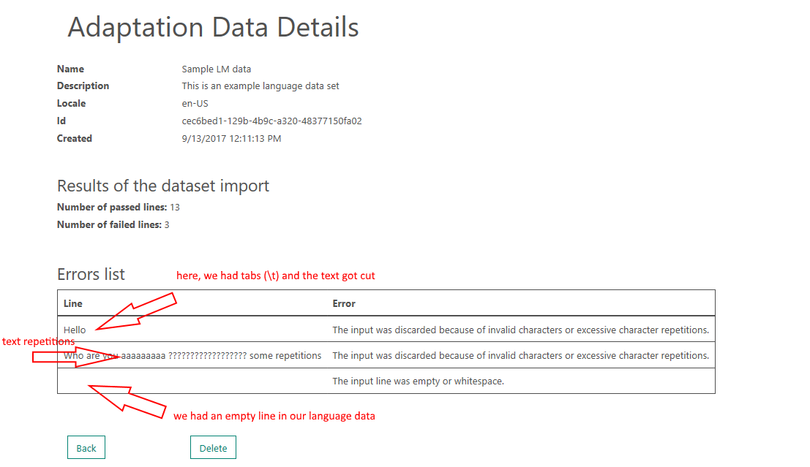
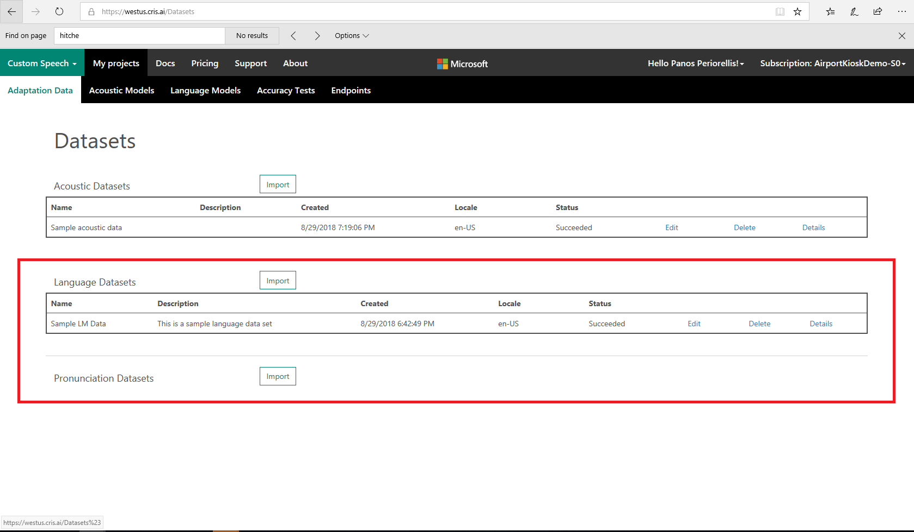
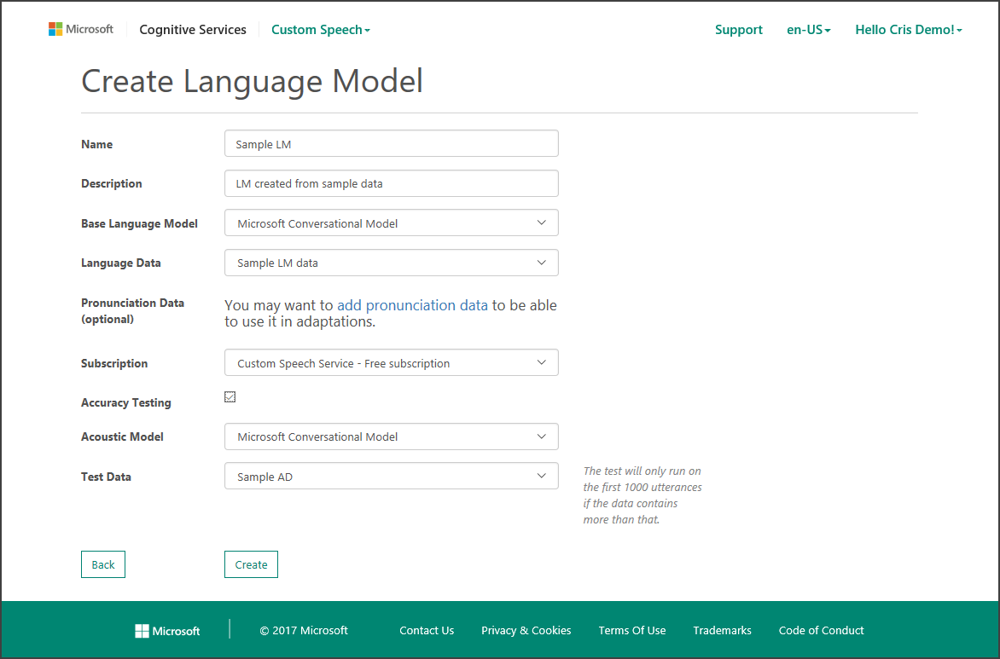

# Tutorial: Create a custom language model

In this document, you create a custom language model. You can then use this custom language model in conjunction with existing state-of-the-art speech models from Microsoft to add voice interaction to your application.

The document discusses how to:
> [!div class="checklist"]
> * Prepare the data
> * Import the language data set
> * Create the custom language model

If you don't have a Cognitive Services account, create a [free account](https://azure.microsoft.com/try/cognitive-services/) before you begin.

## Prerequisites

To ensure that your Cognitive Services account is connected to a subscription, open the [Cognitive Services subscriptions](https://customspeech.ai/Subscriptions) page.

To connect to a Speech Services subscription that was created in the Azure portal, select the **Connect existing subscription** button.

For information about creating a Speech Services subscription in the Azure portal, see the [Get started](get-started.md) page.

## Prepare the data

To create a custom language model for your application, you need to provide a list of example utterances to the system, for example:

*   "The patient has had urticaria for the past week."
*   "The patient had a well-healed herniorrhaphy scar."

The sentences do not need to be complete or grammatically correct, but they should accurately reflect the spoken input the system is expected to encounter in deployment. These examples should reflect both the style and content of the task that the users will perform with your application.

The language model data should be written in UTF-8 BOM. The text file should contain one example (sentence, utterance, or query) per line.

If you want certain terms to have a higher weight (importance), you can add several utterances to your data that include those terms. 

The main requirements for the language data are summarized in the following table.

| Property | Value |
|----------|-------|
| Text encoding | UTF-8 BOM|
| # of utterances per line | 1 |
| Maximum file size | 1.5 GB |
| Remarks | Avoid repeating characters more often than four times, for example 'aaaaa'|
| Remarks | No special characters such as '\t', or any other UTF-8 character above U+00A1 in the [Unicode characters table](http://www.utf8-chartable.de/)|
| Remarks | URIs will also be rejected since there is no unique way to pronounce a URI|

When the text is imported, it is text-normalized so it can be processed by the system. However, there are some important normalizations that must be done by the user _prior_ to uploading the data. See the [transcription guidelines](prepare-transcription.md) to determine the appropriate language to use when preparing your language data.

## Language support

See the full list of [supported languages](language-support.md#text-to-speech) for custom **Speech to Text** language models.

## Import the language data set

Select the **Import** button in the **Language Datasets** row, and the site displays a page for uploading a new data set.

When you're ready to import your language data set, sign into the [Speech Services portal](https://customspeech.ai). First, select the **Custom Speech** drop-down menu on the top ribbon. Then select **Adaptation Data**. The first time you attempt to upload data to Speech Services, you'll see an empty table called **Datasets**.

To import a new data set, select the **Import** button in the **Language Datasets** row. Then the site displays a page for uploading a new data set. Enter a **Name** and **Description** to help you identify the data set in the future, and then choose the locale. 

Next, use the **Choose File** button to locate the language data text file. After that, select **Import**, and the data set will be uploaded. Depending on the size of the data set, import might take several minutes.

After the import is complete, the language data has an entry that corresponds to your language data set. Notice that it has been assigned a unique ID (GUID). The data also has a status that reflects its current state. Its status is **Waiting** while it's being queued for processing, **Processing** while it's going through validation, and **Complete** when the data is ready for use. Data validation performs a series of checks on the text in the file. It also does some text normalization of the data.

When the status is **Complete**, you can select **View Report** to see the language data verification report. The number of utterances that passed and failed verification are shown, along with details about the failed utterances. In the following example, two examples failed verification because of incorrect characters. (In this data set, the first line had two tab characters, the second had several characters that aren't part of  the ASCII printable character set, and the third line was blank).

When the status of the language data set is **Complete**, it can be used to create a custom language model.

## Create a custom language model

After your language data is ready, select **Language Models** from the **Menu** drop-down menu to start the process of custom language model creation. This page contains a table called **Language Models** with your current custom language models. If you haven't yet created any custom language models, the table will be empty. The current locale is shown in the table next to the relevant data entry.

The appropriate locale must be selected before taking any action. The current locale is indicated in the table title on all data, model, and deployment pages. To change the locale, select the **Change Locale** button that's located under the table title.  This takes you to a locale confirmation page. Select **OK** to return to the table.

On the Create Language Model page, enter a **Name** and **Description** to help you keep track of pertinent information about this model, such as the data set that's used. Next, select the **Base Language Model** from the drop-down menu. This model is the starting point for your customization. 

There are two base language models to choose from. The Search and Dictation model is appropriate for speech that's directed at an application, such as commands, search queries, or dictation. The Conversational model is appropriate for recognizing speech that's spoken in a conversational style. This type of speech is typically directed at another person and occurs in call centers or meetings. 

On the "Create Language Model" page, enter a **Name** and **Description** to help you keep track of pertinent information about this model, such as the data set that you used. Next, select the **Base Language Model** from the drop-down menu. This model is the starting point for your customization. There are two base language models to choose from. 

The Search and Dictation model is appropriate for speech that's directed at an application, such as commands, search queries, or dictation. The Conversational model is appropriate for recognizing speech that's spoken in a conversational style. This type of speech is typically directed at another person and occurs in call centers or meetings. A new model called "Universal" is also publicly available. Universal aims to tackle all scenarios and eventually replace the Search and Dictation and the Conversational models.

As shown in the following example, after you've specified the base language model, use the **Language Data** drop-down menu to select the language data set that you want to use for the customization.

As with the acoustic model creation, you can optionally choose to do offline testing of your new model when the processing is complete. Model evaluations require an acoustic data set.

To do offline testing of your language model, select the check box next to **Offline Testing**. Then select an acoustic model from the drop-down menu. If you haven't created any custom acoustic models, the Microsoft base acoustic models will be the only model in the menu. If you've picked a conversational LM base model, you need to use a conversational AM here. If you use a search and dictate LM model, you have to select a search and dictate AM model.

Finally, select the acoustic data set you want to use to do the evaluation.

When you're ready to start processing, select **Create**. Next you'll see the table of language models. There will be a new entry in the table corresponding to this model. The status reflects the model’s state and will go through several states including **Waiting**, **Processing**, and **Complete**.

When the model has reached the **Complete** state, it can be deployed to an endpoint. Selecting **View Result** shows the results of offline testing, if you performed it.

If you want to change the **Name** or **Description** of the model at some point, you can use the **Edit** link in the appropriate row of the language models table.

## Next steps

- [Get your Speech Services trial subscription](https://azure.microsoft.com/try/cognitive-services/)
- [How to recognize speech in C#](quickstart-csharp-dotnet-windows.md)
- [Git sample data](https://github.com/Microsoft/Cognitive-Custom-Speech-Service)
