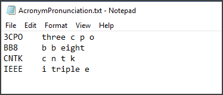

# Enable custom pronunciation
By using custom pronunciation, you can define the phonetic form and display of a word or term. It is useful for handling customized terms, such as product names or acronyms. All you need is a pronunciation file (a simple .txt file).

Here's how it works. In a single .txt file, you can enter several custom pronunciation entries. The structure is as follows:

```
Display form <Tab> Spoken form <Newline>
```

Several examples are shown in the following table:

| Display form | Spoken form |
|----------|-------|
| C3PO | see three pea o |
| L8R | late are |
| CNTK | see n tea k|

## Requirements for the spoken form
The spoken form must be lowercase, which you can force during the import. You also need to provide checks in the data importer. No tab in either the spoken form or the display form is permitted. However, there might be more forbidden characters in the display form (for example, ~ and ^).

Each .txt file can have several entries, as shown in the following image:



The spoken form is the phonetic sequence of the display form. It's composed of letters, words, or syllables. Currently, there's no further guidance or set of standards to help you formulate the spoken form. 

## Supported pronunciation characters
Custom pronunciation is currently supported for English (en-US) and German (de-de). The character sets that you can use to express the spoken form of a term (in the custom pronunciation file) are shown in the following table: 

| Language | Characters |
|----------	|----------|
| English (en-US) | a, b, c, d, e, f, g, h, i, j, k, l, o, p, q, r, s, t, u, v, w, x, y, z |
| German (de-de) | ä, ö, ü, ?, a, b, c, d, e, f, g, h, i, j, k, l, o, p, q, r, s, t, u, v, w, x, y, z |

> [!NOTE]
> A term's display form (in a pronunciation file) should be written the same way in a language adaptation dataset.

## Requirements for the display form
A display form can be only a custom word, a term, an acronym, or compound words that combine existing words. You can also enter alternative pronunciations for common words. 

>[!NOTE]
>We don't recommend using this feature to reformulate common words or to modify the spoken form. It is better to run the decoder to see whether some unusual words (such as abbreviations, technical words, or foreign words) are incorrectly decoded. If they are, add them to the custom pronunciation file. In the language model, you should always and only use the display form of a word. 

## Requirements for the file size
The size of the .txt file that contains the pronunciation entries is limited to 1 megabyte (MB). Usually, you don't need to upload large amounts of data through this file. Most custom pronunciation files are likely to be just a few kilobytes (KBs) in size. The encoding of the .txt file for all locales should be UTF-8 BOM. For the English locale, ANSI is also acceptable.

## Next steps
* Improve recognition accuracy by creating a [custom acoustic model](how-to-customize-acoustic-models.md).
* Improve recognition accuracy by creating a [custom language model](how-to-customize-language-model.md).
 