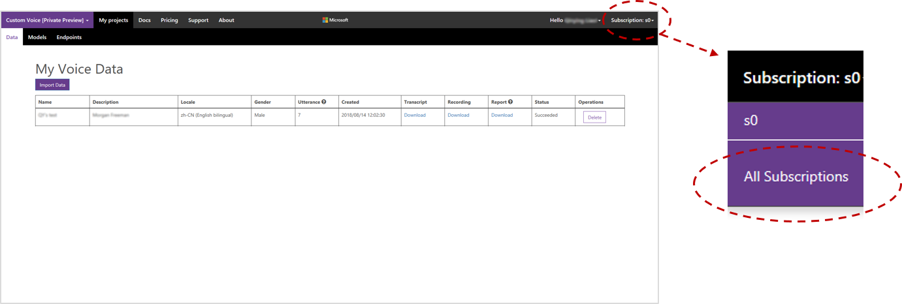
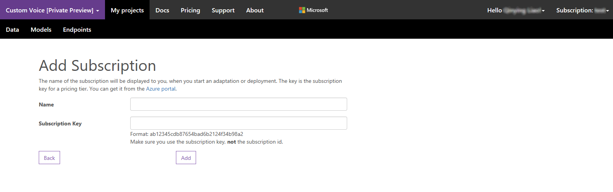
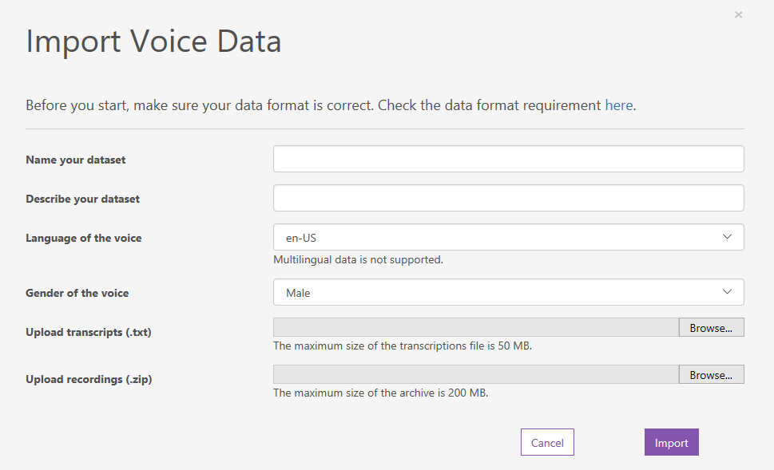
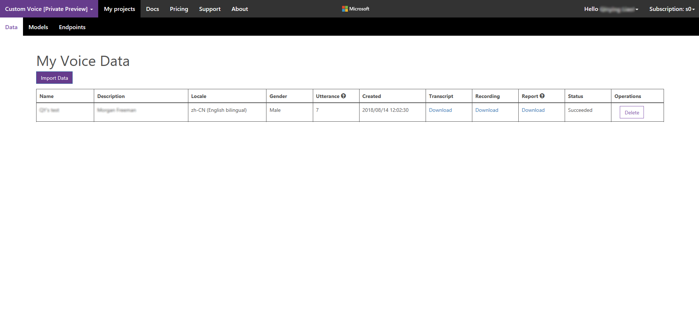
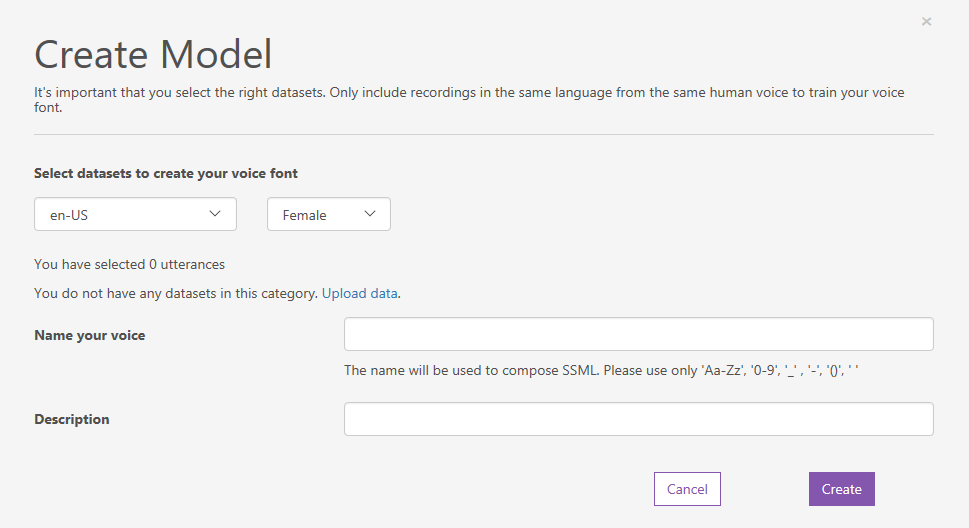
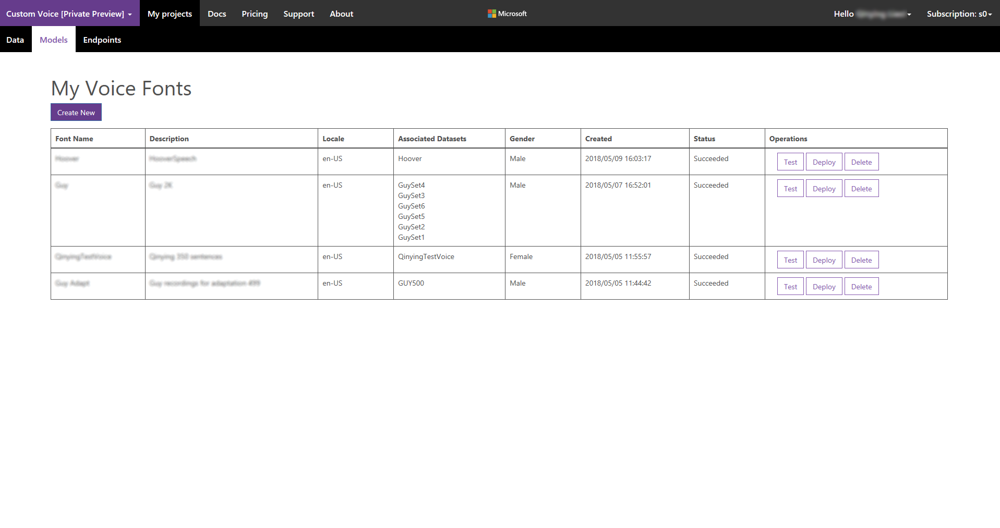
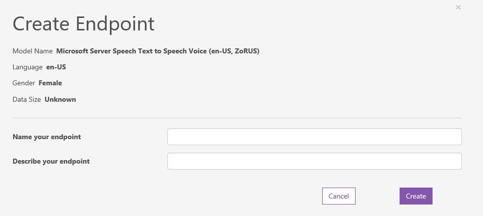
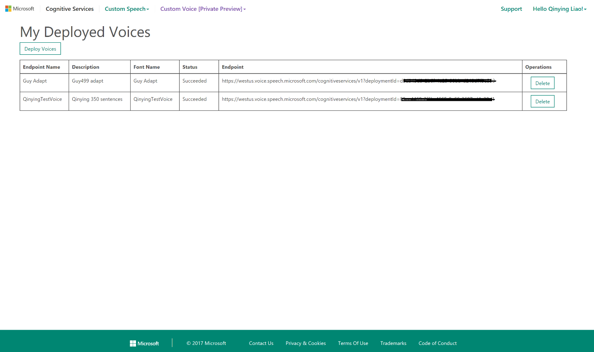

# Creating custom voice fonts

Microsoft Text-to-Speech (TTS) voice customization enables you to create a recognizable, one-of-a-kind voice for your brand: a *voice font.* 

To create your voice font, you make a studio recording and upload the associated scripts as the training data. The service then creates a unique voice model tuned to your recording. You can use  this voice font to synthesize speech. 

You can get started with a small amount of data for a proof of concept. But the more data you provide, the more natural and professional your voice sounds.

## Prerequisites

You need an Azure account and a subscription to the Speech service. [Create one](https://docs.microsoft.com/azure/cognitive-services/speech-service/get-started) if you haven't already. Connect your subscription to the Custom Voice portal as shown here.

1. Sign in to the [Custom Voice portal](https://customvoice.ai) using the same Microsoft account that you used to apply for access.

2. Under your account name on the top right, go to **Subscriptions**.

    

3. On the Subscriptions page, choose **Connect existing subscription**. Note that Speech Services supports different regions. Check the region where your subscription key was created, and make sure that you connect your key to the correct sub-portal.  

4. Paste your subscription key into the table, as shown in the following example. Each subscription has two keys, and you can use either of them.

     

You're ready to go!

## Prepare recordings and transcripts

A voice training dataset consists of a set of audio files, along with a text file that contains the transcripts of the audio files.

You can prepare these files in two ways. Either write a script and have it read by voice talent or use publicly available audio and transcribe it to text. If you do the latter, edit disfluencies from the audio files, such as "um" and other filler sounds, stutters, mumbled words, or mispronunciations.

To produce a good voice font, make the recordings in a quiet room with a high-quality microphone. Consistent volume, speaking rate, speaking pitch, and expressive mannerisms of speech are essential for building a great digital voice. 

To create a voice for production use, we recommend you use a professional recording studio and voice talent. For more information, see [How to record voice samples for a custom voice](record-custom-voice-samples.md).

### Audio files

Each audio file should contain a single utterance (for example, a single sentence or a single turn of a dialog system). All files must be in the same language. (Multilanguage custom voices are not supported.) The audio files must also each have a unique numeric filename with the filename extension `.wav`.

Audio files should be prepared as follows. Other formats are unsupported and will be rejected.

| **Property** | **Value** |
| ------------ | --------- |
| File format  | RIFF (.wav)|
| Sampling rate| at least 16,000 Hz |
| Sample format| PCM, 16-bit |
| File name    | Numeric, with `.wav` extension |
| Archive format| .zip      |
| Maximum archive size|200 MB|

> [!NOTE]
> .wav files with a sampling rate lower than 16,000 Hertz will be rejected. If a .zip file contains waves with different sampling rates, only those equal to or higher than 16,000 Hz will be imported.
> The portal currently imports .zip archives up to 200 MB. However, multiple archives can be uploaded. The maximum number of datasets allowed is 10 .zip files for free subscription users and 50 for standard subscription users.

### Transcripts

The transcription file is a plain text file (ANSI, UTF-8, UTF-8-BOM, UTF-16-LE, or UTF-16-BE). Each line of the transcription file must have the name of an audio file, followed by a tab (code point 9) character, and finally its transcript. No blank lines are allowed.

For example:

```
0000000001	This is the waistline, and it's falling.
0000000002	We have trouble scoring.
0000000003	It was Janet Maslin.
```

The custom voice system normalizes transcripts by converting the text to lowercase and removing extraneous punctuation. It’s important that the transcripts are 100% accurate transcriptions of the corresponding audio recordings.

> [!TIP]
> When building production Text-to-Speech voices, select utterances (or write scripts) that take into account both phonetic coverage and efficiency. Having trouble getting the results you want? [Contact the Custom Voice team](mailto:tts@microsoft.com) to find out more about having us consult.

## Upload your datasets

After you prepare your audio file archive and transcripts, upload them via the [Custom Voice service portal](https://customvoice.ai).

> [!NOTE]
> Datasets cannot be edited after they have been uploaded. If you forget to include transcripts of some of the audio files, for example, or accidentally choose the wrong gender, you must upload the entire dataset again. Check your dataset and settings thoroughly before starting the upload.

1. Sign in to the portal.

2. On the main page, under **Custom Voice**, select **Data**.   

    The **My Voice** table appears. It is empty if you haven't uploaded any voice datasets yet.

3. To open the page for uploading a new dataset, select **Import data**. 

    

4. Enter a name and description in the fields that are provided. 

5. Select the locale for your voice fonts. Make sure the locale information matches the language of the recording data and the scripts. 

6. Select the gender of the speaker whose voice you're using.

7. Select the script and audio files to upload. 

8. Select **Import** to upload your data. For larger datasets, importing may take several minutes.

> [!NOTE]
> Free subscription users can upload two datasets at a time. Standard subscription users can upload five datasets simultaneously. If you reach the limit, wait until at least one of your datasets finishes importing. Then try again.

When the upload is complete, the **My Voice Data** table appears again. You should see an entry that corresponds to the dataset you just uploaded. 

Datasets are automatically validated after upload. Data validation includes a series of checks on the audio files to verify their file format, size, and sampling rate. Checks on the transcription files verify the file format and do some text normalization. The utterances are transcribed using speech recognition. Then the resulting text is compared with the transcript you provided.



The following table shows the processing states for imported datasets: 

| State | Meaning
| ----- | -------
| `NotStarted` | Your dataset has been received and is queued for processing.
| `Running` | Your dataset is being validated.
| `Succeeded` | Your dataset has been validated and may now be used to build a voice font.

After validation is complete, you can see the total number of matched utterances for each of your datasets in the **Utterance** column.

You can download a report to check the pronunciation scores and the noise level for each of your recordings. The pronunciation score ranges from 0 to 100. A score below 70 normally indicates a speech error or script mismatch. A heavy accent can reduce your pronunciation score and impact the generated digital voice.

A higher signal-to-noise ratio (SNR) indicates lower noise in your audio. You can typically reach a 50+ SNR by recording at professional studios. Audio with an SNR below 20 can result in obvious noise in your generated voice.

Consider re-recording any utterances with low pronunciation scores or poor signal-to-noise ratios. If you can't re-record, you might exclude those utterances from your dataset.

## Build your voice font

After your dataset has been validated, you can use it to build your custom voice font. 

1.  In the **Custom Voice** drop-down menu, choose **Models**.
 
    The **My Voice Fonts** table appears, listing any custom voice fonts you've already created.

1. Under the table title, select **Create voices**. 

    The page for creating a voice font appears. The current locale is shown in the first row of the table. Change the locale to create a voice in another language. The locale must be the same as it is for the datasets that are being used to create the voice.

1. As you did when you uploaded your dataset, enter a name and description to help you identify this model. 

    Choose a name carefully. The name you enter here will be the name you use to specify the voice in your request for speech synthesis as part of the SSML input. Only letters, numbers, and a few punctuation characters such as '-', '_', and '(', ')' are allowed.

    A common use of the **Description** field is to record the names of the datasets that were used to create the model.

1. Choose the gender of your voice font. It must match the gender of the dataset.

1. Select the dataset(s) that you want to use for training the voice font. All datasets that you use must be from the same speaker.

1. Click **Create** to begin creating your voice font.

    

Your new model appears in the **My Voice Fonts** table. 



The status that's shown reflects the process of converting your dataset to a voice font, as shown here.

| State | Meaning
| ----- | -------
| `NotStarted` | Your request for voice font creation is queued for processing.
| `Running` | Your voice font is being created.
| `Succeeded` | Your voice font has been created and may be deployed.

Training time varies depending on the volume of audio data processed. Typical times range from about 30 minutes for hundreds of utterances to 40 hours for 20,000 utterances.

> [!NOTE]
> Free subscription users can train one voice font at a time. Standard subscription users can train three voices simultaneously. If you reach the limit, wait until at least one of your voice fonts finishes training, and then try again.

## Test your voice font

After your voice font is successfully built, you can test it before deploying it for use. In the **Operations** column, select **Test**. The test page appears for the selected voice font. The table is empty if you haven’t yet submitted any test requests for the voice.

To display a pop-up menu for submitting text requests, select the **Test with text** button under the table title. You can submit your test request in either plain text or SSML. The maximum input size is 1,024 characters, including all tags for the SSML request. The language of your text must be the same as the language of your voice font.

After filling in the text box and confirming the input mode, select **Yes** to submit your test request and return to the test page. The table now includes an entry that corresponds to your new request and the status column. It can take a few minutes to synthesize speech. When the status column says **Succeeded**, you can download the text input (a `.txt` file) and audio output (a `.wav` file), and audition the latter for quality.

## Create and use a custom endpoint

After you've successfully created and tested your voice model, you deploy it in a custom Text-to-Speech endpoint. You then use this endpoint in place of the usual endpoint when making Text-to-Speech requests through the REST API. Your custom endpoint can be called only by the subscription that you used to deploy the font.

To create a new custom endpoint, choose **Endpoints** from the **Custom Voice** menu at the top of the page. The **My Deployed Voices** page appears, with its table of current custom voice endpoints, if any. The current locale is reflected in the first row of the table. To create a deployment for a different language, change the displayed locale. (It must match the voice you're deploying.)

To create a new endpoint, select the **Deploy voices** button. Enter the name and description of your custom endpoint.

From the **Subscription** menu, choose the subscription that you want to use. Free subscription users can have only one model deployed at a time. Standard subscription users can create up to 20 endpoints, each with its own custom voice.



After selecting the model to be deployed, select **Create**. The **My Deployed Voices** page reappears, now with an entry for your new endpoint. It may take a few minutes to instantiate a new endpoint. When the status of the deployment is **Succeeded**, the endpoint is ready for use.



When the deployment status is **Succeeded**, the endpoint of your deployed voice font appears in the **My Deployed Voices** table. You can use this URI directly in an HTTP request.

Online testing of the endpoint is also available via the custom voice portal. To test your endpoint, choose **Endpoints testing** from the **Custom Voice** drop-down menu. The endpoint testing page appears. Choose a deployed custom voice and enter the text to be spoken (in either plain text or SSML format) in the text box.

> [!NOTE] 
> When using SSML, the `<voice>` tag must specify the name that you gave your custom voice when you created it. If you submit plain text, the custom voice is always used.

To hear the text spoken in your custom voice font, select **Play**.


The custom endpoint is functionally identical to the standard endpoint that's used for text-to-speech requests. See [REST API](rest-apis.md) for more information.

## Language support

Voice customization is available for US English (en-US), mainland Chinese (zh-CN) and Italian (it-IT).

> [!NOTE]
> Italian voice training starts with a dataset of 2,000+ utterances. Chinese-English bilingual models are also supported with a dataset of 2,000+ utterances.

## Next steps

- [Get your Speech trial subscription](https://azure.microsoft.com/try/cognitive-services/)
- [Record your voice samples](record-custom-voice-samples.md)
