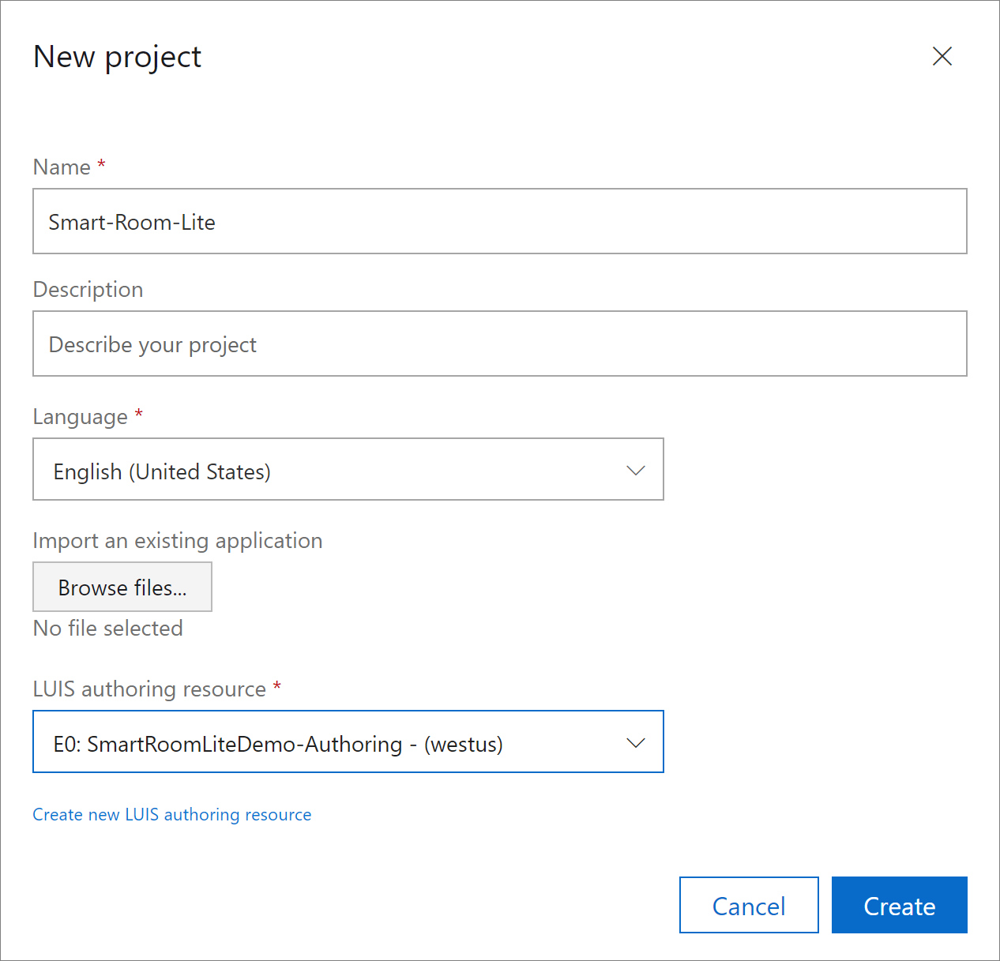
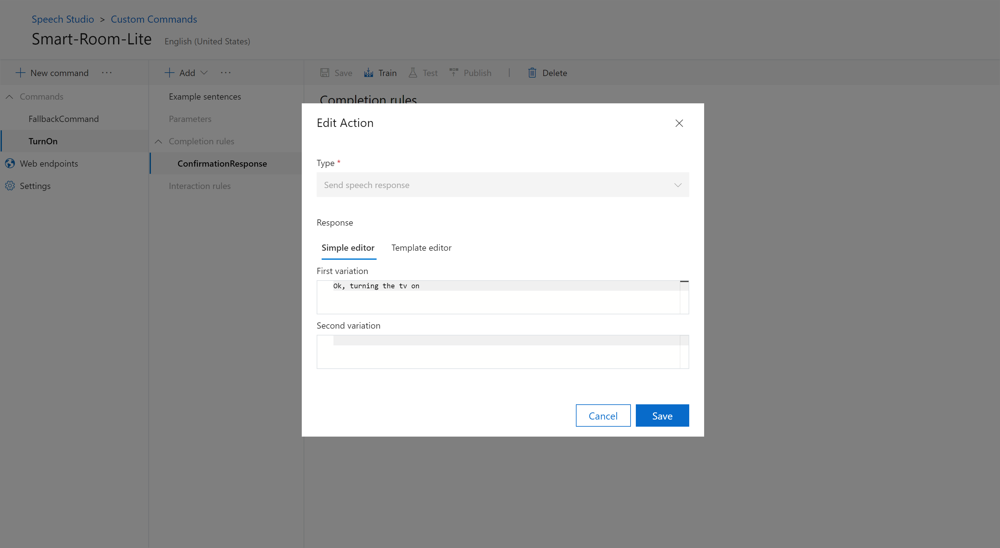
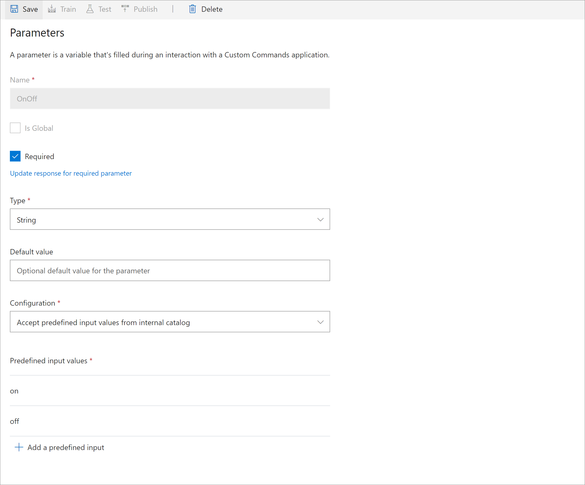
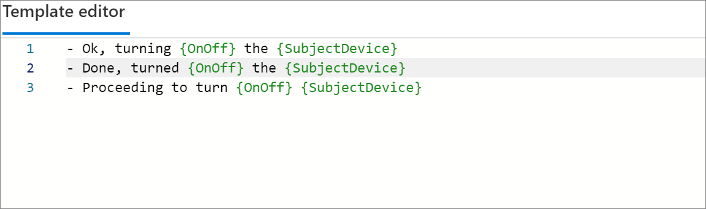
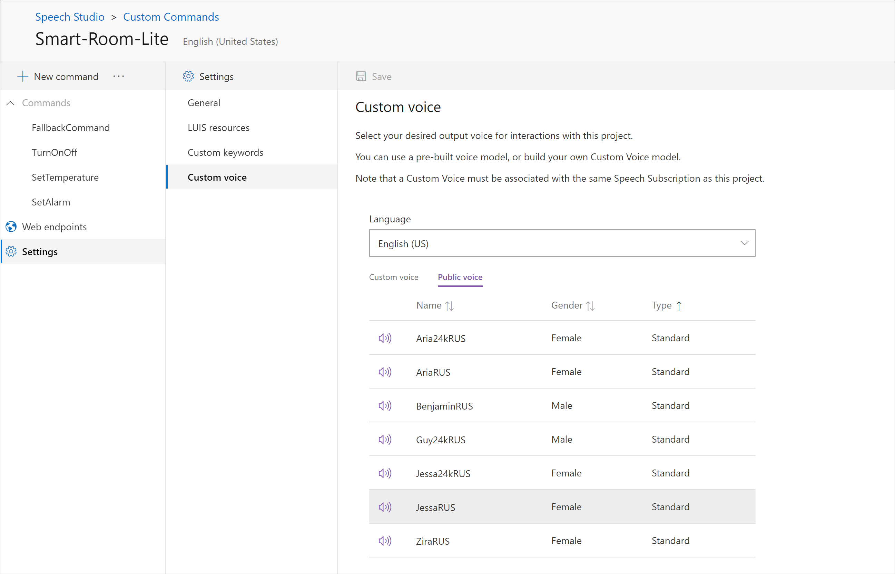

# Develop Custom Commands applications

[!INCLUDE [deprecation notice](./includes/custom-commands-retire.md)]

In this how-to article, you learn how to develop and configure Custom Commands applications. The Custom Commands feature helps you build rich voice-command apps that are optimized for voice-first interaction experiences. The feature is best suited to task completion or command-and-control scenarios. It's particularly well suited for Internet of Things (IoT) devices and for ambient and headless devices.

In this article, you create an application that can turn a TV on and off, set the temperature, and set an alarm. After you create these basic commands, you'll learn about the following options for customizing commands:

* Adding parameters to commands
* Adding configurations to command parameters
* Building interaction rules
* Creating language-generation templates for speech responses
* Using Custom Voice tools

## Create an application by using simple commands

Start by creating an empty Custom Commands application. For details, refer to the [quickstart](quickstart-custom-commands-application.md). In this application, instead of importing a project, you create a blank project.

1. In the **Name** box, enter the project name *Smart-Room-Lite* (or another name of your choice).
1. In the **Language** list, select **English (United States)**.
1. Select or create a LUIS resource.

   > [!div class="mx-imgBorder"]
   > 

### Update LUIS resources (optional)

You can update the authoring resource that you selected in the **New project** window. You can also set a prediction resource.

A prediction resource is used for recognition when your Custom Commands application is published. You don't need a prediction resource during the development and testing phases.

### Add a TurnOn command

In the empty Smart-Room-Lite Custom Commands application you created, add a command. The command will process an utterance, `Turn on the tv`. It will respond with the message `Ok, turning the tv on`.

1. Create a new command by selecting **New command** at the top of the left pane. The **New command** window opens.
1. For the **Name** field, provide the value `TurnOn`.
1. Select **Create**.

The middle pane lists the properties of the command.

The following table explains the command's configuration properties. For more information, see [Custom Commands concepts and definitions](./custom-commands-references.md).

| Configuration            | Description                                                                                                                 |
| ---------------- | --------------------------------------------------------------------------------------------------------------------------- |
| Example sentences | Example utterances the user can say to trigger this command.                                                                 |
| Parameters       | Information required to complete the command.                                                                                |
| Completion rules | Actions to be taken to fulfill the command. Examples: responding to the user or communicating with a web service. |
| Interaction rules   | Other rules to handle more specific or complex situations.                                                              |


> [!div class="mx-imgBorder"]
> 

#### Add example sentences

In the **Example sentences** section, you provide an example of what the user can say.

1. In the middle pane, select **Example sentences**.
1. In the pane on the right, add examples:

    ```
    Turn on the tv
    ```

1.  At the top of the pane, select **Save**.

You don't have parameters yet, so you can move to the **Completion rules** section.

#### Add a completion rule

Next, the command needs a completion rule. This rule tells the user that a fulfillment action is being taken.

For more information about rules and completion rules, see [Custom Commands concepts and definitions](./custom-commands-references.md).

1. Select the default completion rule **Done**. Then edit it as follows:


    | Setting    | Suggested value                          | Description                                        |
    | ---------- | ---------------------------------------- | -------------------------------------------------- |
    | **Name**       | `ConfirmationResponse`                  | A name describing the purpose of the rule          |
    | **Conditions** | None                                     | Conditions that determine when the rule can run    |
    | **Actions**    | **Send speech response** > **Simple editor** > `Ok, turning the tv on` | The action to take when the rule condition is true |

   > [!div class="mx-imgBorder"]
   > 

1. Select **Save** to save the action.
1. Back in the **Completion rules** section, select **Save** to save all changes.

    > [!NOTE]
    > You don't have to use the default completion rule that comes with the command. You can delete the default completion rule and add your own rule.

### Add a SetTemperature command

Now add one more command, `SetTemperature`. This command will take a single utterance, `Set the temperature to 40 degrees`, and respond with the message `Ok, setting temperature to 40 degrees`.

To create the new command, follow the steps you used for the `TurnOn` command, but use the example sentence `Set the temperature to 40 degrees`.

Then edit the existing **Done** completion rules as follows:

| Setting    | Suggested value                          |
| ---------- | ---------------------------------------- |
| **Name**  | `ConfirmationResponse`                  |
| **Conditions** | None                                     |
| **Actions**    | **Send speech response** > **Simple editor** > **First variation** > `Ok, setting temperature to 40 degrees` |

Select **Save** to save all changes to the command.

### Add a SetAlarm command

Create a new `SetAlarm` command. Use the example sentence `Set an alarm for 9 am tomorrow`. Then edit the existing **Done** completion rules as follows:

| Setting    | Suggested value                          |
| ---------- | ---------------------------------------- |
| **Name**  | `ConfirmationResponse`                  |
| **Conditions** | None                                     |
| **Actions**    | **Send speech response** > **Simple editor** > **First variation** > `Ok, setting an alarm for 9 am tomorrow` |

Select **Save** to save all changes to the command.

### Try it out

Test the application's behavior by using the test pane:

1. In the upper-right corner of the pane, select the **Train** icon.
1. When the training finishes, select **Test**.

Try out the following utterance examples by using voice or text:

- You type: *set the temperature to 40 degrees*
- Expected response: Ok, setting temperature to 40 degrees
- You type: *turn on the tv*
- Expected response: Ok, turning the tv on
- You type: *set an alarm for 9 am tomorrow*
- Expected response: Ok, setting an alarm for 9 am tomorrow

> [!div class="mx-imgBorder"]
> 

> [!TIP]
> In the test pane, you can select **Turn details** for information about how this voice input or text input was processed.

## Add parameters to commands

In this section, you learn how to add parameters to your commands. Commands require parameters to complete a task. In complex scenarios, parameters can be used to define conditions that trigger custom actions.

### Configure parameters for a TurnOn command

Start by editing the existing `TurnOn` command to turn on and turn off multiple devices.

1. Now that the command will handle both on and off scenarios, rename the command as *TurnOnOff*.
   1. In the pane on the left, select the **TurnOn** command. Then next to **New command** at the top of the pane, select the edit button.

   1. In the **Rename command** window, change the name to *TurnOnOff*.

1. Add a new parameter to the command. The parameter represents whether the user wants to turn the device on or off.
   1. At top of the middle pane, select  **Add**. From the drop-down menu, select **Parameter**.
   1. In the pane on the right, in the **Parameters** section, in the **Name** box, add `OnOff`.
   1. Select **Required**. In the **Add response for a required parameter** window, select **Simple editor**. In the **First variation** field, add *On or Off?*.
   1. Select **Update**.

       > [!div class="mx-imgBorder"]
       > 

   1. Configure the parameter's properties by using the following table. For information about all of the configuration properties of a command, see [Custom Commands concepts and definitions](./custom-commands-references.md).


       | Configuration      | Suggested value     | Description                                                      |
       | ------------------ | ----------------| ---------------------------------------------------------------------|
       | **Name**               | `OnOff`           | A descriptive name for the parameter                                                                           |
       | **Required**           | Selected         | Check box indicating whether a value for this parameter is required before the command finishes. |
       | **Response for required parameter**      |**Simple editor** > `On or Off?`      | A prompt asking for the value of this parameter when it isn't known. |
       | **Type**               | **String**          | Parameter type, such as Number, String, Date Time, or Geography.   |
       | **Configuration**      | **Accept predefined input values from an internal catalog** | For strings, this setting limits inputs to a set of possible values. |
       | **Predefined input values**     | `on`, `off`           | Set of possible values and their aliases.         |


   1. To add predefined input values, select **Add a predefined input**. In **New Item**  window, type *Name* as shown in the preceding table. In this case, you're not using aliases, so you can leave this field blank.

      > [!div class="mx-imgBorder"]
      > 

   1. Select **Save** to save all configurations of the parameter.

#### Add a SubjectDevice parameter

1. To add a second parameter to represent the name of the devices that can be controlled by using this command, select **Add**. Use the following configuration.


    | Setting            | Suggested value       |
    | ------------------ | --------------------- |
    | **Name**               | `SubjectDevice`         |
    | **Required**           | Selected               |
    | **Response for required parameter**     | **Simple editor** > `Which device do you want to control?`    | 
    | **Type**               | **String**                |     
    | **Configuration**      | **Accept predefined input values from an internal catalog** | 
    | **Predefined input values** | `tv`, `fan`               |
    | **Aliases** (`tv`)      | `television`, `telly`     |

1. Select **Save**.

#### Modify example sentences

For commands that use parameters, it's helpful to add example sentences that cover all possible combinations. For example:

* Complete parameter information: `turn {OnOff} the {SubjectDevice}`
* Partial parameter information: `turn it {OnOff}`
* No parameter information: `turn something`

Example sentences that use varying degrees of information allow the Custom Commands application to resolve both one-shot resolutions and multiple-turn resolutions by using partial information.

With that information in mind, edit the example sentences to use these suggested parameters:

```
turn {OnOff} the {SubjectDevice}
{SubjectDevice} {OnOff}
turn it {OnOff}
turn something {OnOff}
turn something
```

Select **Save**.

> [!TIP]
> In the example-sentences editor, use curly braces to refer to your parameters. For example, `turn {OnOff} the {SubjectDevice}`.
> Use a tab for automatic completion backed by previously created parameters.

#### Modify completion rules to include parameters

Modify the existing completion rule `ConfirmationResponse`.

1. In the **Conditions** section, select **Add a condition**.
1. In the **New Condition** window, in the **Type** list, select **Required parameters**. In the list that follows, select both **OnOff** and **SubjectDevice**.
1. Select **Create**.
1. In the **Actions** section, edit the **Send speech response** action by hovering over it and selecting the edit button. This time, use the newly created `OnOff` and `SubjectDevice` parameters:

    ```
    Ok, turning the {SubjectDevice} {OnOff}
    ```
1. Select **Save**.

Try out the changes by selecting the **Train** icon at the top of the pane on the right.

When the training finishes, select **Test**. A **Test your application** window appears. Try the following interactions:

- Input: *turn off the tv*
- Output: Ok, turning off the tv
- Input: *turn off the television*
- Output: Ok, turning off the tv
- Input: *turn it off*
- Output: Which device do you want to control?
- Input: *the tv*
- Output: Ok, turning off the tv

### Configure parameters for a SetTemperature command

Modify the `SetTemperature` command to enable it to set the temperature as the user directs.

Add a `TemperatureValue` parameter. Use the following configuration:

| Configuration      | Suggested value     |
| ------------------ | ----------------|
| **Name**               | `TemperatureValue`           |
| **Required**           | Selected         |
| **Response for required parameter**      | **Simple editor** > `What temperature would you like?`
| **Type**               | `Number`          |


Edit the example utterances to use the following values.

```
set the temperature to {TemperatureValue} degrees
change the temperature to {TemperatureValue}
set the temperature
change the temperature
```

Edit the existing completion rules. Use the following configuration.

| Configuration      | Suggested value     |
| ------------------ | ----------------|
| **Conditions**         | **Required parameter** > **TemperatureValue**           |
| **Actions**           | **Send speech response** > `Ok, setting temperature to {TemperatureValue} degrees` |

### Configure parameters for a SetAlarm command

Add a parameter called `DateTime`. Use the following configuration.

   | Setting                           | Suggested value                     |
   | --------------------------------- | ----------------------------------------|
   | **Name**                              | `DateTime`                               |
   | **Required**                          | Selected                                 |
   | **Response for required parameter**   | **Simple editor** > `For what time?`            |
   | **Type**                              | **DateTime**                                |
   | **Date Defaults**                     | If the date is missing, use today.            |
   | **Time Defaults**                     | If the time is missing, use the start of the day.     |


> [!NOTE]
> This article mostly uses String, Number, and DateTime parameter types. For a list of all supported parameter types and their properties, see [Custom Commands concepts and definitions](./custom-commands-references.md).


Edit the example utterances. Use the following values.

```
set an alarm for {DateTime}
set alarm {DateTime}
alarm for {DateTime}
```

Edit the existing completion rules. Use the following configuration.

   | Setting    | Suggested value                               |
   | ---------- | ------------------------------------------------------- |
   | **Actions**    | **Send speech response** > `Ok, alarm set for {DateTime}`  |

Test the three commands together by using utterances related to different commands. (You can switch between the different commands.)

- Input: *Set an alarm*
- Output: For what time?
- Input: *Turn on the tv*
- Output: Ok, turning the tv on
- Input: *Set an alarm*
- Output: For what time?
- Input: *5 pm*
- Output: Ok, alarm set for 2020-05-01 17:00:00

## Add configurations to command parameters

In this section, you learn more about advanced parameter configuration, including:

 - How parameter values can belong to a set that's defined outside of the Custom Commands application.
 - How to add validation clauses on the parameter values.

### Configure a parameter as an external catalog entity

The Custom Commands feature allows you to configure string-type parameters to refer to external catalogs hosted over a web endpoint. So you can update the external catalog independently without editing the Custom Commands application. This approach is useful in cases where the catalog entries are numerous.

Reuse the `SubjectDevice` parameter from the `TurnOnOff` command. The current configuration for this parameter is **Accept predefined inputs from internal catalog**. This configuration refers to a static list of devices in the parameter configuration. Move out this content to an external data source that can be updated independently.

To move the content, start by adding a new web endpoint. In the pane on the left, go to the **Web endpoints** section. There, add a new web endpoint URL. Use the following configuration.

| Setting | Suggested value |
|----|----|
| **Name** | `getDevices` |
| **URL** | `<Your endpoint of getDevices.json>` |
| **Method** | **GET** |

Then, configure and host a web endpoint that returns a JSON file that lists the devices that can be controlled. The web endpoint should return a JSON file that's formatted like this example:

```json
{
    "fan" : [],
    "refrigerator" : [
        "fridge"
    ],
    "lights" : [
        "bulb",
        "bulbs",
        "light",
        "light bulb"
    ],
    "tv" : [
        "telly",
        "television"
        ]
}

```

Next go the **SubjectDevice** parameter settings page. Set up the following properties.

| Setting | Suggested value |
| ----| ---- |
| **Configuration** | **Accept predefined inputs from external catalog** |                               
| **Catalog endpoint** | `getDevices` |
| **Method** | **GET** |

Then select **Save**.

> [!IMPORTANT]
> You won't see an option to configure a parameter to accept inputs from an external catalog unless you have the web endpoint set in the **Web endpoint** section in the pane on the left.

Try it out by selecting **Train**. After the training finishes, select **Test** and try a few interactions.

* Input: *turn on*
* Output: Which device do you want to control?
* Input: *lights*
* Output: Ok, turning the lights on

> [!NOTE]
> You can now control all the devices hosted on the web endpoint. But you still need to train the application to test the new changes and then republish the application.

### Add validation to parameters

*Validations* are constructs that apply to certain parameter types that allow you to configure constraints on the parameter's value. They prompt you for corrections if values don't fall within the constraints. For a list of parameter types that extend the validation construct, see [Custom Commands concepts and definitions](./custom-commands-references.md).

Test out validations by using the `SetTemperature` command. Use the following steps to add a validation for the `Temperature` parameter.

1. In the pane on the left, select the **SetTemperature** command.
1. In the middle pane, select **Temperature**.
1. In the pane on the right, select **Add a validation**.
1. In the **New validation** window, configure validation as shown in the following table. Then select **Create**.


    | Parameter configuration | Suggested value | Description |
    | ---- | ---- | ---- |
    | **Min Value** | `60` | For Number parameters, the minimum value this parameter can assume |
    | **Max Value** | `80` | For Number parameters, the maximum value this parameter can assume |
    | **Failure response** |  **Simple editor** > **First variation** > `Sorry, I can only set temperature between 60 and 80 degrees. What temperature do you want?` | A prompt to ask for a new value if the validation fails |

    > [!div class="mx-imgBorder"]
    > 

Try it out by selecting the **Train** icon at the top of the pane on the right. After the training finishes, select **Test**. Try a few interactions:

- Input: *Set the temperature to 72 degrees*
- Output: Ok, setting temperature to 72 degrees
- Input: *Set the temperature to 45 degrees*
- Output: Sorry, I can only set temperature between 60 and 80 degrees
- Input: *make it 72 degrees instead*
- Output: Ok, setting temperature to 72 degrees

## Add interaction rules

Interaction rules are *additional* rules that handle specific or complex situations. Although you're free to author your own interaction rules, in this example you use interaction rules for the following scenarios:

* Confirming commands
* Adding a one-step correction to commands

For more information about interaction rules, see [Custom Commands concepts and definitions](./custom-commands-references.md).

### Add confirmations to a command

To add a confirmation, you use the `SetTemperature` command. To achieve confirmation, create interaction rules by using the following steps:

1. In the pane on the left, select the **SetTemperature** command.
1. In the middle pane, add interaction rules by selecting **Add**. Then select **Interaction rules** > **Confirm command**.

    This action adds three interaction rules. The rules ask the user to confirm the date and time of the alarm. They expect a confirmation (yes or no) for the next turn.

    1. Modify the **Confirm command** interaction rule by using the following configuration:
        1. Change the name to **Confirm temperature**.
        1. The condition **All required parameters** has already been added.
        1. Add a new action: **Type** > **Send speech response** > **Are you sure you want to set the temperature as {TemperatureValue} degrees?**
        1. In the **Expectations** section, leave the default value of **Expecting confirmation from user**.

         > [!div class="mx-imgBorder"]
         > 


    1. Modify the **Confirmation succeeded** interaction rule to handle a successful confirmation (the user said yes).

          1. Change the name to **Confirmation temperature succeeded**.
          1. Leave the existing **Confirmation was successful** condition.
          1. Add a new condition: **Type** > **Required parameters** > **TemperatureValue**.
          1. Leave the default **Post-execution state** value as **Execute completion rules**.

    1. Modify the **Confirmation denied** interaction rule to handle scenarios when confirmation is denied (the user said no).

          1. Change the name to **Confirmation temperature denied**.
          1. Leave the existing **Confirmation was denied** condition.
          1. Add a new condition: **Type** > **Required parameters** > **TemperatureValue**.
          1. Add a new action: **Type** > **Send speech response** > **No problem. What temperature then?**.
          1. Change the default **Post-execution state** value to **Wait for user's input**.

> [!IMPORTANT]
> In this article, you use the built-in confirmation capability. You can also manually add interaction rules one by one.

Try out the changes by selecting **Train**. When the training finishes, select **Test**.

- **Input**: *Set temperature to 80 degrees*
- **Output**: are you sure you want to set the temperature as 80 degrees?
- **Input**: *No*
- **Output**: No problem. What temperature then?
- **Input**: *72 degrees*
- **Output**: are you sure you want to set the temperature as 72 degrees?
- **Input**: *Yes*
- **Output**: OK, setting temperature to 72 degrees

### Implement corrections in a command

In this section, you'll configure a one-step correction. This correction is used after the fulfillment action has run. You'll also see an example of how a correction is enabled by default if the command isn't fulfilled yet. To add a correction when the command isn't finished, add the new parameter `AlarmTone`.

In the left pane, select the **SetAlarm** command. Then and add the new parameter **AlarmTone**.

- **Name** > `AlarmTone`
- **Type** > **String**
- **Default Value** > **Chimes**
- **Configuration** > **Accept predefined input values from the internal catalog**
- **Predefined input values** > **Chimes**, **Jingle**, and **Echo** (These values are individual predefined inputs.)


Next, update the response for the **DateTime** parameter to **Ready to set alarm with tone as {AlarmTone}. For what time?**. Then modify the completion rule as follows:

1. Select the existing completion rule **ConfirmationResponse**.
1. In the pane on the right, hover over the existing action and select **Edit**.
1. Update the speech response to `OK, alarm set for {DateTime}. The alarm tone is {AlarmTone}`.

> [!IMPORTANT]
> The alarm tone can change without any explicit configuration in an ongoing command. For example, it can change when the command hasn't finished yet. A correction is enabled *by default* for all of the command parameters, regardless of the turn number, if the command is yet to be fulfilled.

#### Implement a correction when a command is finished

The Custom Commands platform allows for one-step correction even when the command has finished. This feature isn't enabled by default. It must be explicitly configured.

Use the following steps to configure a one-step correction:

1. In the **SetAlarm** command, add an interaction rule of the type **Update previous command** to update the previously set alarm. Rename the interaction rule as **Update previous alarm**.
1. Leave the default condition: **Previous command needs to be updated**.
1. Add a new condition: **Type** > **Required Parameter** > **DateTime**.
1. Add a new action: **Type** > **Send speech response** > **Simple editor** > **Updating previous alarm time to {DateTime}**.
1. Leave the default **Post-execution state** value as **Command completed**.

Try out the changes by selecting **Train**. Wait for the training to finish, and then select **Test**.

- **Input**: *Set an alarm.*
- **Output**: Ready to set alarm with tone as Chimes. For what time?
- **Input**: *Set an alarm with the tone as Jingle for 9 am tomorrow.*
- **Output**: OK, alarm set for 2020-05-21 09:00:00. The alarm tone is Jingle.
- **Input**: *No, 8 am.*
- **Output**: Updating previous alarm time to 2020-05-29 08:00.

> [!NOTE]
> In a real application, in the **Actions** section of this correction rule, you'll also need to send back an activity to the client or call an HTTP endpoint to update the alarm time in your system. This action should be solely responsible for updating the alarm time. It shouldn't be responsible for any other attribute of the command. In this case, that attribute would be the alarm tone.

## Add language-generation templates for speech responses

Language-generation (LG) templates allow you to customize the responses sent to the client. They introduce variance into the responses. You can achieve language generation by using:

* Language-generation templates.
* Adaptive expressions.

Custom Commands templates are based on the Bot Framework's [LG templates](/azure/bot-service/file-format/bot-builder-lg-file-format#templates). Because the Custom Commands feature creates a new LG template when required (for speech responses in parameters or actions), you don't have to specify the name of the LG template.

So you don't need to define your template like this:

 ```
    # CompletionAction
    - Ok, turning {OnOff} the {SubjectDevice}
    - Done, turning {OnOff} the {SubjectDevice}
    - Proceeding to turn {OnOff} {SubjectDevice}
 ```

Instead, you can define the body of the template without the name, like this:

> [!div class="mx-imgBorder"]
> 


This change introduces variation into the speech responses that are sent to the client. For an utterance, the corresponding speech response is randomly picked out of the provided options.

By taking advantage of LG templates, you can also define complex speech responses for commands by using adaptive expressions. For more information, see the [LG templates format](/azure/bot-service/file-format/bot-builder-lg-file-format#templates).

By default, the Custom Commands feature supports all capabilities, with the following minor differences:

* In the LG templates, entities are represented as `${entityName}`. The Custom Commands feature doesn't use entities. But you can use parameters as variables with either the `${parameterName}` representation or the `{parameterName}` representation.
* The Custom Commands feature doesn't support template composition and expansion, because you never edit the *.lg* file directly. You edit only the responses of automatically created templates.
* The Custom Commands feature doesn't support custom functions that LG injects. Predefined functions are supported.
* The Custom Commands feature doesn't support options, such as `strict`, `replaceNull`, and `lineBreakStyle`.

### Add template responses to a TurnOnOff command

Modify the `TurnOnOff` command to add a new parameter. Use the following configuration.

| Setting            | Suggested value       |
| ------------------ | --------------------- |
| **Name**               | `SubjectContext`         |
| **Required**           | Unselected               |
| **Type**               | **String**                |
| **Default value**      | `all` |
| **Configuration**      | **Accept predefined input values from internal catalog** |
| **Predefined input values** | `room`, `bathroom`, `all`|

#### Modify a completion rule

Edit the **Actions** section of the existing completion rule **ConfirmationResponse**. In the **Edit action** window, switch to **Template Editor**. Then replace the text with the following example.

```
- IF: @{SubjectContext == "all" && SubjectDevice == "lights"}
    - Ok, turning all the lights {OnOff}
- ELSEIF: @{SubjectDevice == "lights"}
    - Ok, turning {OnOff} the {SubjectContext} {SubjectDevice}
- ELSE:
    - Ok, turning the {SubjectDevice} {OnOff}
    - Done, turning {OnOff} the {SubjectDevice}
```

Train and test your application by using the following input and output. Notice the variation of responses. The variation is created by multiple alternatives of the template value and also by use of adaptive expressions.

* Input: *turn on the tv*
* Output: Ok, turning the tv on
* Input: *turn on the tv*
* Output: Done, turned on the tv
* Input: *turn off the lights*
* Output: Ok, turning all the lights off
* Input: *turn off room lights*
* Output: Ok, turning off the room lights

## Use a custom voice

Another way to customize Custom Commands responses is to select an output voice. Use the following steps to switch the default voice to a custom voice:

1. In your Custom Commands application, in the pane on the left, select **Settings**.
1. In the middle pane, select **Custom Voice**.
1. In the table, select a custom voice or public voice.
1. Select **Save**.

> [!div class="mx-imgBorder"]
> 

> [!NOTE]
> For public voices, neural types are available only for specific regions. For more information, see [Speech service supported regions](./regions.md#speech-service).
>
> You can create custom voices on the **Custom Voice** project page. For more information, see [Get started with Custom Voice](./how-to-custom-voice.md).

Now the application will respond in the selected voice, instead of the default voice.

## Next steps

* Learn how to [integrate your Custom Commands application](how-to-custom-commands-setup-speech-sdk.md) with a client app by using the Speech SDK.
* [Set up continuous deployment](how-to-custom-commands-deploy-cicd.md) for your Custom Commands application by using Azure DevOps.
