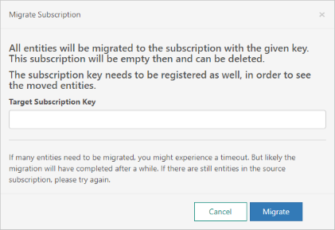

# Migration guide for Custom Speech service
Learn how to migrate from the Custom Speech service to the **Speech Service**.

Custom Speech Service and its corresponding Client libraries and APIs are being deprecated. Switch to the Speech Service and SDK to benefit from the latest quality and feature updates. 
 
## Migration for new customers

The pricing model is simpler, moving to an hour-based pricing model for the Speech Service.   

1. Create an Azure resource in each region where your application is available. The Azure resource name is **Speech**. You can use a single Azure resource for the following services in the same region, instead of creating separate resources:

    * Speech-to-text
    * Custom speech-to-text
    * Text-to-speech
    * Speech translation

2. Download the [Speech SDK](speech-sdk.md). 

3. Follow the quickstart guides and SDK samples to use the correct APIs. If you use the REST APIs, you also need to use the correct endpoints and resource keys. 

4. Update the client application to use the Speech service and APIs. 

> [!NOTE]
> * LUIS - If you enabled speech in Language Understanding (LUIS), a single LUIS resource in the same region will work for LUIS as well as all the speech services. See [Recognize intents from speech](how-to-recognize-intents-from-speech-csharp.md) documentation.
> * Text-to-text translation is not part of the Speech service. It needs its own Azure resource subscription.
  

## Migration for existing customers

Existing customers are required to migrate their existing resource keys to the new service on the Speech Service portal. Note that resource keys can only be migrated within the same region. Use the following steps:

1. Sign in to the [cris.ai](http://www.cris.ai) portal and select the subscription in the top right menu. 

2. Select **Migrate selected subscription**.

    

3. Enter the subscription key in the text box and select **Migrate**.

    

## Next steps

Learn [speech to text](./speech-to-text.md) concepts