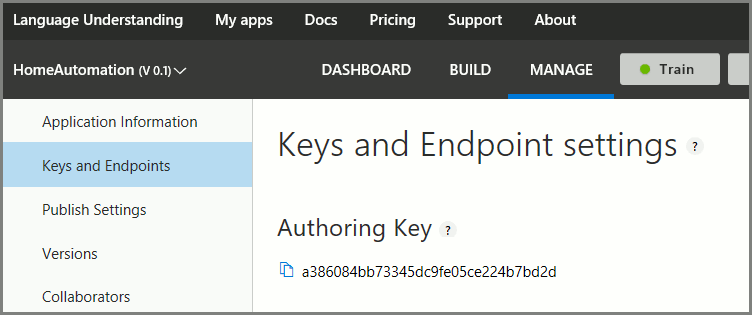
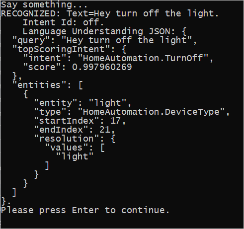

# Tutorial: Recognize intents from speech using the Speech SDK for C#

[!INCLUDE [Article selector](../../../includes/cognitive-services-speech-service-how-to-recognize-intents-from-speech-selector.md)]

The Cognitive Services [Speech SDK](~/articles/cognitive-services/speech-service/speech-sdk.md) integrates with the [Language Understanding service (LUIS)](https://www.luis.ai/home) to provide **intent recognition.** An intent is something the user wants to do: book a flight, check the weather, or make a call. The user can use whatever terms feel natural. Using machine learning, LUIS maps user requests to the intents you have defined.

> [!NOTE]
> A LUIS application defines the intents and entities you want to recognize. It's separate from the C# application that uses the Speech service. In this article, "app" means the LUIS app, while "application" means the C# code.

In this tutorial, you use the Speech SDK to develop a C# console application that derives intents from user utterances through your device's microphone. You'll learn how to:

> [!div class="checklist"]
> * Create a Visual Studio project referencing the Speech SDK NuGet package
> * Create a speech config and get an intent recognizer
> * Get the model for your LUIS app and add the intents you need
> * Specify the language for speech recognition
> * Recognize speech from a file
> * Use asynchronous, event-driven continuous recognition

## Prerequisites

Be sure you have the following before you begin this tutorial.

* A LUIS account. You can get one for free through the [LUIS portal](https://www.luis.ai/home).
* Visual Studio 2017 (any edition).

## LUIS and speech

LUIS integrates with the Speech service to recognize intents from speech. You don't need a Speech service subscription, just LUIS.

LUIS uses two kinds of keys: 

|Key type|Purpose|
|--------|-------|
|authoring|lets you create and modify LUIS apps programmatically|
|endpoint |authorizes access to a particular LUIS app|

The endpoint key is the LUIS key needed for this tutorial. This tutorial uses the example Home Automation LUIS app, which you can create by following [Use prebuilt Home automation app](https://docs.microsoft.com/azure/cognitive-services/luis/luis-get-started-create-app). If you have created a LUIS app of your own, you can use it instead.

When you create a LUIS app, a starter key is automatically generated so you can test the app using text queries. This key does not enable the Speech service integration and won't work with this tutorial. You must create a LUIS resource in the Azure dashboard and assign it to the LUIS app. You can use the free subscription tier for this tutorial. 

After creating the LUIS resource in the Azure dashboard, log into the [LUIS portal](https://www.luis.ai/home), choose your application on the My Apps page, then switch to the app's Manage page. Finally, click **Keys and Endpoints** in the sidebar.



On the Keys and Endpoint settings page:

1. Scroll down to the Resources and Keys section and click **Assign resource**.
1. In the **Assign a key to your app** dialog, choose the following:

    * Choose Microsoft as the Tenant.
    * Under Subscription Name, choose the Azure subscription that contains the LUIS resource you want to use.
    * Under Key, choose the LUIS resource that you want to use with the app.

In a moment, the new subscription appears in the table at the bottom of the page. Click the icon next to a key to copy it to the clipboard. (You may use either key.)


## Create a speech project in Visual Studio

[!INCLUDE [Create project ](../../../includes/cognitive-services-speech-service-create-speech-project-vs-csharp.md)]

## Add the code

Open the file `Program.cs` in the Visual Studio project and replace the block of `using` statements at the beginning of the file with the following declarations.

[!code-csharp[Top-level declarations](~/samples-cognitive-services-speech-sdk/samples/csharp/sharedcontent/console/intent_recognition_samples.cs#toplevel)]

Inside the provided `Main()` method, add the following code.

```csharp
RecognizeIntentAsync().Wait();
Console.WriteLine("Please press Enter to continue.");
Console.ReadLine();
```

Create an empty asynchronous method `RecognizeIntentAsync()`, as shown here.

```csharp
static async Task RecognizeIntentAsync()
{
}
```

In the body of this new method, add this code.

[!code-csharp[Intent recognition by using a microphone](~/samples-cognitive-services-speech-sdk/samples/csharp/sharedcontent/console/intent_recognition_samples.cs#intentRecognitionWithMicrophone)]

Replace the placeholders in this method with your LUIS subscription key, region, and app ID as follows.

|Placeholder|Replace with|
|-----------|------------|
|`YourLanguageUnderstandingSubscriptionKey`|Your LUIS endpoint key. As previously noted, this must be a key obtained from your Azure dashboard, not a "starter key." You can find it on your app's Keys and Endpoints page (under Manage) in the [LUIS portal](https://www.luis.ai/home).|
|`YourLanguageUnderstandingServiceRegion`|The short identifier for the region your LUIS subscription is in, such as `westus` for West US. See [Regions](regions.md).|
|`YourLanguageUnderstandingAppId`|The LUIS app ID. You can find it on your app's Settings page of the [LUIS portal](https://www.luis.ai/home).|

With these changes made, you can build (Control-Shift-B) and run (F5) the tutorial application. When prompted, try saying "Turn off the lights" into your PC's  microphone. The result is displayed in the console window.

The following sections include a discussion of the code.


## Create an intent recognizer

The first step in recognizing intents in speech is to create a speech config from your LUIS endpoint key and region. Speech configs can be used to create recognizers for the various capabilities of the Speech SDK. The speech config has multiple ways to specify the subscription you want to use; here, we use `FromSubscription`, which takes the subscription key and region.

> [!NOTE]
> Use the key and region of your LUIS subscription, not of a Speech Service subscription.

Next, create an intent recognizer using `new IntentRecognizer(config)`. Since the configuration already knows which subscription to use, there's no need to specify the subscription key and endpoint again when creating the recognizer.

## Import a LUIS model and add intents

Now import the model from the LUIS app using `LanguageUnderstandingModel.FromAppId()` and add the LUIS intents that you wish to recognize via the recognizer's `AddIntent()` method. These two steps improve the accuracy of speech recognition by indicating words that the user is likely to use in their requests. It is not necessary to add all the app's intents if you do not need to recognize them all in your application.

Adding intents requires three arguments: the LUIS model (which has just been created and is named `model`), the intent name, and an intent ID. The difference between the ID and the name is as follows.

|`AddIntent()` argument|Purpose|
|--------|-------|
|intentName |The name of the intent as defined in the LUIS app. Must match the LUIS intent name exactly.|
|intentID    |An ID assigned to a recognized intent by the Speech SDK. Can be whatever you like; does not need to correspond to the intent name as defined in the LUIS app. If multiple intents are handled by the same code, for instance, you could use the same ID for them.|

The Home Automation LUIS app has two intents: one for turning a device on, and another for turning a device off. The lines below add these intents to the recognizer; replace the three `AddIntent` lines in the `RecognizeIntentAsync()` method with this code.

```csharp
recognizer.AddIntent(model, "HomeAutomation.TurnOff", "off");
recognizer.AddIntent(model, "HomeAutomation.TurnOn", "on");
```

## Start recognition

With the recognizer created and the intents added, recognition can begin. The Speech SDK supports both single-shot and continuous recognition.

|Recognition mode|Methods to call|Result|
|----------------|-----------------|---------|
|Single-shot|`RecognizeOnceAsync()`|Returns the recognized intent, if any, after one utterance.|
|Continuous|`StartContinuousRecognitionAsync()`<br>`StopContinuousRecognitionAsync()`|Recognizes multiple utterances. Emits events (e.g. `IntermediateResultReceived`) when results are available.|

The tutorial application uses single-shot mode and so calls `RecognizeOnceAsync()` to begin recognition. The result is an `IntentRecognitionResult` object containing information about the intent recognized. The LUIS JSON response is extracted by the following expression:

```csharp
result.Properties.GetProperty(PropertyId.LanguageUnderstandingServiceResponse_JsonResult)
```

The tutorial application doesn't parse the JSON result, only displaying it in the console window.



## Specify recognition language

By default, LUIS recognizes intents in US English (`en-us`). By assigning a locale code to the `SpeechRecognitionLanguage` property of the speech configuration, you can recognize intents in other languages. For example, add `config.SpeechRecognitionLanguage = "de-de";` in our tutorial application before creating the recognizer to recognize intents in German. See [Supported Languages](language-support.md#speech-to-text).

## Continuous recognition from a file

The following code illustrates two additional capabilities of intent recognition using the Speech SDK. The first, previously mentioned, is continuous recognition, where the recognizer emits events when results are available. These events can then be processed by event handlers that you provide. With continuous recognition, you call the recognizer's `StartContinuousRecognitionAsync()` to start recognition instead of `RecognizeOnceAsync()`.

The other capability is reading the audio containing the speech to be processed from a WAV file. This involves creating an audio configuration that can be used when creating the intent recognizer. The file must be single-channel (mono) with a sampling rate of 16 kHz.

To try out these features, replace the body of the `RecognizeIntentAsync()` method with the following code. 

[!code-csharp[Intent recognition by using events from a file](~/samples-cognitive-services-speech-sdk/samples/csharp/sharedcontent/console/intent_recognition_samples.cs#intentContinuousRecognitionWithFile)]

Revise the code to include your LUIS endpoint key, region, and app ID and to add the Home Automation intents, as before. Change `whatstheweatherlike.wav` to the name of your audio file. Then build and run.

[!INCLUDE [Download the sample](../../../includes/cognitive-services-speech-service-speech-sdk-sample-download-h2.md)]
Look for the code from this article in the samples/csharp/sharedcontent/console folder.

## Next steps

> [!div class="nextstepaction"]
> [How to recognize speech](how-to-recognize-speech-csharp.md)
