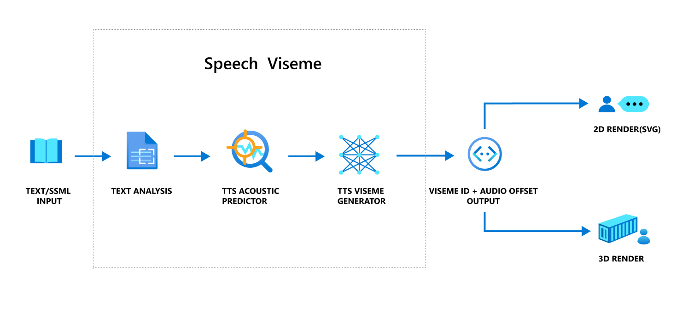
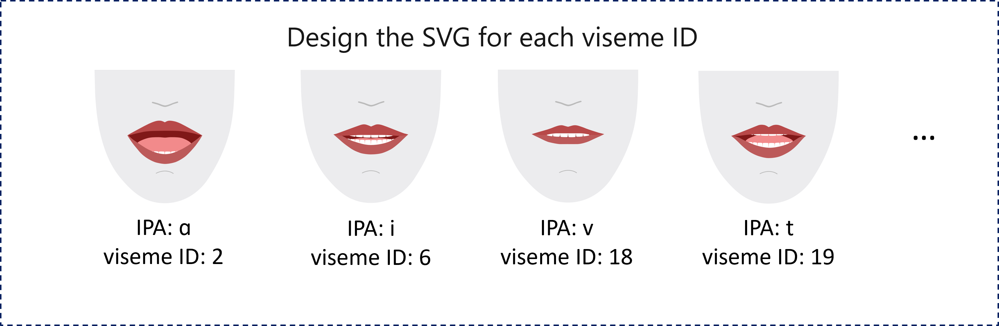

# Get facial pose events

> [!NOTE]
> Viseme events are only available for `en-US` English (United States) [neural voices](language-support.md#text-to-speech) for now.

A _viseme_ is the visual description of a phoneme in spoken language.
It defines the position of the face and mouth when speaking a word.
Each viseme depicts the key facial poses for a specific set of phonemes.
Viseme can be used to control the movement of 2D and 3D avatar models, perfectly matching mouth movements to synthetic speech.

Visemes make avatars easier to use and control. Using visemes, you can:

 * Create an **animated virtual voice assistant** for intelligent kiosks, building multi-mode integrated services for your customers.
 * Build **immersive news broadcasts** and improve audience experiences with natural face and mouth movements.
 * Generate more **interactive gaming avatars and cartoon characters** that can speak with dynamic content.
 * Make more **effective language teaching videos** that help language learners to understand the mouth behavior of each word and phoneme.
 * People with hearing impairment can also pick up sounds visually and **"lip-read"** speech content that shows visemes on an animated face.

See [the introduction video](https://youtu.be/ui9XT47uwxs) of the viseme.
> [!VIDEO https://www.youtube.com/embed/ui9XT47uwxs]

## Azure neural TTS can produce visemes with speech

A neural voice turns input text or SSML (Speech Synthesis Markup Language) into synthesized speech. Speech audio output can be accompanied by viseme IDs and their offset timestamps. Each viseme ID specifies a specific pose in observed speech, such as the position of the lips, jaw, and tongue when producing a particular phoneme. Using a 2D or 3D rendering engine, you can use these viseme events to animate your avatar.

The overall workflow of viseme is depicted in the flowchart below.



| Parameter | Description |
|-----------|-------------|
| Viseme ID | Integer number that specifies a viseme. In English (United States), we offer 22 different visemes to depict the mouth shapes for a specific set of phonemes. There is no one-to-one correspondence between visemes and phonemes. Often several phonemes correspond to a single viseme, as several phonemes look the same on the face when produced, such as `s` and `z`. See the [mapping table between Viseme ID and phonemes](#map-phonemes-to-visemes).  |
| Audio offset | The start time of each viseme, in ticks (100 nanoseconds). |

## Get viseme events with the Speech SDK

To get viseme with your synthesized speech, subscribe to the `VisemeReceived` event in Speech SDK.
The following snippet shows how to subscribe to the viseme event.

::: zone pivot="programming-language-csharp"

```csharp
using (var synthesizer = new SpeechSynthesizer(speechConfig, audioConfig))
{
    // Subscribes to viseme received event
    synthesizer.VisemeReceived += (s, e) =>
    {
        Console.WriteLine($"Viseme event received. Audio offset: " +
            $"{e.AudioOffset / 10000}ms, viseme id: {e.VisemeId}.");
    };

    var result = await synthesizer.SpeakSsmlAsync(ssml));
}

```

::: zone-end

::: zone pivot="programming-language-cpp"

```cpp
auto synthesizer = SpeechSynthesizer::FromConfig(speechConfig, audioConfig);

// Subscribes to viseme received event
synthesizer->VisemeReceived += [](const SpeechSynthesisVisemeEventArgs& e)
{
    cout << "viseme event received. "
        // The unit of e.AudioOffset is tick (1 tick = 100 nanoseconds), divide by 10,000 to convert to milliseconds.
        << "Audio offset: " << e.AudioOffset / 10000 << "ms, "
        << "viseme id: " << e.VisemeId << "." << endl;
};

auto result = synthesizer->SpeakSsmlAsync(ssml).get();
```

::: zone-end

::: zone pivot="programming-language-java"

```java
SpeechSynthesizer synthesizer = new SpeechSynthesizer(speechConfig, audioConfig);

// Subscribes to viseme received event
synthesizer.VisemeReceived.addEventListener((o, e) -> {
    // The unit of e.AudioOffset is tick (1 tick = 100 nanoseconds), divide by 10,000 to convert to milliseconds.
    System.out.print("Viseme event received. Audio offset: " + e.getAudioOffset() / 10000 + "ms, ");
    System.out.println("viseme id: " + e.getVisemeId() + ".");
});

SpeechSynthesisResult result = synthesizer.SpeakSsmlAsync(ssml).get();
```

::: zone-end

::: zone pivot="programming-language-python"

```Python
speech_synthesizer = speechsdk.SpeechSynthesizer(speech_config=speech_config, audio_config=audio_config)

# Subscribes to viseme received event
speech_synthesizer.viseme_received.connect(lambda evt: print(
    "Viseme event received: audio offset: {}ms, viseme id: {}.".format(evt.audio_offset / 10000, evt.viseme_id)))

result = speech_synthesizer.speak_ssml_async(ssml).get()
```

::: zone-end

::: zone pivot="programming-language-javascript"

```Javascript
var synthesizer = new SpeechSDK.SpeechSynthesizer(speechConfig, audioConfig);

// Subscribes to viseme received event
synthesizer.visemeReceived = function (s, e) {
    window.console.log("(Viseme), Audio offset: " + e.audioOffset / 10000 + "ms. Viseme ID: " + e.visemeId);
}

synthesizer.speakSsmlAsync(ssml);
```

::: zone-end

::: zone pivot="programming-language-objectivec"

```Objective-C
SPXSpeechSynthesizer *synthesizer =
    [[SPXSpeechSynthesizer alloc] initWithSpeechConfiguration:speechConfig
                                           audioConfiguration:audioConfig];

// Subscribes to viseme received event
[synthesizer addVisemeReceivedEventHandler: ^ (SPXSpeechSynthesizer *synthesizer, SPXSpeechSynthesisVisemeEventArgs *eventArgs) {
    NSLog(@"Viseme event received. Audio offset: %fms, viseme id: %lu.", eventArgs.audioOffset/10000., eventArgs.visemeId);
}];

[synthesizer speakSsml:ssml];
```

::: zone-end

Here is an example of the viseme output.

```text
(Viseme), Viseme ID: 1, Audio offset: 200ms.

(Viseme), Viseme ID: 5, Audio offset: 850ms.

……

(Viseme), Viseme ID: 13, Audio offset: 2350ms.
```

After obtaining the viseme output, you can use these events to drive character animation. You can build your own characters and automatically animate the characters.

For 2D characters, you can design a character that suits your scenario and use Scalable Vector Graphics (SVG) for each viseme ID to get a time-based face position. With temporal tags provided in viseme event, these well-designed SVGs will be processed with smoothing modifications, and provide robust animation to the users. For example, below illustration shows a red lip character designed for language learning.



For 3D characters, think of the characters as string puppets. The puppet master pulls the strings from one state to another and the laws of physics do the rest and drive the puppet to move fluidly. The viseme output acts as a puppet master to provide an action timeline. The animation engine defines the physical laws of action. By interpolating frames with easing algorithms, the engine can further generate high-quality animations.

## Map phonemes to visemes

Visemes vary by language. Each language has a set of visemes that correspond to its specific phonemes. The following table shows the correspondence between International Phonetic Alphabet (IPA) phonemes and viseme IDs for English (United States).

| IPA | Example | Viseme ID |
|-----|---------|-----------|
| i	  |	**ea**t   | 6 |
| ɪ	  | **i**f | 6 |
| eɪ  | **a**te | 4 |
| ɛ | **e**very | 4 |
|æ	|	**a**ctive	      |1|
|ɑ	|	**o**bstinate	  |2|
|ɔ	|	c**au**se	      |3|
|ʊ	|	b**oo**k	      |4|
|oʊ	|	**o**ld	          |8|
|u	|	**U**ber	      |7|
|ʌ	|	**u**ncle	      |1|
|aɪ	|	**i**ce	          |11|
|aʊ	|	**ou**t	          |9|
|ɔɪ	|	**oi**l	          |10|
|ju	|	**Yu**ma	      |[6, 7]|
|ə	|	**a**go	          |1|
|ɪɹ	|	**ear**s	      |[6, 13]|
|ɛɹ	|	**air**plane	  |[4, 13]|
|ʊɹ	|	c**ur**e	      |[4, 13]|
|aɪ(ə)ɹ	|	**Ire**land	  |[11, 13]|
|aʊ(ə)ɹ	|	**hour**s	  |[9, 13]|
|ɔɹ	|	**or**ange	      |[3, 13]|
|ɑɹ	|	**ar**tist	      |[2, 13]|
|ɝ	|	**ear**th	      |[5, 13]|
|ɚ	|	all**er**gy	      |[1, 13]|
|w	|	**w**ith, s**ue**de	  |7|
|j	|	**y**ard, f**e**w	  |6|
|p	|	**p**ut	          |21|
|b	|	**b**ig	          |21|
|t	|	**t**alk	      |19|
|d	|	**d**ig	          |19|
|k	|	**c**ut	          |20|
|g	|	**g**o	          |20|
|m	|	**m**at, s**m**ash	  |21|
|n	|	**n**o, s**n**ow	  |19|
|ŋ	|	li**n**k	      |20|
|f	|	**f**ork	      |18|
|v	|	**v**alue	      |18|
|θ	|	**th**in	      |17|
|ð	|	**th**en	      |17|
|s	|	**s**it	          |15|
|z	|	**z**ap	          |15|
|ʃ	|	**sh**e	          |16|
|ʒ	|	**J**acques	      |16|
|h	|	**h**elp	      |12|
|tʃ	|	**ch**in	      |16|
|dʒ	|	**j**oy	          |16|
|l	|	**l**id, g**l**ad	  |14|
|ɹ	|	**r**ed, b**r**ing	  |13|


## Next steps

* [Speech SDK reference documentation](speech-sdk.md)
