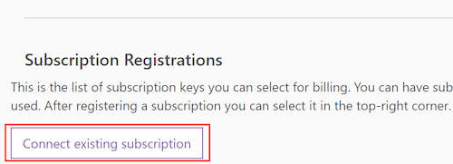

# Fine-tune text-to-speech output

Azure Speech Services allow you to adjust the speed, pronunciation, volume, pitch, and contour of text-to-speech output using [Speech Synthesis Markup Language (SSML)](speech-synthesis-markup.md). SSML is an XML-based markup language that uses tags to inform the service about what feature requires tuning. The SSML message is then sent in the body of each request to the text-to-speech service. To simplify the customization process, the Speech Services now offer a [Voice Tuning](https://aka.ms/voicetuning) tool that allows you to visually inspect and fine-tune text-to-speech outputs in real time.

The Voice Tuning tool supports Microsoft's [standard](language-support.md#standard-voices), [neural](language-support.md#text-to-speech), and [custom voices](how-to-customize-voice-font.md).

## Get started with the Voice Tuning tool

Before you can start fine-tuning the text-to-speech output with the Voice Tuning tool, you'll need to complete these steps:

1. Create a [free Microsoft account](https://account.microsoft.com/account) if you don't already have one.
2. Create a [free Azure account](https://azure.microsoft.com/free/) if you don't already have one. Click **Start Free**, and create a new Azure account using your Microsoft account.

3. Create a Speech Services subscription in the Azure portal. Step-by-step instructions for [how to create a speech resource](https://docs.microsoft.com/azure/cognitive-services/speech-service/get-started#create-a-speech-resource-in-azure) are available.
   >[!NOTE]
   >When you create a speech resource in the Azure portal, the Azure location information needs to match with the TTS voice region. Neural TTS voice supports a sub set of Azure locations. For a full list of support, see [Regions](regions.md#text-to-speech).

   >[!NOTE]
   >You need to have a F0 or a S0 key created in the Azure portal before you can use the service. Voice Tuning  **doesn't** support the [30-day free trial key](https://docs.microsoft.com/azure/cognitive-services/speech-service/get-started?branch=release-build-cogserv-speech-services#free-trial).

4. Sign in to the [Voice Tuning](https://aka.ms/voicetuning) portal, and connect your Speech Services subscription. Choose a single Speech Services subscription and then create a project.
5. Select **New Tuning**. Then follow these steps:

   * Locate and select **All Subscriptions**.  
   * Select **Connect existing subscription**.  
     .
   * Enter your Azure Speech Services subscription key, then select **Add**. Your subscription keys are available in the Speech customization portal from the [Subscription page](https://go.microsoft.com/fwlink/?linkid=2090458). You could also get the keys from the Resource Management pane in the [Azure portal](https://portal.azure.com/).
   * If you have more than one Speech Services subscription that you plan to use, repeat these steps for each subscription.

## Customize the text-to-speech output

Now that you've created accounts and linked your subscription, you can start tuning the text-to-speech output.

1. Choose a voice.
2. Input the text you want to edit.
3. Before you start making edits, play the audio to get a feel for the output.
4. Select the word/sentence you want to refine, and start experimenting with different SSML-based functions.

>[!TIP]
> For detailed information about adjusting SSML and tuning the voice output, see [Speech Synthesis Markup Language (SSML)](speech-synthesis-markup.md).

## Limitations

Neural Voice tuning is slightly different than tuning for Standard and Custom voices.

* Intonation is not supported for Neural voices.
* Pitch and volume features only work with complete sentences. These features are not available at the word-level.
* For rate, some Neural voices can be tuned based on words, while others require you to select whole sentences.

> [!TIP]
> The Voice Tuning tool provides contextual information about features and tuning.

## Next steps
* [Create a Speech resource in Azure](https://docs.microsoft.com/azure/cognitive-services/speech-service/get-started#create-a-speech-resource-in-azure)
* [Start Voice Tuning](https://speech.microsoft.com/app.html#/VoiceTuning)
* [Speech Synthesis Markup Language (SSML)](speech-synthesis-markup.md)
