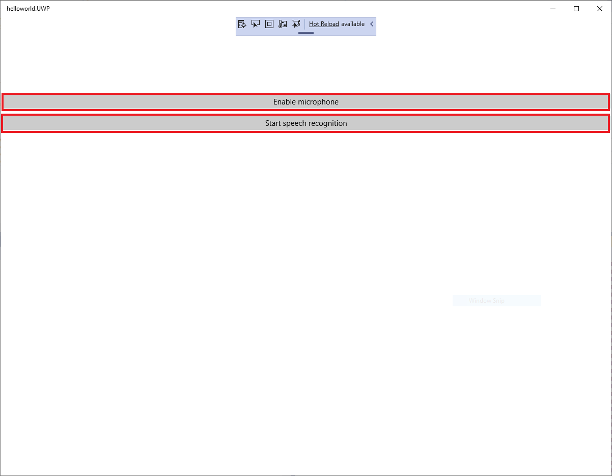
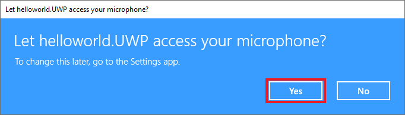
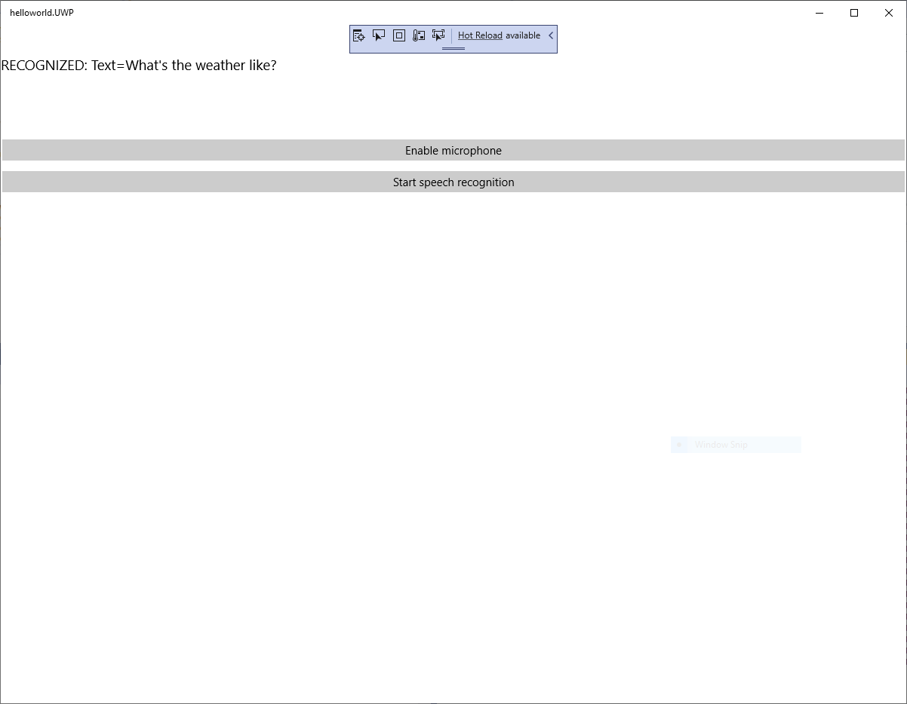

## Prerequisites

Before you get started:

> [!div class="checklist"]
> * [Create an Azure Speech Resource](../../../../get-started.md)
> * [Setup your development environment and create an empty project](../../../../quickstarts/setup-platform.md?tabs=xamarin&pivots=programming-language-csharp)
> * Make sure that you have access to a microphone for audio capture

If you've already done this, great. Let's keep going.

## Add sample code for the common helloworld project

The common helloworld project contains platform-independent implementations for your cross-platform application. Now add the XAML code that defines the user interface of the application, and add the C# code behind the implementation.

1. In **Solution Explorer**, under the common helloworld project, open `MainPage.xaml`.

1. In the designer's XAML view, insert the following XAML snippet into the **Grid** tag between `<StackLayout>` and `</StackLayout>`:

   [!code-xml[UI elements](~/samples-cognitive-services-speech-sdk/quickstart/csharp/xamarin/helloworld/helloworld/MainPage.xaml)]

1. In **Solution Explorer**, open the code-behind source file `MainPage.xaml.cs`. It's grouped under `MainPage.xaml`.

1. Replace all the code in it with the following snippet:

   [!code-csharp[Quickstart code](~/samples-cognitive-services-speech-sdk/quickstart/csharp/xamarin/helloworld/helloworld/MainPage.xaml.cs)]

1. In the source file's `OnRecognitionButtonClicked` handler, find the string `YourSubscriptionKey`, and replace it with your subscription key.


1. In the `OnRecognitionButtonClicked` handler, find the string `YourServiceregion`, and replace it with the **Region identifier** from [region](https://aka.ms/speech/sdkregion) associated with your subscription. (For example, use `westus` for the free trial subscription.)

1. Next, you need to create a [Xamarin Service](https://docs.microsoft.com/xamarin/android/app-fundamentals/services/creating-a-service/), which is used to query microphone permissions from different platform projects, such as UWP, Android, and iOS. To do that, add a new folder named *Services* under the helloworld project, and create a new C# source file under it. You can right-click the *Services* folder, and select **Add** > **New Item** > **Code File**. Rename the file `IMicrophoneService.cs`, and place all code from the following snippet in that file:

   [!code-csharp[Quickstart code](~/samples-cognitive-services-speech-sdk/quickstart/csharp/xamarin/helloworld/helloworld/Services/IMicrophoneService.cs)]

#### [Android](#tab/x-android)
## Add sample code for the `helloworld.Android` project

Now add the C# code that defines the Android-specific part of the application.

1. In **Solution Explorer**, under the helloworld.Android project, open `MainActivity.cs`.

1. Replace all the code in it with the following snippet:

   [!code-csharp[Quickstart code](~/samples-cognitive-services-speech-sdk/quickstart/csharp/xamarin/helloworld/helloworld.Android/MainActivity.cs)]

1. Next, add Android-specific implementation for `MicrophoneService` by creating the new folder *Services* under the helloworld.Android project. After that, create a new C# source file under it. Rename the file `MicrophoneService.cs`. Copy and paste the following code snippet into that file:

   [!code-csharp[Quickstart code](~/samples-cognitive-services-speech-sdk/quickstart/csharp/xamarin/helloworld/helloworld.Android/Services/MicrophoneService.cs)]

1. After that, open `AndroidManifest.xml` under the *Properties* folder. Add the following uses-permission setting for the microphone between `<manifest>` and `</manifest>`:

   ```xml
   <uses-permission android:name="android.permission.RECORD_AUDIO" />
   ```
   
#### [iOS](#tab/ios)
## Add sample code for the `helloworld.iOS` project

Now add the C# code that defines the iOS-specific part of the application. Also create Apple device-specific configurations to the helloworld.iOS project.

1. In **Solution Explorer**, under the helloworld.iOS project, open `AppDelegate.cs`.

1. Replace all the code in it with the following snippet:

   [!code-csharp[Quickstart code](~/samples-cognitive-services-speech-sdk/quickstart/csharp/xamarin/helloworld/helloworld.iOS/AppDelegate.cs)]

1. Next, add iOS-specific implementation for `MicrophoneService` by creating the new folder *Services* under the helloworld.iO project. After that, create a new C# source file under it. Rename the file `MicrophoneService.cs`. Copy and paste the following code snippet into that file:

   [!code-csharp[Quickstart code](~/samples-cognitive-services-speech-sdk/quickstart/csharp/xamarin/helloworld/helloworld.iOS/Services/MicrophoneService.cs)]

1. Open `Info.plist` under the helloworld.iOS project in the text editor. Add the following key value pair under the dict section:

   <key>NSMicrophoneUsageDescription</key>
   <string>This sample app requires microphone access</string>

   > [!NOTE]
   > If you're building for an iPhone device, ensure that `Bundle Identifier` matches your device's provisioning profile app ID. Otherwise, the build will fail. With iPhoneSimulator, you can leave it as is.

1. If you're building on a Windows PC, establish a connection to the Mac device for building via **Tools** > **iOS** > **Pair to Mac**. Follow the instruction wizard provided by Visual Studio to enable the connection to the Mac device.

#### [UWP](#tab/helloworlduwp)
## Add sample code for the `helloworld.UWP` project

## Add sample code for the helloworld.UWP project

Now add the C# code that defines the UWP-specific part of the application.

1. In **Solution Explorer**, under the helloworld.UWP project, open `MainPage.xaml.cs`.

1. Replace all the code in it with the following snippet:

   [!code-csharp[Quickstart code](~/samples-cognitive-services-speech-sdk/quickstart/csharp/xamarin/helloworld/helloworld.UWP/MainPage.xaml.cs)]

1. Next, add a UWP-specific implementation for `MicrophoneService` by creating the new folder *Services* under the helloworld.UWP project. After that, create a new C# source file under it. Rename the file `MicrophoneService.cs`. Copy and paste the following code snippet into that file:

   [!code-csharp[Quickstart code](~/samples-cognitive-services-speech-sdk/quickstart/csharp/xamarin/helloworld/helloworld.UWP/Services/MicrophoneService.cs)]

1. Next, double-click the `Package.appxmanifest` file under the helloworld.UWP project inside Visual Studio. Under **Capabilities**, make sure that **Microphone** is selected, and save the file.

1. Next double click `Package.appxmanifest` file under the `helloworld.UWP` project inside Visual Studio and under **Capabilities** > **Microphone** is checked and save the file.
   > Note: In case you see warning : Certificate file does not exist: helloworld.UWP_TemporaryKey.pfx, please check [speech to text](~/articles/cognitive-services/Speech-Service/quickstarts/speech-to-text-from-microphone.md?pivots=programming-language-csharp&tabs=uwp) sample for more information.

1. From the menu bar, select **File** > **Save All** to save your changes.

## Build and run the UWP application

1. Set helloworld.UWP as a startup project. Right-click the helloworld.UWP project, and select **Build** to build the application.

1. Select **Debug** > **Start Debugging** (or select **F5**) to start the application. The **helloworld** window appears.

   

1. Select **Enable Microphone**. When the access permission request appears, select **Yes**.

   

1. Select **Start Speech recognition**, and speak an English phrase or sentence into your device's microphone. Your speech is transmitted to the Speech service and transcribed to text, which appears in the window.

   
* * *

## Build and run the Android and iOS applications

Building and running Android and iOS applications in the device or simulator happen in a similar way to the UWP. Make sure all SDKs are installed correctly as required in the "Prerequisites" section of this article.

## Next steps

[!INCLUDE [Speech recognition basics](../../speech-to-text-next-steps.md)]
