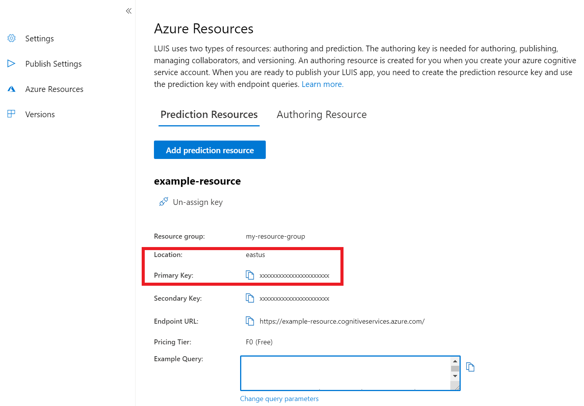
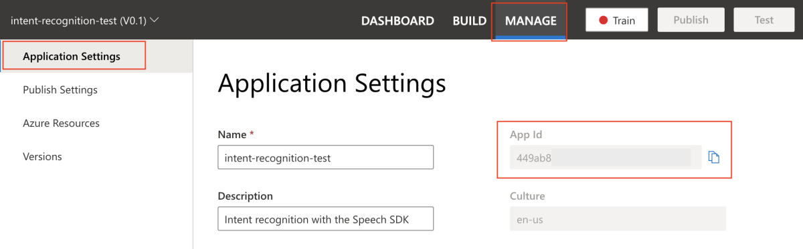

To complete the intent recognition quickstart, you'll need to create a LUIS account and a project using the LUIS preview portal. This quickstart only requires a LUIS subscription. A Speech service subscription isn't required. Keep this in mind, later in this quickstart you'll be using your LUIS key and app ID.

The first thing you'll need to do is create a LUIS account and app using the LUIS preview portal. The LUIS app that you create will use a prebuilt domain for home automation, which provides  intents, entities, and example utterances. When you're finished, you'll have a LUIS endpoint running in the cloud that you can call using the Speech SDK. 

Follow these instructions to create your LUIS app: 

* [Quickstart: Build prebuilt domain app](../../../../luis/luis-get-started-create-app.md)

When you're done, you'll need three things: 

* Your LUIS key
* Your LUIS region
* Your LUIS app ID

Here's where you can find this information in the [LUIS preview portal](https://preview.luis.ai/):

1. From the LUIS preview portal, select **Manage**, then select **Azure Resources**. On this page, you'll find your LUIS key and location (also referred to as _region_).  

   

2. After you've got your key and location, you'll need the app ID. Select **Application Settings** -- your app ID is available on this page.

   