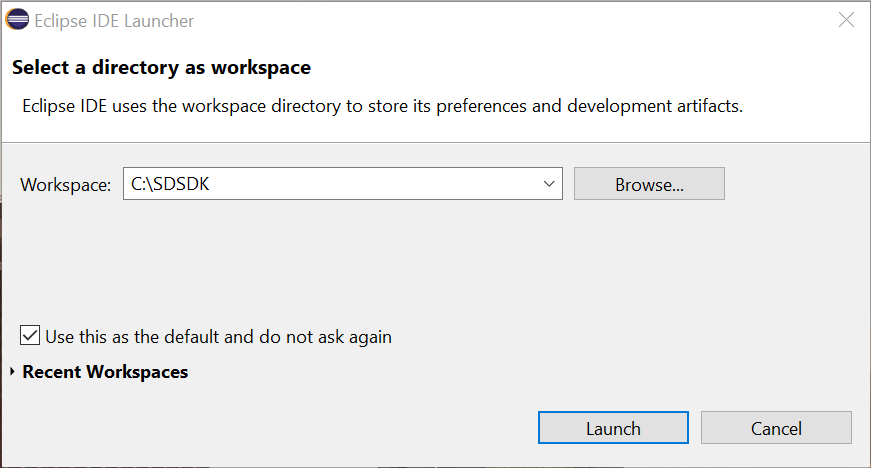
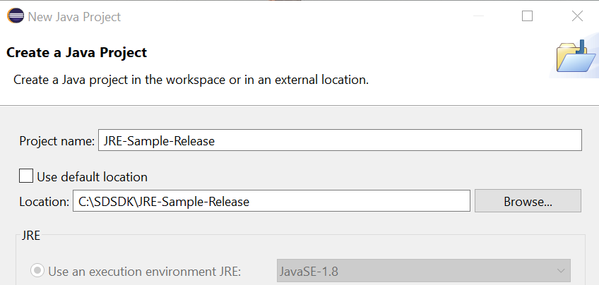
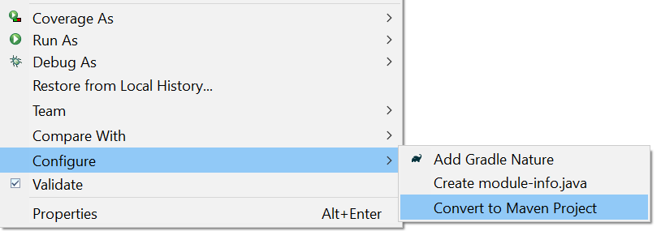
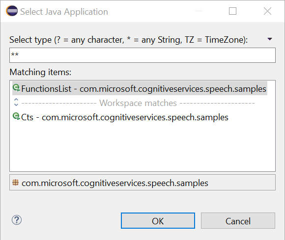
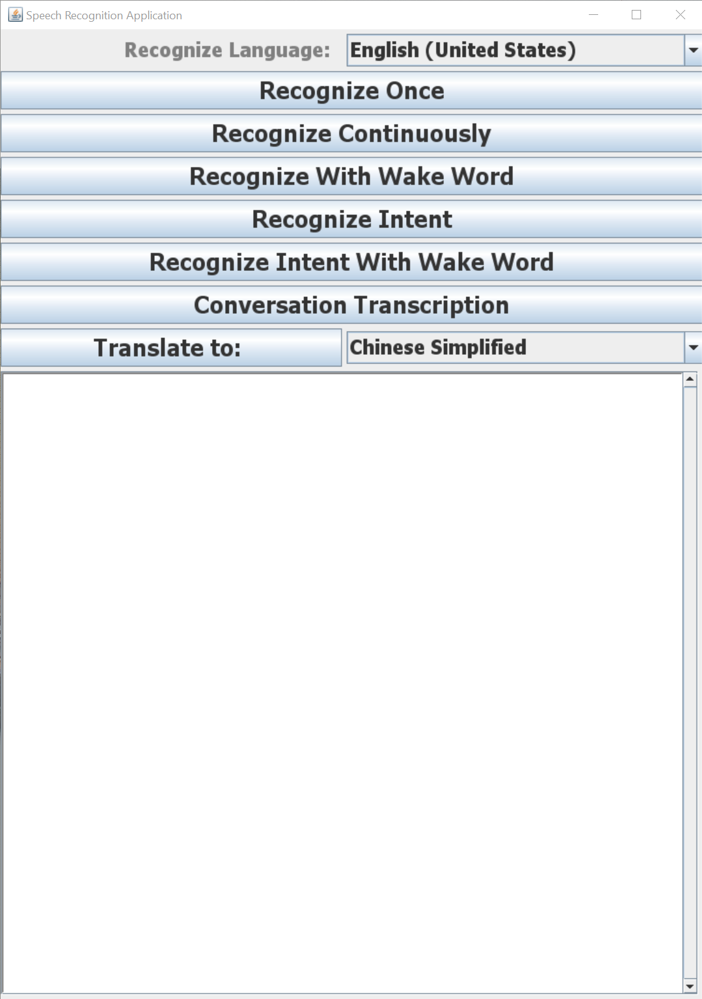
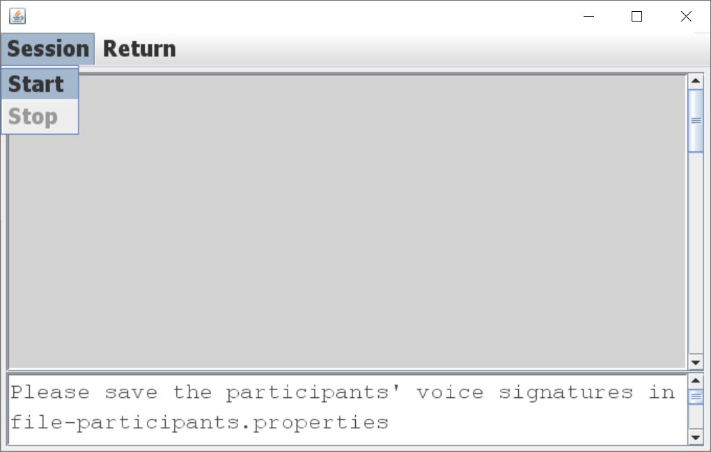
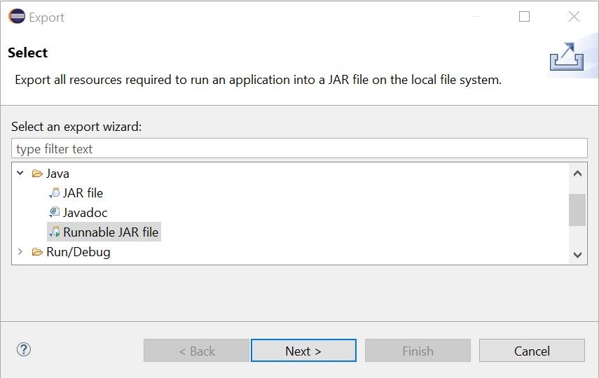
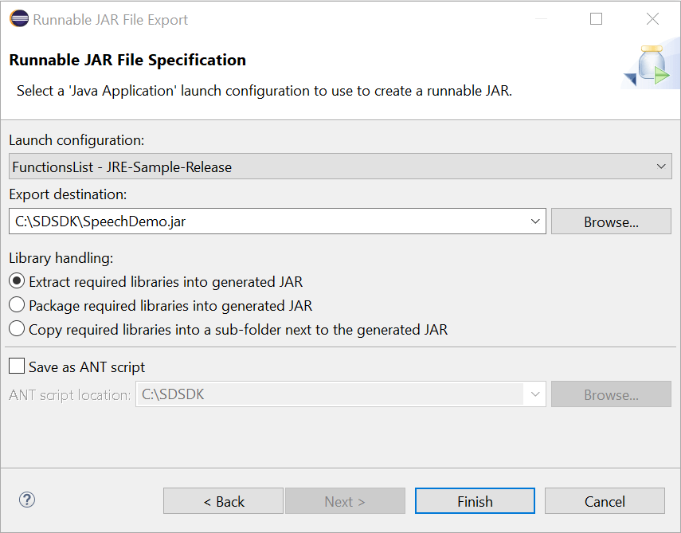

In this quickstart, you'll learn how to use the Speech Devices SDK for Windows to build a speech-enabled product or use it as a [Conversation Transcription](../conversation-transcription-service.md) device. For Conversation Transcription only the [Azure Kinect DK](https://azure.microsoft.com/services/kinect-dk/) is supported. For other speech use linear mic arrays that provide a microphone array geometry are supported.

The application is built with the Speech SDK package, and the Eclipse Java IDE (v4) on 64-bit Windows. It runs on a 64-bit Java 8 runtime environment (JRE).

This guide requires an [Azure Cognitive Services](../get-started.md) account with a Speech service resource. If you don't have an account, you can use the [free trial](https://azure.microsoft.com/try/cognitive-services/) to get a subscription key.

The source code for the [sample application](https://aka.ms/sdsdk-download-JRE) is included with the Speech Devices SDK. It's also [available on GitHub](https://github.com/Azure-Samples/Cognitive-Services-Speech-Devices-SDK).

## Prerequisites

This quickstart requires:

* Operating System: 64-bit Windows
* A microphone array such as [Azure Kinect DK](https://azure.microsoft.com/services/kinect-dk/)
* [Eclipse Java IDE](https://www.eclipse.org/downloads/)
* [Java 8](https://www.oracle.com/technetwork/java/javase/downloads/jre8-downloads-2133155.html) or [JDK 8](https://www.oracle.com/technetwork/java/javase/downloads/index.html) only.
* [Microsoft Visual C++ Redistributable](https://support.microsoft.com/help/2977003/the-latest-supported-visual-c-downloads)
* An Azure subscription key for the Speech service. [Get one for free](../get-started.md).
* Download the latest version of the [Speech Devices SDK](https://aka.ms/sdsdk-download-JRE) for Java, and extract the .zip to your working directory.
   > [!NOTE]
   > This quickstart assumes that the app is extracted to C:\SDSDK\JRE-Sample-Release

Conversation Transcription is currently only available for "en-US" and "zh-CN", in the “centralus” and “eastasia” regions. You must have a speech key in one of those regions to use Conversation Transcription.

If you plan to use the intents you'll need a [Language Understanding Service (LUIS)](https://docs.microsoft.com/azure/cognitive-services/luis/azureibizasubscription) subscription. To learn more about LUIS and intent recognition, see [Recognize speech intents with LUIS, C#](https://docs.microsoft.com/azure/cognitive-services/speech-service/how-to-recognize-intents-from-speech-csharp). A [sample LUIS model](https://aka.ms/sdsdk-luis) is available for this app.

## Create and configure the project

1. Start Eclipse.

1. In the **Eclipse IDE Launcher**, in the **Workspace** field, enter the name of a new workspace directory. Then select **Launch**.

   

1. In a moment, the main window of the Eclipse IDE appears. Close the Welcome screen if one is present.

1. From the Eclipse menu bar, create a new project by choosing **File** > **New** > **Java Project**. If not available choose **Project** and then **Java Project**.

1. The **New Java Project** wizard starts. **Browse** for the location of the sample project. Select **Finish**.

   

1. In the **Package explorer**, right-click your project. Choose **Configure** > **Convert to Maven Project** from the context menu. Select **Finish**.

   

1. Open the pom.xml file and edit it.

    At the end of the file, before the closing tag `</project>`, create `repositories` and `dependencies` elements, as shown here, and ensure the `version` matches your current version:
    ```xml
    <repositories>
         <repository>
             <id>maven-cognitiveservices-speech</id>
             <name>Microsoft Cognitive Services Speech Maven Repository</name>
             <url>https://csspeechstorage.blob.core.windows.net/maven/</url>
         </repository>
    </repositories>
 
    <dependencies>
        <dependency>
             <groupId>com.microsoft.cognitiveservices.speech</groupId>
             <artifactId>client-sdk</artifactId>
             <version>1.12.1</version>
        </dependency>
    </dependencies>
   ```

1. Copy the contents of **Windows-x64** to the Java Project location, eg **C:\SDSDK\JRE-Sample-Release**

1. Copy `kws.table`, `participants.properties` and `Microsoft.CognitiveServices.Speech.extension.pma.dll` into the project folder **target\classes**

## Configure the sample application

1. Add your speech subscription key to the source code. If you want to try intent recognition, also add your [Language Understanding service](https://azure.microsoft.com/services/cognitive-services/language-understanding-intelligent-service/) subscription key and application ID.

   For speech and LUIS, your information goes into `FunctionsList.java`:

   ```java
    // Subscription
    private static String SpeechSubscriptionKey = "<enter your subscription info here>";
    private static String SpeechRegion = "westus"; // You can change this if your speech region is different.
    private static String LuisSubscriptionKey = "<enter your subscription info here>";
    private static String LuisRegion = "westus2"; // you can change this, if you want to test the intent, and your LUIS region is different.
    private static String LuisAppId = "<enter your LUIS AppId>";
   ```

   If you are using conversation transcription, your speech key and region information are also needed in `Cts.java`:

   ```java
    private static final String CTSKey = "<Conversation Transcription Service Key>";
    private static final String CTSRegion="<Conversation Transcription Service Region>";// Region may be "centralus" or "eastasia"
   ```

1. The default keyword (keyword) is "Computer". You can also try one of the other provided keywords, like "Machine" or "Assistant". The resource files for these alternate keywords are in the Speech Devices SDK, in the keyword folder. For example, `C:\SDSDK\JRE-Sample-Release\keyword\Computer` contains the files used for the keyword "Computer".

    > [!TIP]
    > You can also [create a custom keyword](../speech-devices-sdk-create-kws.md).

    To use a new keyword, update the following line in `FunctionsList.java`, and copy the keyword to your app. For example, to use the keyword 'Machine' from the keyword package `machine.zip`:

   * Copy the `kws.table` file from the zip package into the project folder **target/classes**.
   * Update the `FunctionsList.java` with the keyword name:

     ```java
     private static final String Keyword = "Machine";
     ```

## Run the sample application from Eclipse

1. From the Eclipse menu bar, **Run** > **Run As** > **Java Application**. Then select **FunctionsList** and **OK**.

   

1. The Speech Devices SDK example application starts and displays the following options:

   

1. Try the new **Conversation Transcription** demo. Start transcribing with **Session** > **Start**. By default everyone is a guest. However, if you have participant’s voice signatures they can be put into a file `participants.properties` in the project folder **target/classes**. To generate the voice signature, look at [Transcribe conversations (SDK)](../how-to-use-conversation-transcription-service.md).

   

## Create and run a standalone application

1. In the **Package explorer**, right-click your project. Choose **Export**.

1. The **Export** window appears. Expand **Java** and select **Runnable JAR file** and then select **Next**.

   

1. The **Runnable JAR File Export** window appears. Choose an **Export destination** for the application, and then select **Finish**.

   

1. Please put `kws.table`, `participants.properties`, `unimic_runtime.dll`, `pma.dll` and `Microsoft.CognitiveServices.Speech.extension.pma.dll` in the destination folder chosen above as these files are needed by the application.

1. To run the standalone application

   ```powershell
   java -jar SpeechDemo.jar
   ```
