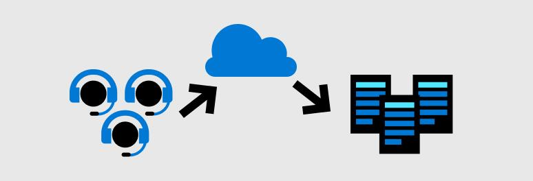
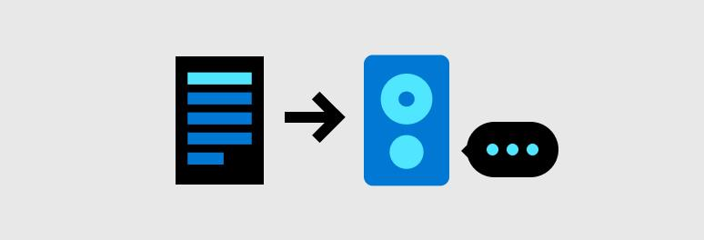
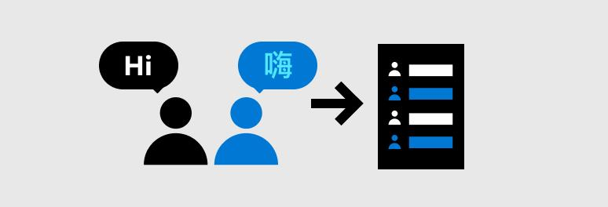

---
# aka.ms/skyeye/meta for more information
layout: HubPage
ms.date: 11-21-2019
ms.topic: hub-page
title: Speech Service Documentation
description: Get started with the Speech Services.
---

    

        <h1>Speech Service documentation</h1>
        <ul class="pivots">
            <li>
                <a href="#start">Get Started</a>
                <ul id="start">
                    <li>
                        <a href="#speechtotext">Speech-to-text</a>
                        <ul id="speechtotext" class="cardsC">
                            <li>
                                <a href="https://aka.ms/speech/sr-microphone">
                                    

                                        

                                            

                                                

                                                    

                                                        
                                                    

                                                

                                                

                                                    <h3>Recognize speech with a microphone</h3>
                                                    
Use the Speech SDK to recognize speech from a microphone and transcribe the output.

                                                

                                            

                                        

                                    

                                </a>
                            </li>
                            <li>
                                <a href="https://aka.ms/speech/sr-file">
                                    

                                        

                                            

                                                

                                                    

                                                        
                                                    

                                                

                                                

                                                    <h3>Recognize speech from an audio file</h3>
                                                    
Use the Speech SDK to recognize speech from a single file and transcribe the output.

                                                

                                            

                                        

                                    

                                </a>
                            </li>
                            <li>
                                <a href="https://aka.ms/speech/sr-blob">
                                    

                                        

                                            

                                                

                                                    

                                                        
                                                    

                                                

                                                

                                                    <h3>Asynchronous recognition from blob</h3>
                                                    
Use our REST service to asynchronously recognize speech from files stored in Azure Blob Storage.

                                                

                                            

                                        

                                    

                                </a>
                            </li>
                            <li>
                                <a href="https://aka.ms/speech/sr-languages">
                                    

                                        

                                            

                                                

                                                    

                                                        
                                                    

                                                

                                                

                                                    <h3>Language support</h3>
                                                    
Learn more about programming and spoken language support for speech-to-text.

                                                

                                            

                                        

                                    

                                </a>
                            </li>
                            <li>
                                <a href="https://aka.ms/speech/sr-pricing">
                                    

                                        

                                            

                                                

                                                    

                                                        
                                                    

                                                

                                                

                                                    <h3>Pricing</h3>
                                                    
Learn more about the costs associated with speech-to-text.

                                                

                                            

                                        

                                    

                                </a>
                            </li>
                            <li>
                                <a href="https://aka.ms/speech/sr-overview">
                                    

                                        

                                            

                                                

                                                    

                                                        
                                                    

                                                

                                                

                                                    <h3>Documentation</h3>
                                                    
Learn more about the Speech service and how to use it in your apps, tools, and products.

                                                

                                            

                                        

                                    

                                </a>
                            </li>
                        </ul>
                    </li>
                        <li>
                            <a href="#texttospeech">Text-to-speech</a>
                            <ul id="texttospeech" class="cardsC">
                            <li>
                                <a href="https://aka.ms/speech/tts-speaker">
                                    

                                        

                                            

                                                

                                                    

                                                        
                                                    

                                                

                                                

                                                    <h3>Synthesize speech to a speaker</h3>
                                                    
Use the Speech SDK to synthesize speech to an audio output, like a speaker.

                                                

                                            

                                        

                                    

                                </a>
                            </li>
                            <li>
                                <a href="https://aka.ms/speech/tts-file">
                                    

                                        

                                            

                                                

                                                    

                                                        
                                                    

                                                

                                                

                                                    <h3>Synthesize speech to an audio file</h3>
                                                    
Use the Speech SDK to synthesize speech to an audio file.

                                                

                                            

                                        

                                    

                                </a>
                            </li>                            
                            <li>
                                <a href="https://aka.ms/speech/tts-ssml">
                                    

                                        

                                            

                                                

                                                    

                                                        
                                                    

                                                

                                                

                                                    <h3>Speech Synthesis Markup Language</h3>
                                                    
Use Speech Synthesis Markup Language to fine tune pitch, prosody, and speaking rate of your audio output.

                                                

                                            

                                        

                                    

                                </a>
                            </li>
                            <li>
                                <a href="https://aka.ms/speech/tts-languages">
                                    

                                        

                                            

                                                

                                                    

                                                        
                                                    

                                                

                                                

                                                    <h3>Language support</h3>
                                                    
Learn what languages are supported for speech synthesis.

                                                

                                            

                                        

                                    

                                </a>
                            </li>
                            <li>
                                <a href="https://aka.ms/speech/tts-pricing">
                                    

                                        

                                            

                                                

                                                    

                                                        
                                                    

                                                

                                                

                                                    <h3>Pricing</h3>
                                                    
Learn more about the costs associated with text-to-speech.

                                                

                                            

                                        

                                    

                                </a>
                            </li>
                            <li>
                                <a href="https://aka.ms/speech/tts-overview">
                                    

                                        

                                            

                                                

                                                    

                                                        
                                                    

                                                

                                                

                                                    <h3>Documentation</h3>
                                                    
Learn more about the Speech service and how to use it in your apps, tools, and products.

                                                

                                            

                                        

                                    

                                </a>
                            </li>
                        </ul>
                    </li>
                    <li>
                        <a href="#intentrecognition">Intent recognition</a>
                        <ul id="intentrecognition" class="cardsC">
                            <li>
                                <a href="https://aka.ms/speech/intent-microphone">
                                    

                                        

                                            

                                                

                                                    

                                                        
                                                    

                                                

                                                

                                                    <h3>Recognize speech, intents, and entities</h3>
                                                    
Use the Speech SDK and LUIS to recognize speech, intents, and entities.

                                                

                                            

                                        

                                    

                                </a>
                            </li>
                            <li>
                                <a href="https://aka.ms/speech/intent-luis-docs">
                                    

                                        

                                            

                                                

                                                    

                                                        
                                                    

                                                

                                                

                                                    <h3>LUIS documentation</h3>
                                                    
Learn more about the Language Understanding Service (LUIS) and Natural Language Processing (NLP).

                                                

                                            

                                        

                                    

                                </a>
                            </li>
                            <li>
                                <a href="https://www.luis.ai/">
                                    

                                        

                                            

                                                

                                                    

                                                        
                                                    

                                                

                                                

                                                    <h3>LUIS portal</h3>
                                                    
Build natural language into apps, bots, and IoT devices.

                                                

                                            

                                        

                                    

                                </a>
                            </li>
                        </ul>
                    </li>
                    <li>
                        <a href="#speechtranslation">Speech translation</a>
                        <ul id="speechtranslation" class="cardsC">
                            <li>
                                <a href="https://aka.ms/speech/sttt-microphone">
                                    

                                        

                                            

                                                

                                                    

                                                        
                                                    

                                                

                                                

                                                    <h3>Translate speech-to-text from microphone</h3>
                                                    
Use the Speech SDK to translate speech-to-text from a microphone.

                                                

                                            

                                        

                                    

                                </a>
                            </li>
                            <li>
                                <a href="https://aka.ms/speech/sttt-multiple-languages">
                                    

                                        

                                            

                                                

                                                    

                                                        
                                                    

                                                

                                                

                                                    <h3>Translate speech to multiple target languages</h3>
                                                    
Use the Speech SDK to translate speech to multiple target language outputs.

                                                

                                            

                                        

                                    

                                </a>
                            </li>
                            <li>
                                <a href="https://aka.ms/speech/stst-microphone">
                                    

                                        

                                            

                                                

                                                    

                                                        
                                                    

                                                

                                                

                                                    <h3>Translate speech-to-speech</h3>
                                                    
Use the Speech SDK to translate speech to speech.

                                                

                                            

                                        

                                    

                                </a>
                            </li>
                            <li>
                                <a href="https://aka.ms/speech/sttt-languages">
                                    

                                        

                                            

                                                

                                                    

                                                        
                                                    

                                                

                                                

                                                    <h3>Language support</h3>
                                                    
Learn more about programming and spoken language support for speech translation.

                                                

                                            

                                        

                                    

                                </a>
                            </li>
                            <li>
                                <a href="https://aka.ms/speech/sttt-pricing">
                                    

                                        

                                            

                                                

                                                    

                                                        
                                                    

                                                

                                                

                                                    <h3>Pricing</h3>
                                                    
Learn more about the costs associated with speech translation.

                                                

                                            

                                        

                                    

                                </a>
                            </li>
                            <li>
                                <a href="https://aka.ms/speech/sttt-overview">
                                    

                                        

                                            

                                                

                                                    

                                                        
                                                    

                                                

                                                

                                                    <h3>Documentation</h3>
                                                    
Learn more about the Speech service and how to use it in your apps, tools, and products.

                                                

                                            

                                        

                                    

                                </a>
                            </li>
                        </ul>
                    </li>
                    <li>
                        <a href="#conversationtranscription">Conversation transcription</a>
                        <ul id="conversationtranscription" class="cardsC">
                            <li>
                                <a href="https://aka.ms/speech/cts-overview">
                                    

                                        

                                            

                                                

                                                    

                                                        
                                                    

                                                

                                                

                                                    <h3>Overview</h3>
                                                    
Learn more about Conversation Transcription and how to integrate it into your products.

                                                

                                            

                                        

                                    

                                </a>
                            </li>
                            <li>
                                <a href="https://aka.ms/speech/cts-microphone">
                                    

                                        

                                            

                                                

                                                    

                                                        
                                                    

                                                

                                                

                                                    <h3>Transcribe a real-time conversation</h3>
                                                    
Learn how to transcribe a conversation in real time.

                                                

                                            

                                        

                                    

                                </a>
                            </li>
                            <li>
                                <a href="https://aka.ms/speech/cts-async-op">
                                    

                                        

                                            

                                                

                                                    

                                                        
                                                    

                                                

                                                

                                                    <h3>Asynchronously transcribe conversations</h3>
                                                    
Learn how to asynchronously transcribe conversations, poll for status, and download the outputs.

                                                

                                            

                                        

                                    

                                </a>
                            </li>
                            <li>
                                <a href="https://aka.ms/speech/cts-languages">
                                    

                                        

                                            

                                                

                                                    

                                                        
                                                    

                                                

                                                

                                                    <h3>Language support</h3>
                                                    
Learn more about programming and spoken language support for conversation transcription.

                                                

                                            

                                        

                                    

                                </a>
                            </li>
                            <li>
                                <a href="https://aka.ms/speech/cts-pricing">
                                    

                                        

                                            

                                                

                                                    

                                                        
                                                    

                                                

                                                

                                                    <h3>Pricing</h3>
                                                    
Learn more about the costs associated with Conversation Transcription.

                                                

                                            

                                        

                                    

                                </a>
                            </li>
                        </ul>
                    </li>
                    <li>
                        <a href="#voice-assistants">Voice assistants</a>
                        <ul id="voice-assistants" class="cardsC">
                            <li>
                                <a href="https://aka.ms/speech/va-overview">
                                    

                                        

                                            

                                                

                                                    

                                                        
                                                    

                                                

                                                

                                                    <h3>Overview</h3>
                                                    
Learn more about what it takes to build a voice assistant.

                                                

                                            

                                        

                                    

                                </a>
                            </li>
                            <li>
                                <a href="https://aka.ms/speech/va-bot-framework">
                                    

                                        

                                            

                                                

                                                    

                                                        
                                                    

                                                

                                                

                                                    <h3>Integrate with Bot Framework</h3>
                                                    
Learn more about the Bot Framework, Direct Line Speech Channel, and more.

                                                

                                            

                                        

                                    

                                </a>
                            </li>
                            <li>
                                <a href="https://aka.ms/speech/va-no-code">
                                    

                                        

                                            

                                                

                                                    

                                                        
                                                    

                                                

                                                

                                                    <h3>Use Custom Commands</h3>
                                                    
Learn to build simple and robust command and control interactions with language understanding and error correction.

                                                

                                            

                                        

                                    

                                </a>
                            </li>
                        </ul>
                    </li>
                    <li>
                        <a href="#support">Support</a>
                        <ul id="support" class="cardsC">
                            <li>
                                <a href="https://ms.portal.azure.com/#blade/Microsoft_Azure_Support/HelpAndSupportBlade/overview">
                                    

                                        

                                            

                                                

                                                    

                                                        
                                                    

                                                

                                                

                                                    <h3>Azure support</h3>
                                                    
Explore the range of Azure support options and choose the plan that best fits your needs.

                                                

                                            

                                        

                                    

                                </a>
                            </li>
                            <li>
                                <a href="https://stackoverflow.com/questions/tagged/microsoft-cognitive">
                                    

                                        

                                            

                                                

                                                    

                                                        
                                                    

                                                

                                                

                                                    <h3>Stack Overflow</h3>
                                                    
	For immediate answers from the community, look to Stack Overflow as the preferred channel for development related questions.

                                                

                                            

                                        

                                    

                                </a>
                            </li>
                            <li>
                                <a href="https://cognitive.uservoice.com/forums/912208-speech-service">
                                    

                                        

                                            

                                                

                                                    

                                                        
                                                    

                                                

                                                

                                                    <h3>UserVoice forum</h3>
                                                    
Share your ideas for making Speech Services and the accompanying APIs work better for the applications you develop.

                                                

                                            

                                        

                                    

                                </a>
                            </li>
                            <li>
                                <a href="https://github.com/Azure-Samples?utf8=%E2%9C%93&q=cognitive&type=&language=">
                                    

                                        

                                            

                                                

                                                    

                                                        
                                                    

                                                

                                                

                                                    <h3>GitHub samples</h3>
                                                    
For questions and issues, create an issue in the respective GitHub repository. You can even submit a pull request.

                                                

                                            

                                        

                                    

                                </a>
                            </li>
                            <li>
                                <a href="releasenotes.md">
                                    

                                        

                                            

                                                

                                                    

                                                        
                                                    

                                                

                                                

                                                    <h3>What's new?</h3>
                                                    
When developing a Speech Services solution learn what changes are happening to the SDKs and REST APIs with release notes.

                                                

                                            

                                        

                                    

                                </a>
                            </li>
                            <li>
                                <a href="https://azure.microsoft.com/blog/topics/cognitive-services">
                                    

                                        

                                            

                                                

                                                    

                                                        
                                                    

                                                

                                                

                                                    <h3>Azure blog</h3>
                                                    
News about Cognitive Services is often shared in the Azure blog.

                                                

                                            

                                        

                                    

                                </a>
                            </li>
                        </ul>
                    </li>
                </ul>
            </li>
            <li>
                <a href="#customization">Customization</a>
                <ul id="customization">
                    <li>
                        <a href="#speech-to-text-customization">Speech-to-text</a>
                        <ul id="speech-to-text-customization" class="cardsC">
                            <li>
                                <a href="https://aka.ms/speech/phrase-list">
                                    

                                        

                                            

                                                

                                                    

                                                        
                                                    

                                                

                                                

                                                    <h3>Improve accuracy with Phrase Lists</h3>
                                                    
Use Phrase Lists in the Speech SDK to improve recognition accuracy.

                                                

                                            

                                        

                                    

                                </a>
                            </li>
                            <li>
                                <a href="https://aka.ms/speech/tlm-overview">
                                    

                                        

                                            

                                                

                                                    

                                                        
                                                    

                                                

                                                

                                                    <h3>Improve accuracy with Tenant Models</h3>
                                                    
Generate custom models with Office365 data to optimize speech recognition accuracy for organization-specific terms.

                                                

                                            

                                        

                                    

                                </a>
                            </li>
                            <li>
                                <a href="https://aka.ms/speech/custom-sr-overview">
                                    

                                        

                                            

                                                

                                                    

                                                        
                                                    

                                                

                                                

                                                    <h3>Improve accuracy with Custom Speech</h3>
                                                    
A set of online tools that allow you to evaluate and improve Microsoft's speech-to-text accuracy for your apps, tools, and products.

                                                

                                            

                                        

                                    

                                </a>
                            </li>
                            <li>
                                <a href="https://aka.ms/speech/custom-sr-languages">
                                    

                                        

                                            

                                                

                                                    

                                                        
                                                    

                                                

                                                

                                                    <h3>Language support</h3>
                                                    
Learn more about programming and spoken language support for Custom Speech.

                                                

                                            

                                        

                                    

                                </a>
                            </li>
                            <li>
                                <a href="https://aka.ms/speech/custom-sr-pricing">
                                    

                                        

                                            

                                                

                                                    

                                                        
                                                    

                                                

                                                

                                                    <h3>Pricing</h3>
                                                    
Learn more about the costs associated with Custom Speech.
                                                    

                                                

                                            

                                        

                                    

                                </a>
                            </li>
                        </ul>
                    </li>
                    <li>
                        <a href="#text-to-speech-customization">Text-to-speech</a>
                        <ul id="text-to-speech-customization" class="cardsC">
                            <li>
                                <a href="https://aka.ms/speech/tts-ssml">
                                    

                                        

                                            

                                                

                                                    

                                                        
                                                    

                                                

                                                

                                                    <h3>Improve synthesis with SSML</h3>
                                                    
Use Speech Synthesis Markup Language to fine tune pitch, prosody, and speaking rate of your audio output.
                                                    

                                                

                                            

                                        

                                    

                                </a>
                            </li>
                            <li>
                                <a href="https://aka.ms/speech/custom-tts-overview">
                                    

                                        

                                            

                                                

                                                    

                                                        
                                                    

                                                

                                                

                                                    <h3>Improve synthesis with Custom Voice</h3>
                                                    
Build a recognizable, one-of-a-kind voice for your Text-to-Speech apps with your speaking data available.

                                                

                                            

                                        

                                    

                                </a>
                            </li>
                            <li>
                                <a href="https://aka.ms/speech/custom-tts-audio-content-creation">
                                    

                                        

                                            

                                                

                                                    

                                                        
                                                    

                                                

                                                

                                                    <h3>Improve synthesis with Audio Content Creation</h3>
                                                    
Use the Audio Content Creation tool to fine-tune your synthesized voice outputs.

                                                

                                            

                                        

                                    

                                </a>
                            </li>
                            <li>
                                <a href="https://aka.ms/speech/custom-tts-neural">
                                    

                                        

                                            

                                                

                                                    

                                                        
                                                    

                                                

                                                

                                                    <h3>Get access to Custom Neural Voices</h3>
                                                    
This is a gated feature that allows you to create a Custom Neural Voice. Learn more about access and restrictions.
                                                    

                                                

                                            

                                        

                                    

                                </a>
                            </li>
                            <li>
                                <a href="https://aka.ms/speech/custom-tts-pricing">
                                    

                                        

                                            

                                                

                                                    

                                                        
                                                    

                                                

                                                

                                                    <h3>Pricing</h3>
                                                    
Learn more about the costs associated with Custom Voice.
                                                    

                                                

                                            

                                        

                                    

                                </a>
                            </li>
                        </ul>
                    </li>
                </ul>
            </li>
            <li>
                <a href="#architecture">Architecture</a>
                <ul id="architecture">
                    <li>
                        <a href="#deploy-architecture">Deployment</a>
                        <ul id="deploy-architecture" class="cardsC">
                            <li>
                                <a href="speech-container-howto.md?tabs=stt">
                                    

                                        

                                            

                                                

                                                    

                                                        
                                                    

                                                

                                                

                                                    <h3>Deploy Speech-to-text Docker container</h3>
                                                    
Learn how to deploy speech recognition functionality as a container image.

                                                

                                            

                                        

                                    

                                </a>
                            </li>
                            <li>
                                <a href="speech-container-howto.md?tabs=tts">
                                    

                                        

                                            

                                                

                                                    

                                                        
                                                    

                                                

                                                

                                                    <h3>Deploy Text-to-speech Docker container</h3>
                                                    
Learn how to deploy speech synthesis functionality as a container image.

                                                

                                            

                                        

                                    

                                </a>
                            </li>
                            <li>
                                <a href="speech-container-howto-on-premises.md">
                                    

                                        

                                            

                                                

                                                    

                                                        
                                                    

                                                

                                                

                                                    <h3>Orchestration with Kubernetes & Helm</h3>
                                                    
Leverage industry-leading container orchestration, with on-premises Kubernetes clusters and Speech containers.

                                                

                                            

                                        

                                    

                                </a>
                            </li>
                            <li>
                                <a href="speech-container-howto.md?tabs=cstt">
                                    

                                        

                                            

                                                

                                                    

                                                        
                                                    

                                                

                                                

                                                    <h3>Deploy Custom Speech-to-text Docker container</h3>
                                                    
Learn how to deploy custom model speech recognition functionality as a container image.

                                                

                                            

                                        

                                    

                                </a>
                            </li>
                            <li>
                                <a href="speech-container-howto.md?tabs=ctts">
                                    

                                        

                                            

                                                

                                                    

                                                        
                                                    

                                                

                                                

                                                    <h3>Deploy Custom Text-to-speech Docker container</h3>
                                                    
Learn how to deploy custom model speech synthesis functionality as a container image.

                                                

                                            

                                        

                                    

                                </a>
                            </li>
                        </ul>
                    </li>
                    <li>
                        <a href="#misc-architecture">Design Scenarios</a>
                        <ul id="misc-architecture" class="cardsC">
                            <li>
                                <a href="call-center-transcription.md">
                                    

                                        

                                            

                                                

                                                    

                                                        
                                                    

                                                

                                                

                                                    <h3>Designing for telephony data with Speech Services</h3>
                                                    
Learn how to use the appropriate technologies available from Speech Services for telephony data application scenarios.

                                                

                                            

                                        

                                    

                                </a>
                            </li>
                            <li>
                                <a href="https://aka.ms/speech/va-overview">
                                    

                                        

                                            

                                                

                                                    

                                                        
                                                    

                                                

                                                

                                                    <h3>Overview</h3>
                                                    
Learn how to create natural, human-like conversational interfaces for your applications and experiences with Voice assistants.

                                                

                                            

                                        

                                    

                                </a>
                            </li>
                        </ul>
                    </li>
                </ul>
            </li>
        </ul>
    

