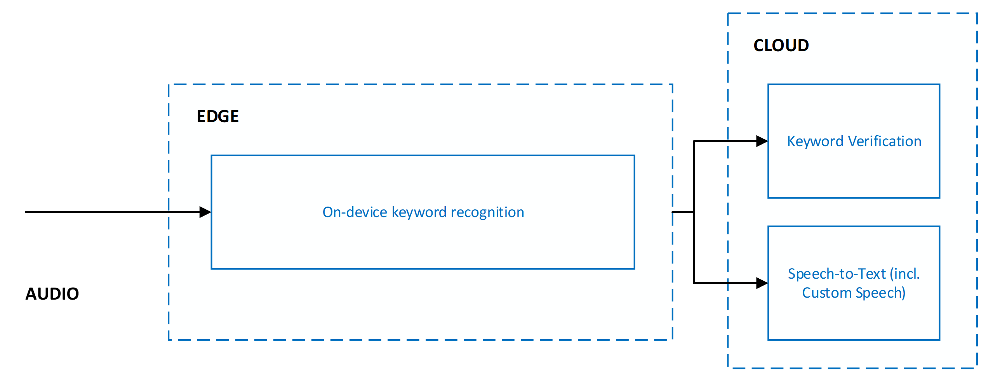

# Keyword recognition

Keyword recognition refers to speech technology that recognizes the existence of a word or short phrase within a given stream of audio. It is often synonymously referred to as keyword spotting. The most common use case of keyword recognition is voice activation of virtual assistants. For example, "Hey Cortana" is the keyword for the Cortana assistant. Upon recognition of the keyword, a scenario-specific action is carried out. For virtual assistant scenarios, a common resulting action is speech recognition of audio that follows the keyword.

Generally, virtual assistants are always listening. Keyword recognition acts as a privacy boundary for the user. A keyword requirement acts as a gate that prevents unrelated user audio from crossing the local device to the cloud.

To balance accuracy, latency, and computational complexity, keyword recognition is implemented as a multi-stage system. For all stages beyond the first, audio is only processed if the stage prior to it believed to have recognized the keyword of interest.

The current system is designed with multiple stages spanning across the edge and cloud:

Accuracy of keyword recognition is measured via the following metrics:
* **Correct accept rate (CA)** – Measures the system’s ability to recognize the keyword when it is spoken by an end-user. This is also known as the true positive rate. 
* **False accept rate (FA)** – Measures the system’s ability to filter out audio that is not the keyword spoken by an end-user. This is also known as the false positive rate.

The goal is to maximize the correct accept rate while minimizing the false accept rate. The current system is designed to detect a keyword or phrase preceded by a short amount of silence. Detecting a keyword in the middle of a sentence or utterance is not supported.

## Custom Keyword for on-device models

The [Custom Keyword portal on Speech Studio](https://speech.microsoft.com/customkeyword) allows you to generate keyword recognition models that execute at the edge by specifying any word or short phrase. You can further personalize your keyword model by choosing the right pronunciations.

### Pricing

There is no cost to using Custom Keyword for generating models, including both Basic and Advanced models. There is also no cost for running models on-device with the Speech SDK.

### Types of models

Custom Keyword allows you to generate two types of on-device models for any keyword:

| Model type | Description |
| ---------- | ----------- |
| Basic | Best suited for demo or rapid prototyping purposes. Models are generated with a common base model and can take up to 15 minutes to be ready. Models may not have optimal accuracy characteristics. |
| Advanced | Best suited for product integration purposes. Models are generated with adaptation of a common base model using simulated training data to improve accuracy characteristics. It can take up to 48 hours for models to be ready. |

Neither model type requires you to upload training data. Custom Keyword fully handles data generation and model training.

### Pronunciations

When creating a new model, Custom Keyword automatically generates possible pronunciations of the provided keyword. You can listen to each pronunciation and choose all that closely represent the way you expect end-users to say the keyword. All other pronunciations should not be selected.

It is important to be deliberate about the pronunciations you select to ensure the best accuracy characteristics. For example, choosing more pronunciations than needed can lead to higher false accept rates. Choosing too few pronunciations, where not all expected variations are covered, can lead to lower correct accept rates.

### Testing models

Once on-device models are generated by Custom Keyword, they can be tested directly on the portal. The portal allows you to speak directly into your browser and get keyword recognition results.

## Keyword Verification

Keyword Verification is a cloud service that reduces the impact of false accepts from on-device models with robust models running on Azure. There is no tuning or training required for Keyword Verification to work with your keyword. Incremental model updates are continually deployed to the service to improve accuracy and latency, completely transparent to client applications.

### Pricing

Keyword Verification is always used in combination with Speech-to-text, and there is no cost to using Keyword Verification beyond the cost of Speech-to-text.

### Keyword Verification and Speech-to-text

When Keyword Verification is used, it is always in combination with Speech-to-text. Both services run in parallel. This means that audio is sent to both services for simultaneous processing.

Running Keyword Verification and Speech-to-text in parallel yields the following benefits:
* **No additional latency on Speech-to-text results** – Parallel execution means Keyword Verification adds no latency, and the client receives Speech-to-text results just as quickly. If Keyword Verification determines the keyword was not present in the audio, Speech-to-text processing is terminated, which protects against unnecessary Speech-to-text processing. However, network and cloud model processing increases the user-perceived latency of voice activation. For details, see [Recommendations and guidelines](keyword-recognition-guidelines.md)).
* **Forced keyword prefix in Speech-to-text results** – Speech-to-text processing will ensure that the results sent to the client are prefixed with the keyword. This allows for increased accuracy in the Speech-to-text results for speech that follows the keyword.
* **Increased Speech-to-text timeout** – Due to the expected presence of the keyword at the beginning of audio, Speech-to-text will allow for a longer pause of up to 5 seconds after the keyword, before determining end of speech and terminating Speech-to-text processing. This ensures the end-user experience is correctly handled for both staged commands (*\<keyword> \<pause> \<command>*) and chained commands (*\<keyword> \<command>*). 

### Keyword Verification responses and latency considerations

For each request to the service, Keyword Verification will return one of two responses: Accepted or Rejected. The processing latency varies depending on the length of the keyword and the length of the audio segment expected to contain the keyword. Processing latency does not include network cost between the client and Azure Speech services.

| Keyword Verification response | Description |
| ----------------------------- | ----------- |
| Accepted | Indicates the service believed the keyword was present in the audio stream provided as part of the request. |
| Rejected | Indicates the service believed the keyword was not present in the audio stream provided as part of the request. |

Rejected cases often yield higher latencies as the service processes more audio than accepted cases. By default, Keyword Verification will process a maximum of two seconds of audio to search for the keyword. If the keyword is determined not to be present in the two seconds, the service will time out and signal a rejected response to the client.

### Using Keyword Verification with on-device models from Custom Keyword

The Speech SDK facilitates seamless use of on-device models generated using Custom Keyword with Keyword Verification and Speech-to-text. It transparently handles:
* Audio gating to Keyword Verification & Speech recognition based on the outcome of on-device model.
* Communicating the keyword to the Keyword Verification service.
* Communicating any additional metadata to the cloud for orchestrating the end-to-end scenario. 

You do not need to explicitly specify any configuration parameters. All necessary information will automatically be extracted from the on-device model generated by Custom Keyword.

The sample and tutorials linked below show how to use the Speech SDK:
 * [Voice assistant samples on GitHub](https://github.com/Azure-Samples/Cognitive-Services-Voice-Assistant)
 * [Tutorial: Voice enable your assistant built using Azure Bot Service with the C# Speech SDK](./tutorial-voice-enable-your-bot-speech-sdk.md)
 * [Tutorial: Create a Custom Commands application with simple voice commands](./how-to-develop-custom-commands-application.md)

## Speech SDK integration and scenarios

The Speech SDK facilitates easy use of personalized on-device keyword recognition models generated with Custom Keyword and the Keyword Verification service. To ensure your product needs can be met, the SDK supports two scenarios:

| Scenario | Description | Samples |
| -------- | ----------- | ------- |
| End-to-end keyword recognition with Speech-to-text | Best suited for products that will use a customized on-device keyword model from Custom Keyword with Azure Speech’s Keyword Verification and Speech-to-text services. This is the most common scenario. | <ul><li>[Voice assistant sample code.](https://github.com/Azure-Samples/Cognitive-Services-Voice-Assistant)</li><li>[Tutorial: Voice enable your assistant built using Azure Bot Service with the C# Speech SDK.](./tutorial-voice-enable-your-bot-speech-sdk.md)</li><li>[Tutorial: Create a Custom Commands application with simple voice commands.](./how-to-develop-custom-commands-application.md)</li></ul> |
| Offline keyword recognition | Best suited for products without network connectivity that will use a customized on-device keyword model from Custom Keyword. | <ul><li>[C# on Windows UWP sample.](https://github.com/Azure-Samples/cognitive-services-speech-sdk/tree/master/quickstart/csharp/uwp/keyword-recognizer)</li><li>[Java on Android sample.](https://github.com/Azure-Samples/cognitive-services-speech-sdk/tree/master/quickstart/java/android/keyword-recognizer)</li></ul>

## Next steps

* [Read the quickstart to generate on-device keyword recognition models using Custom Keyword.](custom-keyword-basics.md)
* [Learn more about Voice Assistants.](voice-assistants.md)
