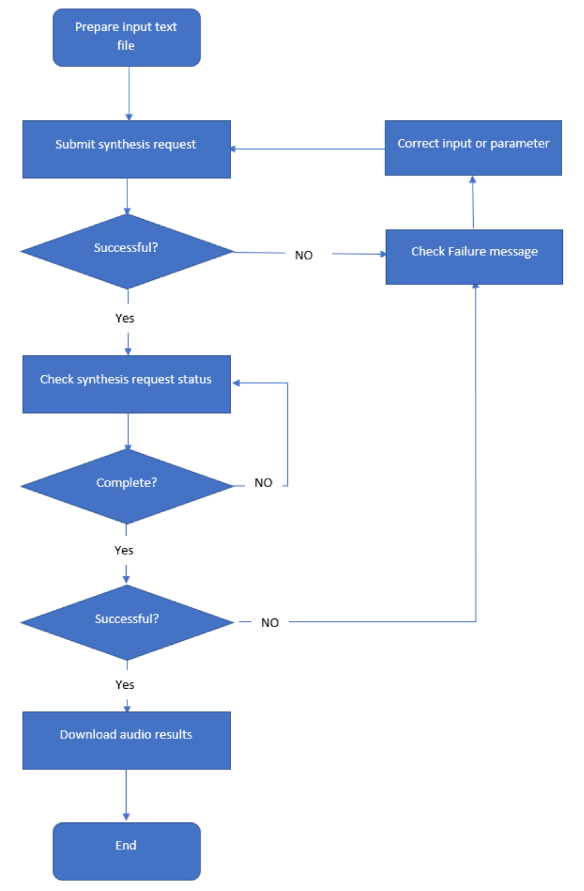

# Long Audio API (Preview)

The Long Audio API is designed for asynchronous synthesis of long-form text to speech (for example: audio books, news articles and documents). This API doesn't return synthesized audio in real-time, instead the expectation is that you will poll for the response(s) and consume the output(s) as they are made available from the service. Unlike the text to speech API that's used by the Speech SDK, the Long Audio API can create synthesized audio longer than 10 minutes, making it ideal for publishers and audio content platforms.

Additional benefits of the Long Audio API:

* Synthesized speech returned by the service uses the best neural voices.
* There's no need to deploy a voice endpoint as it synthesizes voices in none real-time batch mode.

> [!NOTE]
> The Long Audio API now supports both [Public Neural Voices](https://docs.microsoft.com/azure/cognitive-services/speech-service/language-support#neural-voices) and [Custom Neural Voices](https://docs.microsoft.com/azure/cognitive-services/speech-service/how-to-custom-voice#custom-neural-voices).

## Workflow

Typically, when using the Long Audio API, you'll submit a text file or files to be synthesized, poll for the status, then if the status is successful, you can download the audio output.

This diagram provides a high-level overview of the workflow.

## Prepare content for synthesis

When preparing your text file, make sure it:

* Is either plain text (.txt) or SSML text (.txt)
* Is encoded as [UTF-8 with Byte Order Mark (BOM)](https://www.w3.org/International/questions/qa-utf8-bom.en#bom)
* Is a single file, not a zip
* Contains more than 400 characters for plain text or 400 [billable characters](https://docs.microsoft.com/azure/cognitive-services/speech-service/text-to-speech#pricing-note) for SSML text, and less than 10,000 paragraphs
  * For plain text, each paragraph is separated by hitting **Enter/Return** - View [plain text input example](https://github.com/Azure-Samples/Cognitive-Speech-TTS/blob/master/CustomVoice-API-Samples/Java/en-US.txt)
  * For SSML text, each SSML piece is considered a paragraph. SSML pieces shall be separated by different paragraphs - View [SSML text input example](https://github.com/Azure-Samples/Cognitive-Speech-TTS/blob/master/CustomVoice-API-Samples/Java/SSMLTextInputSample.txt)
> [!NOTE]
> For Chinese (Mainland), Chinese (Hong Kong SAR), Chinese (Taiwan), Japanese, and Korean, one word will be counted as two characters. 

## Submit synthesis requests

After preparing the input content, follow the [long-form audio synthesis quickstart](https://aka.ms/long-audio-python) to submit the request. If you have more than one input file, you will need to submit multiple requests. 

The **HTTP status codes** indicate common errors.

| API | HTTP status code | Description | Proposal |
|-----|------------------|-------------|----------|
| Create | 400 | The voice synthesis is not enabled in this region. | Change the speech subscription key with a supported region. |
|        | 400 | Only the **Standard** speech subscription for this region is valid. | Change the speech subscription key to the "Standard" pricing tier. |
|        | 400 | Exceed the 20,000 request limit for the Azure account. Please remove some requests before submitting new ones. | The server will keep up to 20,000 requests for each Azure account. Delete some requests before submitting new ones. |
|        | 400 | This model cannot be used in the voice synthesis : {modelID}. | Make sure the {modelID}'s state is correct. |
|        | 400 | The region for the request does not match the region for the model : {modelID}. | Make sure the {modelID}'s region match with the request's region. |
|        | 400 | The voice synthesis only supports the text file in the UTF-8 encoding with the byte-order marker. | Make sure the input files are in UTF-8 encoding with the byte-order marker. |
|        | 400 | Only valid SSML inputs are allowed in the voice synthesis request. | Make sure the input SSML expressions are correct. |
|        | 400 | The voice name {voiceName} is not found in the input file. | The input SSML voice name is not aligned with the model ID. |
|        | 400 | The amount of paragraph in the input file should be less than 10,000. | Make sure the paragraph in the file is less than 10,000. |
|        | 400 | The input file should be more than 400 characters. | Make sure your input file exceeds 400 characters. |
|        | 404 | The model declared in the voice synthesis definition cannot be found : {modelID}. | Make sure the {modelID} is correct. |
|        | 429 | Exceed the active voice synthesis limit. Please wait until some requests finish. | The server is allowed to run and queue up to 120 requests for each Azure account. Please wait and avoid submitting new requests until some requests are completed. |
| All       | 429 | There are too many requests. | The client is allowed to submit up to 5 requests to server per second for each Azure account. Please reduce the request amount per second. |
| Delete    | 400 | The voice synthesis task is still in use. | You can only delete requests that is **Completed** or **Failed**. |
| GetByID   | 404 | The specified entity cannot be found. | Make sure the synthesis ID is correct. |

## Regions and endpoints

The Long audio API is available in multiple regions with unique endpoints.

| Region | Endpoint |
|--------|----------|
| Australia East | `https://australiaeast.customvoice.api.speech.microsoft.com` |
| Canada Central | `https://canadacentral.customvoice.api.speech.microsoft.com` |
| East US | `https://eastus.customvoice.api.speech.microsoft.com` |
| India Central | `https://centralindia.customvoice.api.speech.microsoft.com` |
| South Central US | `https://southcentralus.customvoice.api.speech.microsoft.com` |
| Southeast Asia | `https://southeastasia.customvoice.api.speech.microsoft.com` |
| UK South | `https://uksouth.customvoice.api.speech.microsoft.com` |
| West Europe | `https://westeurope.customvoice.api.speech.microsoft.com` |
| West US 2 | `https://westus2.customvoice.api.speech.microsoft.com` |

## Audio output formats

We support flexible audio output formats. You can generate audio outputs per paragraph or concatenate the audio outputs into a single output by setting the 'concatenateResult' parameter. The following audio output formats are supported by the Long Audio API:

> [!NOTE]
> The default audio format is riff-16khz-16bit-mono-pcm.

* riff-8khz-16bit-mono-pcm
* riff-16khz-16bit-mono-pcm
* riff-24khz-16bit-mono-pcm
* riff-48khz-16bit-mono-pcm
* audio-16khz-32kbitrate-mono-mp3
* audio-16khz-64kbitrate-mono-mp3
* audio-16khz-128kbitrate-mono-mp3
* audio-24khz-48kbitrate-mono-mp3
* audio-24khz-96kbitrate-mono-mp3
* audio-24khz-160kbitrate-mono-mp3

## Quickstarts

We offer quickstarts designed to help you run the Long Audio API successfully. This table includes a list of Long Audio API quickstarts organized by language.

* [Quickstart: Python](https://aka.ms/long-audio-python)

## Sample code
Sample code for Long Audio API is available on GitHub.

* [Sample code: Python](https://github.com/Azure-Samples/Cognitive-Speech-TTS/tree/master/CustomVoice-API-Samples/Python)
* [Sample code: C#](https://github.com/Azure-Samples/Cognitive-Speech-TTS/tree/master/CustomVoice-API-Samples/CSharp)
* [Sample code: Java](https://github.com/Azure-Samples/Cognitive-Speech-TTS/blob/master/CustomVoice-API-Samples/Java/)
