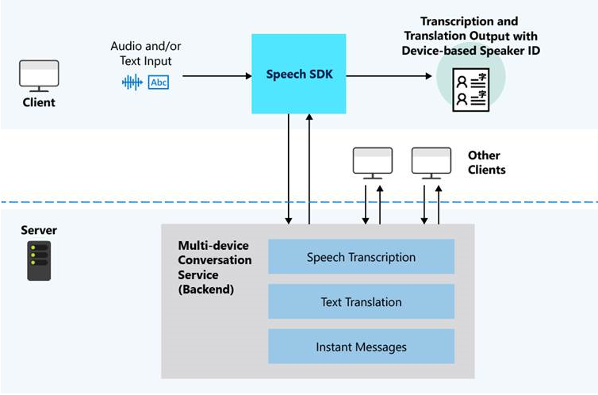

# What is Multi-device Conversation?

**Multi-device conversation** makes it easy to create a speech or text conversation between multiple clients and coordinate the messages sent between them.

With **multi-device conversation**, you can:

- Connect multiple clients into the same conversation and manage the sending and receiving of messages between them.
- Easily transcribe audio from each client and send the transcription to the others, with optional translation.
- Easily send text messages between clients, with optional translation.

You can build a feature or solution that works across an array of devices, including mobile (Android or iOS), PC, and Linux. Each device can independently send messages (either transcriptions of audio or instant messages) to all other devices.

Whereas **Conversation Transcription** works on a single device with a multichannel microphone array, **Multi-device Conversation** is suited for scenarios with multiple devices, each with a single microphone.

>[!IMPORTANT]
> Multi-device conversation does not support sending audio files between clients: only the transcription and/or translation.

## Key features

- **Cross-platform support** – Clients can be mobile apps (Android or iOS), Windows UWP apps, or web apps.
- **Real-time transcription** – Everyone will receive a transcript of the conversation, so they can follow along the text in real-time or save it for later.
- **Real-time translation** – With more than 60 supported languages for text translation, everyone can translate the conversation into their preferred language(s).
- **Readable transcripts** – The transcription and translation are easy to follow, with punctuation and sentence breaks.
- **Voice or text input** – Each user can speak or type on their own device, depending on language support.
- **Message relay** - The service will distributes messages sent by one client to all the others, in the language(s) of their choice.
- **Multi-speaker diarization** – If every speaker uses a separate device, the service will attribute messages to devices from which they are sent.

## Use cases

### Lightweight conversations

Creating and joining a conversation is easy. One user will act as the 'host' and create a conversation, which generates a random 5-letter conversation code and a QR code. All other users ('participants') can join the conversation by typing in the conversation code or scanning the QR code. 

Since users join via the randomly generated code and are not using any personal accounts, multi-device conversations is suited for scenarios in which individuals may not already have each other's contact information, and makes it easy to create quick, on-the-spot conversations.

### Inclusive meetings

Real-time transcription and translation can help make conversations more accessible to people who speak different languages, and/or are deaf or hard of hearing. Using multi-device conversation, each person can also actively participate in the conversation, by speaking their native tongue or using text input.

### Presentations

In scenarios where one person is giving a speech or presenting content to an audience, you can provide captions for the speaker, and also allow members of the audience to follow the speech in their own language, on their own device.

## How it works

All clients will use the Speech SDK to create or join a conversation. The Speech SDK interacts with a backend service for multi-device conversation, which manages the lifetime of a conversation, including the list of participants, each client’s chosen language(s), and messages sent.  

Each client can send audio or instant messages. The service will transcribe audio into text, and instant messages will be sent as-is. If clients have chosen different languages, then the service will translate all messages into the specified language(s) of each client.

## Overview of Conversation, Host, and Participant

A **conversation** is a session that the clients connect to and is started by the **host** user. 

Metadata of the conversation includes: 
-	Timestamps of the start and end of the conversation, as defined by when the **host** user starts and leaves the conversation
-	List of participants in the conversation, including each participant's chosen nickname and language

There are two types of users in a conversation:  **host** and **participant**.

The **host** is the user who starts a conversation, and who acts as the administrator of that conversation.
- Each conversation can only have one host
- The host must be connected to the conversation for the duration of the conversation. If the host leaves the conversation, the conversation will end for all other participants.
- The host has a few extra controls to manage the conversation: 
    - Lock the conversation (prevent additional participants from joining)
    - Mute all participants (prevent other participants from sending all kinds of messages to the conversation)
    - Mute individual participants
    - Unmute all participants
    - Unmute individual participants

A **participant** is a user who joins a conversation.
- Participants can leave and rejoin the same conversation at any time, without ending the conversation for other participants.
- Participants cannot lock the conversation or mute/unmute other participants.

> [!NOTE]
> Each conversation can have up to 100 participants, of which 10 can be speaking at any given time.

## Language support

When creating or joining a conversation, each participant must choose a primary language. This is the language which they will speak in, send instant messages in, and also the language that incoming messages will be translated to.

There are two kinds of languages: **speech-to-text** and **text-only**:
- If the user chooses a language that is supported for **speech-to-text**, then s/he will be able to use speech input in the conversation. 

- If the user chooses a **text-only** language, then they will only be able to type and send instant messages in the conversation. 

Apart from their primary language, each participant can also specify additional languages for translating the conversation.

Below is a summary of what the user will be able to do in a multi-device conversation, according to their chosen language.

|  | Speech-to-text | Text translation |
|-----------------------------------|----------------|------|
| Use speech input | ✔️ | ❌ |
| Send instant messages | ✔️ | ✔️ |
| Translate the conversation | ✔️ | ✔️ |

> [!NOTE]
> For lists of available speech-to-text and text translation languages, see [supported languages](supported-languages.md).

## Next steps

> [!div class="nextstepaction"]
> [Translate conversations in real-time](quickstarts/multi-device-conversation.md)
