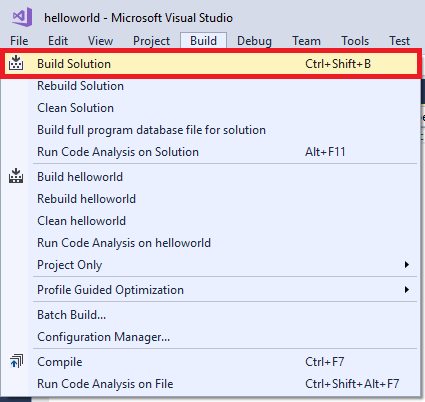
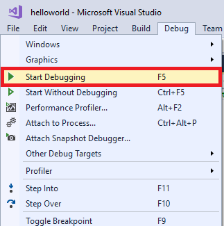
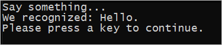

# Quickstart: Recognize speech in C++ on Windows by using the Speech SDK

Quickstarts are also available for [text-to-speech](quickstart-text-to-speech-cpp-windows.md) and [speech-translation](quickstart-translate-speech-cpp-windows.md).

If desired, choose a different programming language and/or environment: 
[!INCLUDE [Selector](../../../includes/cognitive-services-speech-service-quickstart-selector.md)]

In this article, you create a C++ console application for Windows. You use the Cognitive Services [Speech SDK](speech-sdk.md) to transcribe speech to text in real time from your PC's microphone. The application is built with the [Speech SDK NuGet package](https://aka.ms/csspeech/nuget) and Microsoft Visual Studio 2017 (any edition).

## Prerequisites

You need a Speech Services subscription key to complete this Quickstart. You can get one for free. See [Try the Speech Services for free](get-started.md) for details.

## Create a Visual Studio project

[!INCLUDE [Quickstart C++ project](../../../includes/cognitive-services-speech-service-quickstart-cpp-create-proj.md)]

## Add sample code

1. Open the source file *helloworld.cpp*. Replace all the code below the initial include statement (`#include "stdafx.h"` or `#include "pch.h"`) with the following:

   [!code-cpp[Quickstart Code](~/samples-cognitive-services-speech-sdk/quickstart/cpp-windows/helloworld/helloworld.cpp#code)]

1. In the same file, replace the string `YourSubscriptionKey` with your subscription key.

1. Replace the string `YourServiceRegion` with the [region](regions.md) associated with your subscription (for example, `westus` for the free trial subscription).

1. Save changes to the project.

## Build and run the app

1. Build the application. From the menu bar, choose **Build** > **Build Solution**. The code should compile without errors.

   

1. Start the application. From the menu bar, choose **Debug** > **Start Debugging**, or press **F5**.

   

1. A console window appears, prompting you to say something. Speak an English phrase or sentence. Your speech is transmitted to the Speech Services and transcribed to text, which appears in the same window.

   

## Next steps

Additional samples, such as how to read speech from an audio file, are available on GitHub.

> [!div class="nextstepaction"]
> [Explore C++ samples on GitHub](https://aka.ms/csspeech/samples)

## See also

- [Customize acoustic models](how-to-customize-acoustic-models.md)
- [Customize language models](how-to-customize-language-model.md)
