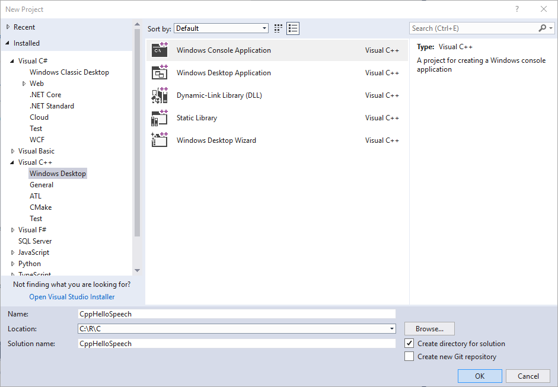
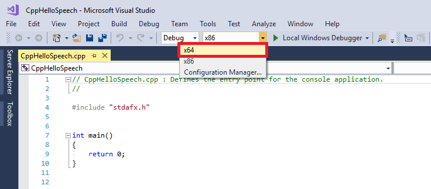
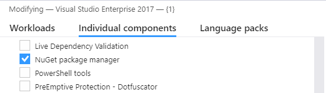
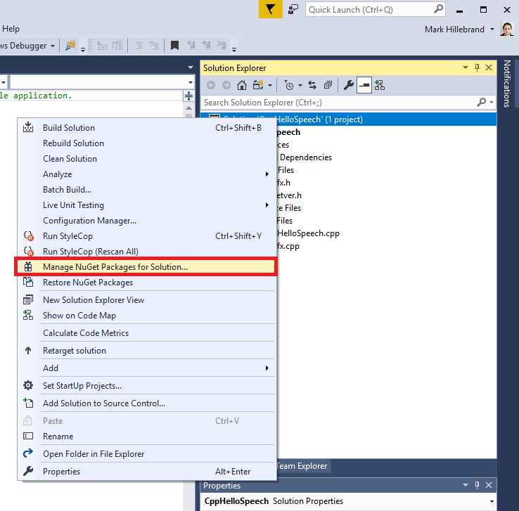
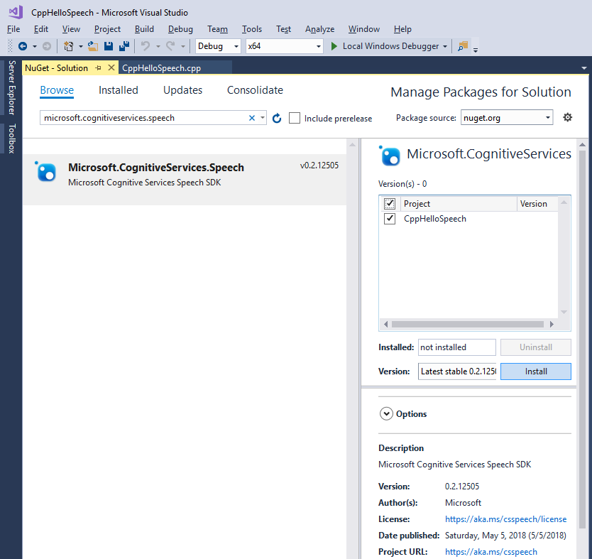
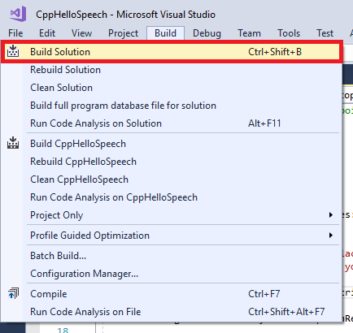
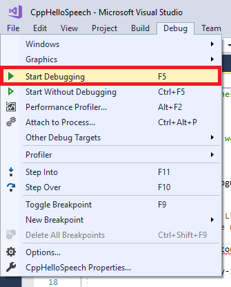
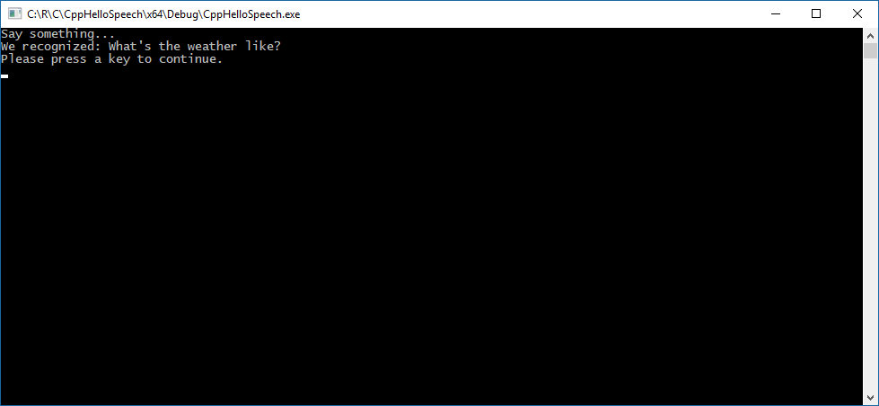

# Quickstart for C++ and Windows

The current version of the Cognitive Services Speech SDK is `0.4.0`.

We describe how to create a C++-based console application for Windows Desktop that makes use of the Speech SDK.
The application is based on the [Microsoft Cognitive Services SDK NuGet Package](https://www.nuget.org/packages/Microsoft.CognitiveServices.Speech) and Microsoft Visual Studio 2017.

> [!NOTE]
> If you're looking for a quickstart for C++ and Linux, go [here](quickstart-cpp-linux.md). 
> If you're looking for a quickstart for C# and Windows, go [here](quickstart-csharp-windows.md).

> [!NOTE]
> This quickstart requires a PC with a working microphone. 
> For a sample that recognizes speech from a given audio input file see the [sample](speech-to-text-sample.md#speech-recognition-from-a-file).

> [!NOTE]
> Ensure that your Visual Studio installation includes the **Desktop development with C++** workload.
> If you're not sure, use these steps to check and fix:
> In Visual Studio 2017, select **Tools** \> **Get Tools and Features** and acknowledge the User Account Control prompt by choosing **Yes**.
> In the **Workloads** tab, if **Desktop development with C++** does not have a set checkbox next to it, set it and click on **Modify** to save changes.

[!include[Get a Subscription Key](includes/get-subscription-key.md)]

## Creating an empty console application project

In Visual Studio 2017, create a new Visual C++ Windows Desktop Windows Console Application with the name "CppHelloSpeech":

If you're running on a 64-bit Windows installation, optionally switch your build platform to `x64`:

## Install and reference the Speech SDK NuGet package

> [!NOTE]
> Ensure the NuGet package manager is enabled for your Visual Studio 2017 installation.
> In Visual Studio 2017, select **Tools** \> **Get Tools and Features** and
> acknowledge the User Account Control prompt by choosing **Yes**. Then select
> the **Individual components** tab, and look for **NuGet package manager** under **Code tools**.
> If the checkbox to its left is not set, make sure to set it and click on **Modify** to save changes.
>
> 

In the Solution Explorer, right-click the solution and click on **Manage NuGet Packages for Solution**.

In the upper-right corner, in the **Package Source** field, choose "Nuget.org".
From the **Browse** tab, search for the "Microsoft.CognitiveServices.Speech" package, select it and check the **Project** and **CppHelloSpeech** boxes on the right, and select **Install** to install it into the CppHelloSpeech project.

In the license screen that pops up, accept the license:

## Add the sample code

Replace your default starter code with the following one:

[!code-cpp[Quickstart Code](~/samples-cognitive-services-speech-sdk/Windows/quickstart-cpp/CppHelloSpeech.cpp#code)]

> [!IMPORTANT]
> Replace the subscription key with the one that you obtained.  
> Replace the [region](regions.md) with the one associated with the subscription, for example, replace with `westus` for the free trial subscription.

## Build and run the sample

The code should compile without errors now:

Launch the program under the debugger with the Launch button or using the F5 keyboard shortcut:

A console window should pop up, prompting you to say something (in English).
The result of the recognition will be displayed on screen.

## Downloading the sample

For the latest set of samples, see the [Cognitive Services Speech SDK Sample GitHub repository](https://aka.ms/csspeech/samples).

## Next steps

* Visit the [samples page](samples.md) for additional samples.
