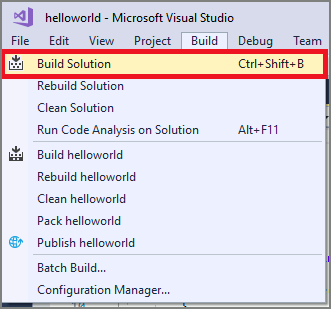
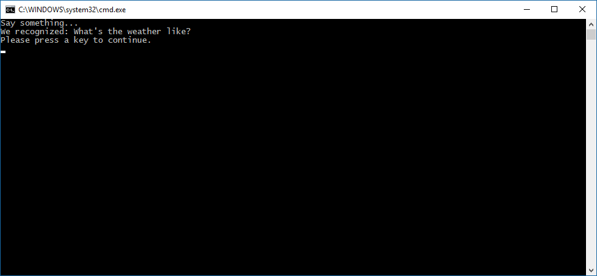

# Quickstart: Recognize speech in C# under .NET Framework on Windows by using the Speech SDK

[!INCLUDE [Selector](../../../includes/cognitive-services-speech-service-quickstart-selector.md)]

In this article, you create a C# console application for .NET Framework on Windows by using the [Speech SDK](speech-sdk.md). You transcribe speech to text in real time from your PC's microphone. The application is built with the [Speech SDK NuGet package](https://aka.ms/csspeech/nuget) and Microsoft Visual Studio 2017 (any edition).

## Prerequisites

You need a Speech service subscription key to complete this Quickstart. You can get one for free. See [Try the Speech service for free](get-started.md) for details.

## Create a Visual Studio project

[!INCLUDE [Create project ](../../../includes/cognitive-services-speech-service-create-speech-project-vs-csharp.md)]

## Add sample code

1. Open `Program.cs`, and replace all the code in it with the following.

    [!code-csharp[Quickstart Code](~/samples-cognitive-services-speech-sdk/quickstart/csharp-dotnet-windows/helloworld/Program.cs#code)]

1. In the same file, replace the string `YourSubscriptionKey` with your Speech service subscription key.

1. Also replace the string `YourServiceRegion` with the [region](regions.md) associated with your subscription (for example, `westus` for the free trial subscription).

1. Save changes to the project.

## Build and run the app

1. Build the application. From the menu bar, select **Build** > **Build Solution**. The code should compile without errors now.

    

1. Start the application. From the menu bar, select **Debug** > **Start Debugging**, or press **F5**.

    

1. A console window appears, prompting you to say something. Speak an English phrase or sentence. Your speech is transmitted to the Speech service and transcribed to text, which appears in the same window.

    

[!INCLUDE [Download this sample](../../../includes/cognitive-services-speech-service-speech-sdk-sample-download-h2.md)]
Look for this sample in the `quickstart/csharp-dotnet-windows` folder.

## Next steps

> [!div class="nextstepaction"]
> [Recognize intents from speech by using the Speech SDK for C#](how-to-recognize-intents-from-speech-csharp.md)

## See also

- [Translate speech](how-to-translate-speech-csharp.md)
- [Customize acoustic models](how-to-customize-acoustic-models.md)
- [Customize language models](how-to-customize-language-model.md)
