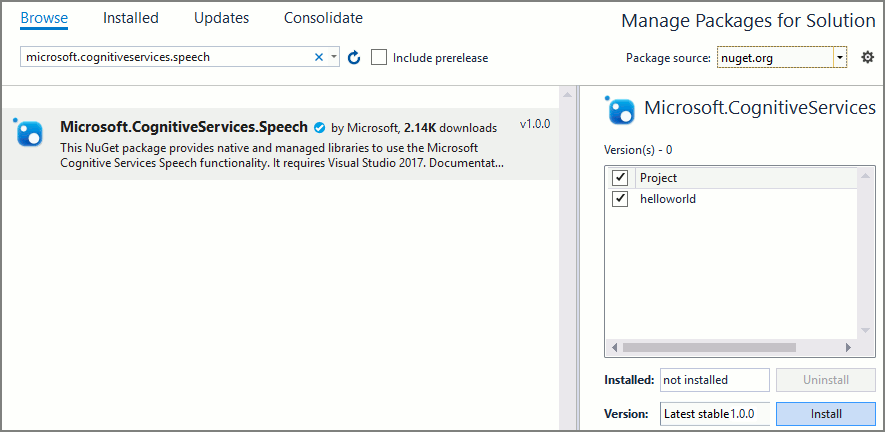
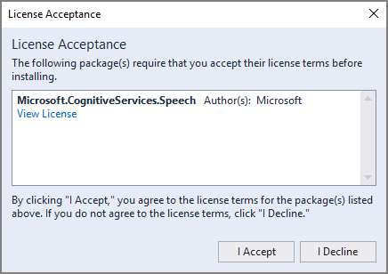
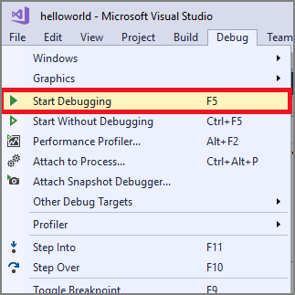
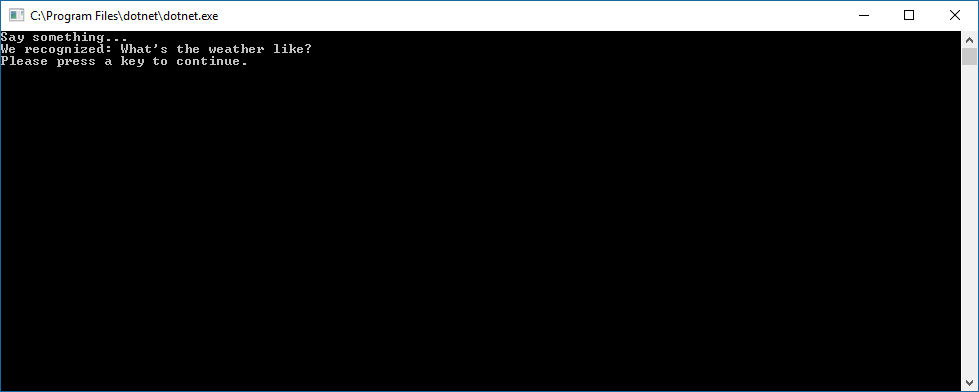

# Quickstart: Recognize speech in C# under .NET Core on Windows by using the Speech SDK

[!INCLUDE [Selector](../../../includes/cognitive-services-speech-service-quickstart-selector.md)]

In this article, you create a C# console application for .NET Core on Windows by using the Cognitive Services [Speech SDK](speech-sdk.md). You transcribe speech to text in real time from your PC's microphone. The application is built with the [Speech SDK NuGet package](https://aka.ms/csspeech/nuget) and Microsoft Visual Studio 2017 (any edition).

> [!NOTE]
> .NET Core is an open-source, cross-platform .NET platform that implements the [.NET Standard](https://docs.microsoft.com/dotnet/standard/net-standard) specification.

You need a Speech service subscription key to complete this Quickstart. You can get one for free. See [Try the Speech service for free](get-started.md) for details.

## Create a Visual Studio project

1. Start Visual Studio 2017.

1. Make sure the **.NET cross-platform development** workload is available. Choose **Tools** > **Get Tools and Features** from the Visual Studio menu bar to open the Visual Studio installer. If this workload is already enabled, close the dialog box.

    

    Otherwise, select the box next to **.NET Core cross-platform development,** and select **Modify** at the lower right corner of the dialog box. Installation of the new feature will take a moment.

1. Create a new Visual C# .NET Core Console App. In the **New Project** dialog box, from the left pane, expand **Installed** > **Visual C#** > **.NET Core**. Then select **Console App (.NET Core)**. For the project name, enter *helloworld*.

    ")

1. Install and reference the [Speech SDK NuGet package](https://aka.ms/csspeech/nuget). In Solution Explorer, right-click the solution and select **Manage NuGet Packages for Solution**.

    

1. In the upper-right corner, in the **Package Source** field, select **nuget.org**. Search for the `Microsoft.CognitiveServices.Speech` package, and install it into the **helloworld** project.

    

1. Accept the displayed license to begin installation of the NuGet package.

    

After the package is installed, a confirmation appears in the Package Manager console.

## Add sample code

1. Open `Program.cs`, and replace all the code in it with the following.

    [!code-csharp[Quickstart Code](~/samples-cognitive-services-speech-sdk/quickstart/csharp-dotnetcore/helloworld/Program.cs#code)]

1. In the same file, replace the string `YourSubscriptionKey` with your subscription key.

1. Also replace the string `YourServiceRegion` with the [region](regions.md) associated with your subscription (for example, `westus` for the free trial subscription).

1. Save changes to the project.

## Build and run the app

1. Build the application. From the menu bar, choose **Build** > **Build Solution**. The code should compile without errors.

    

1. Start the application. From the menu bar, choose **Debug** > **Start Debugging**, or press **F5**.

    

1. A console window appears, prompting you to say something. Speak an English phrase or sentence. Your speech is transmitted to the Speech service and transcribed to text, which appears in the same window.

    

[!INCLUDE [Download this sample](../../../includes/cognitive-services-speech-service-speech-sdk-sample-download-h2.md)]
Look for this sample in the `quickstart/csharp-dotnetcore-windows` folder.

## Next steps

> [!div class="nextstepaction"]
> [Recognize intents from speech by using the Speech SDK for C#](how-to-recognize-intents-from-speech-csharp.md)

## See also

- [Translate speech](how-to-translate-speech-csharp.md)
- [Customize acoustic models](how-to-customize-acoustic-models.md)
- [Customize language models](how-to-customize-language-model.md)
