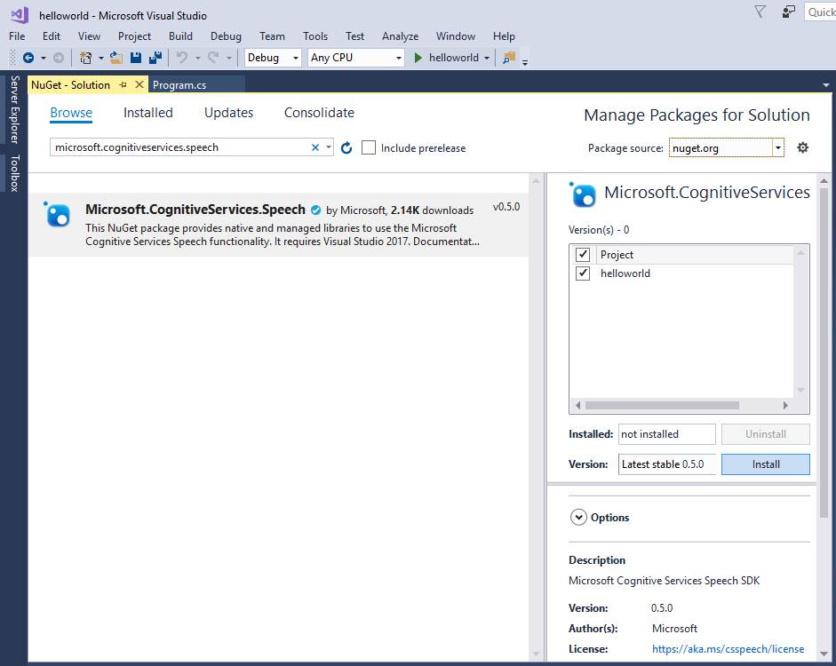

# Quickstart: Recognize speech in C# under .NET Core on Windows using the Speech SDK

In this article, you learn how to create a C# console application for .NET Core on Windows using the Cognitive Services Speech SDK to transcribe speech to text.
The application is based on the [Microsoft Cognitive Services Speech SDK NuGet Package](https://aka.ms/csspeech/nuget) and Microsoft Visual Studio 2017.

## Prerequisites

* A subscription key for the Speech service. See [Try the speech service for free](get-started.md).
* A Windows PC with a working microphone.
* [Microsoft Visual Studio 2017](https://www.visualstudio.com/), Community Edition or higher.
* The **.NET Core cross-platform development** workload in Visual Studio. You can enable it in **Tools** \> **Get Tools and Features**.

  

## Create a Visual Studio project

1. In Visual Studio 2017, create a new Visual C# .NET Core Console App. In the **New Project** dialog box, from the left pane, expand **Installed** \> **Visual C#** \> **.NET Core** and then select **Console App (.NET Core)**. For the project name, enter *helloworld*.

    ")

1. Install and reference the [Speech SDK NuGet package](https://aka.ms/csspeech/nuget). In the Solution Explorer, right-click the solution and select **Manage NuGet Packages for Solution**.

    

1. In the upper-right corner, in the **Package Source** field, select **Nuget.org**. Search for and install the `Microsoft.CognitiveServices.Speech` package and install it into the **helloworld** project.

    

1. In the license screen that pops up, accept the license:

    

## Add the sample code

1. In the `Program.cs` file in your Visual Studio project, replace all code with the following:

    [!code-csharp[Quickstart Code](~/samples-cognitive-services-speech-sdk/quickstart/csharp-dotnetcore-windows/helloworld/Program.cs#code)]

1. Replace the string `YourSubscriptionKey` with your subscription key.

1. Replace the string `YourServiceRegion` with the [region](regions.md) associated with your subscription (for example, `westus` for the free trial subscription).

1. Save changes to the project.

## Build and run the sample

1. Build the application. From the menu bar, select **Build** > **Build Solution**. The code should compile without errors now:

    

1. Start the application. From the menu bar, select **Debug** > **Start Debugging**, or press **F5**.

    

1. A console window pops up, prompting you to say something (in English).
The result of the recognition is displayed on screen.

    

[!include[Download the sample](../../../includes/cognitive-services-speech-service-speech-sdk-sample-download-h2.md)]
Look for this sample in the `quickstart/csharp-dotnetcore-windows` folder.

## Next steps

- [Translate speech](how-to-translate-speech.md)
- [Customize acoustic models](how-to-customize-acoustic-models.md)
- [Customize language models](how-to-customize-language-model.md)
