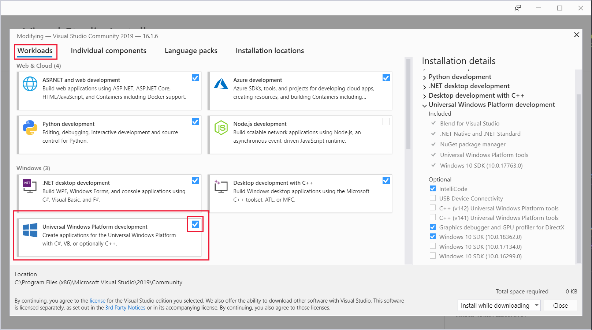
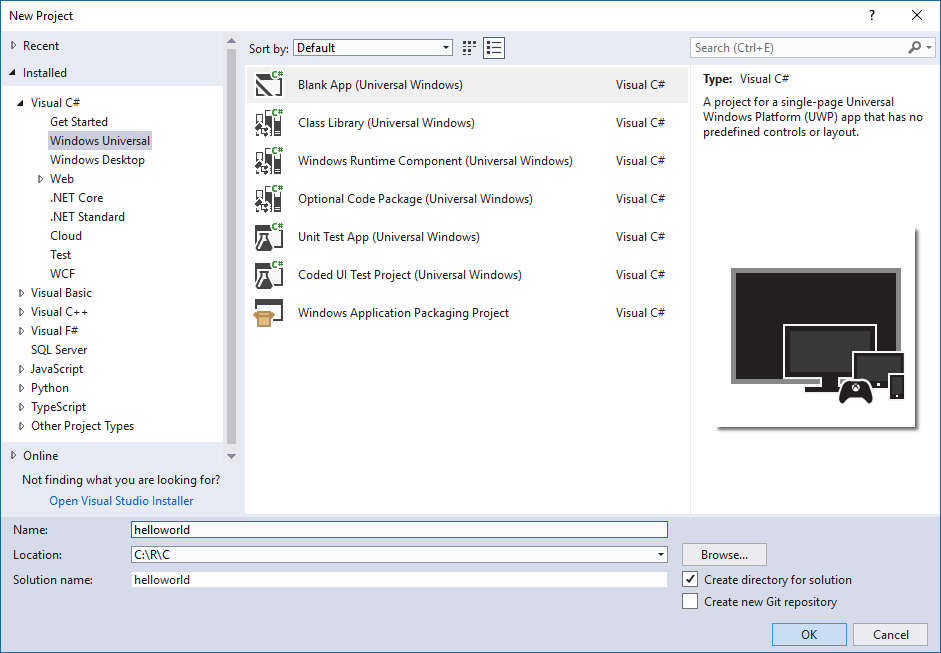
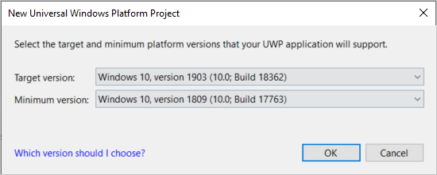
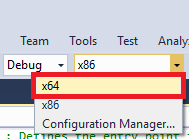
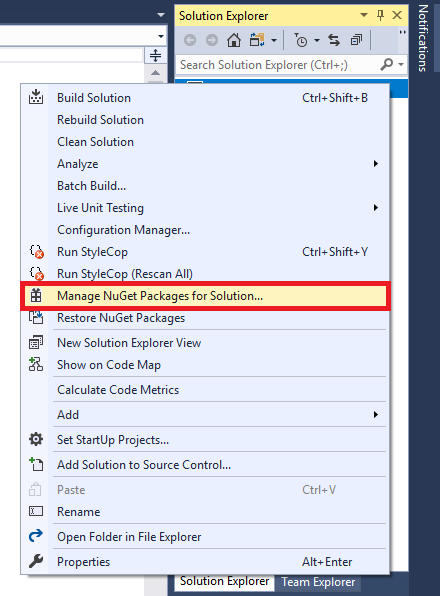
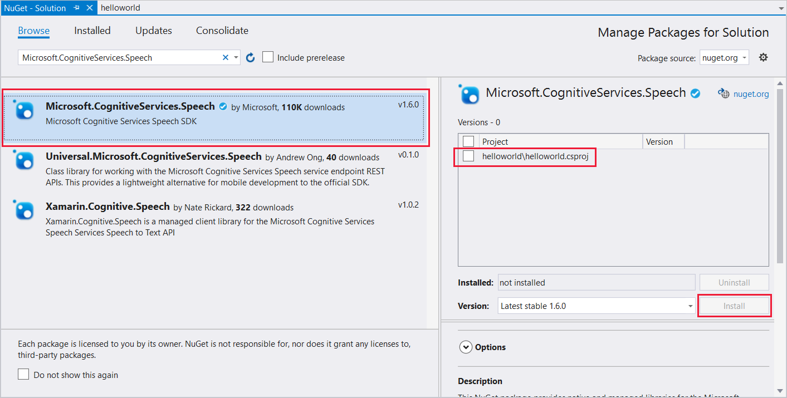
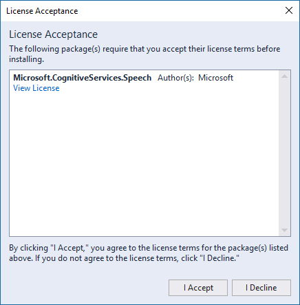
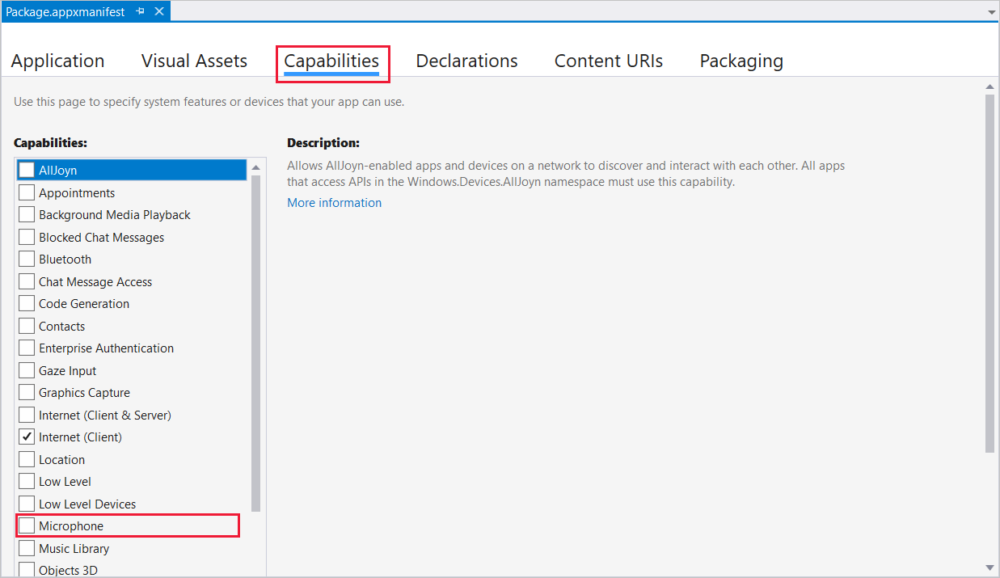
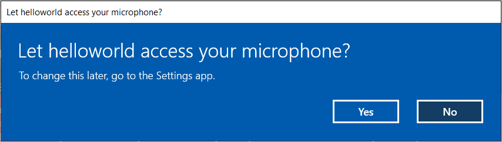

# Quickstart: Recognize speech in a UWP app by using the Speech SDK

[!INCLUDE [Selector](../../../includes/cognitive-services-speech-service-quickstart-selector.md)]

In this article, you create a C# Universal Windows Platform (UWP) application by using the Cognitive Services [Speech SDK](speech-sdk.md). You transcribe speech to text in real time from your device's microphone. The application is built with the [Speech SDK NuGet Package](https://aka.ms/csspeech/nuget) and Microsoft Visual Studio 2017 (any edition).

> [!NOTE]
> The Universal Windows Platform lets you develop apps that run on any device that supports Windows 10, including PCs, Xbox, Surface Hub, and other devices.

## Prerequisites

You need a Speech service subscription key to complete this Quickstart. You can get one for free. See [Try the Speech service for free](get-started.md) for details.

## Create a Visual Studio project

1. Start Visual Studio 2017.

1. Make sure the **Universal Windows Platform development** workload is available. Choose **Tools** > **Get Tools and Features** from the Visual Studio menu bar to open the Visual Studio installer. If this workload is already enabled, close the dialog box. 

    

    Otherwise, select the box next to **.NET cross-platform development,** and select **Modify** at the lower right corner of the dialog box. Installation of the new feature takes a moment.

1. Create a blank Visual C# Universal Windows app. First, choose **File** > **New** > **Project** from the menu. In the **New Project** dialog box, expand **Installed** > **Visual C#** > **Windows Universal** in the left pane. Then select **Blank App (Universal Windows)**. For the project name, enter *helloworld*.

    

1. The Speed SDK requires that your application be built for the Windows 10 Fall Creators Update or later. In the **New Universal Windows Platform Project** window that pops up, choose **Windows 10 Fall Creators Update (10.0; Build 16299)** as **Minimum version**. In the **Target version** box, select this or any later version, and then click **OK**.

    

1. If you're running 64-bit Windows, you can switch your build platform to `x64` by using the drop-down menu in the Visual Studio toolbar. (64-bit Windows can run 32-bit applications, so you can leave it set to `x86` if you prefer.)

   

   > [!NOTE]
   > The Speech SDK supports Intel-compatible processors only. ARM is currently not supported.

1. Install and reference the [Speech SDK NuGet package](https://aka.ms/csspeech/nuget). In Solution Explorer, right-click the solution, and select **Manage NuGet Packages for Solution**.

    

1. In the upper-right corner, in the **Package Source** field, select **nuget.org**. Search for the `Microsoft.CognitiveServices.Speech` package, and install it into the **helloworld** project.

    

1. Accept the displayed license to begin installation of the NuGet package.

    

1. The following output line appears in the Package Manager console.

   ```text
   Successfully installed 'Microsoft.CognitiveServices.Speech 1.0.1' to helloworld
   ```

1. Because the application uses the microphone for speech input, add the **Microphone** capability to the project. In Solution Explorer, double-click **Package.appxmanifest** to edit your application manifest. Then switch to the **Capabilities** tab, select the box for the **Microphone** capability, and save your changes.

   


## Add sample code

1. The application's user interface is defined by using XAML. Open `MainPage.xaml` in Solution Explorer. In the designer's XAML view, insert the following XAML snippet into the Grid tag (between `<Grid>` and `</Grid>`).

   [!code-xml[UI elements](~/samples-cognitive-services-speech-sdk/quickstart/csharp-uwp/helloworld/MainPage.xaml#StackPanel)]

1. Open the code-behind source file `MainPage.xaml.cs` (find it grouped under `MainPage.xaml`). Replace all the code in it with the following.

   [!code-csharp[Quickstart Code](~/samples-cognitive-services-speech-sdk/quickstart/csharp-uwp/helloworld/MainPage.xaml.cs#code)]

1. In the `SpeechRecognitionFromMicrophone_ButtonClicked` handler in this file, replace the string `YourSubscriptionKey` with your subscription key.

1. In the `SpeechRecognitionFromMicrophone_ButtonClicked` handler, replace the string `YourServiceRegion` with the [region](regions.md) associated with your subscription (for example, `westus` for the free trial subscription).

1. Save all changes to the project.

## Build and run the app

1. Build the application. From the menu bar, select **Build** > **Build Solution**. The code should compile without errors now.

    

1. Start the application. From the menu bar, select **Debug** > **Start Debugging**, or press **F5**.

    

1. A window pops up. Select **Enable Microphone**, and acknowledge the permission request that pops up.

    

1. Select **Speech recognition with microphone input**, and speak an English phrase or sentence into your device's microphone. Your speech is transmitted to the Speech service and transcribed to text, which appears in the window.

    

[!INCLUDE [Download this sample](../../../includes/cognitive-services-speech-service-speech-sdk-sample-download-h2.md)]
Look for this sample in the `quickstart/csharp-uwp` folder.

## Next steps

> [!div class="nextstepaction"]
> [Recognize intents from speech by using the Speech SDK for C#](how-to-recognize-intents-from-speech-csharp.md)

## See also

- [Translate speech](how-to-translate-speech-csharp.md)
- [Customize acoustic models](how-to-customize-acoustic-models.md)
- [Customize language models](how-to-customize-language-model.md)
