# Quickstart: Recognize speech using the Cognitive Services Speech C# SDK

In this article, you learn how to create a C# console application in Windows using the Cognitive Services Speech SDK to transcribe speech to text.

## Prerequisites

* A subscription key for the Speech service. See [Try the speech service for free](get-started.md).
* Visual Studio 2017, Community Edition or higher.
* The **.NET desktop development** workload in Visual Studio. You can enable it in **Tools** \> **Get Tools and Features**. 

## Create a Visual Studio project

1. In Visual Studio 2017, create a new Visual C# Console App. In the **New Project** dialog box, from the left pane, expand **Installed** and then select **Console App (.NET Framework)**. For the project name, enter *CsharpHelloSpeech*.

    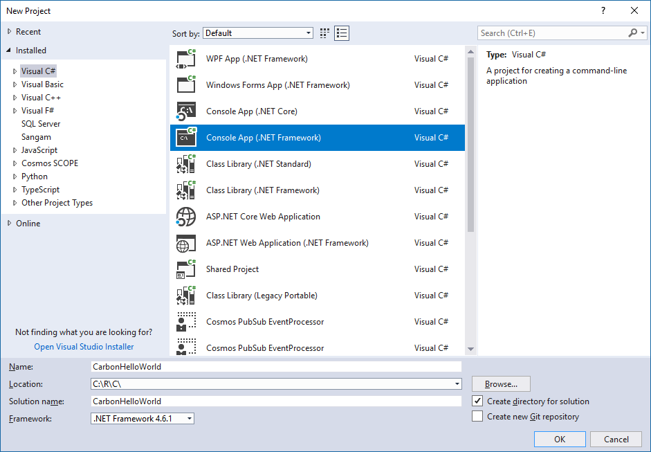

2. Install and reference the [Speech SDK NuGet package](https://aka.ms/csspeech/nuget). In the Solution Explorer, right-click the solution and select **Manage NuGet Packages for Solution**.

    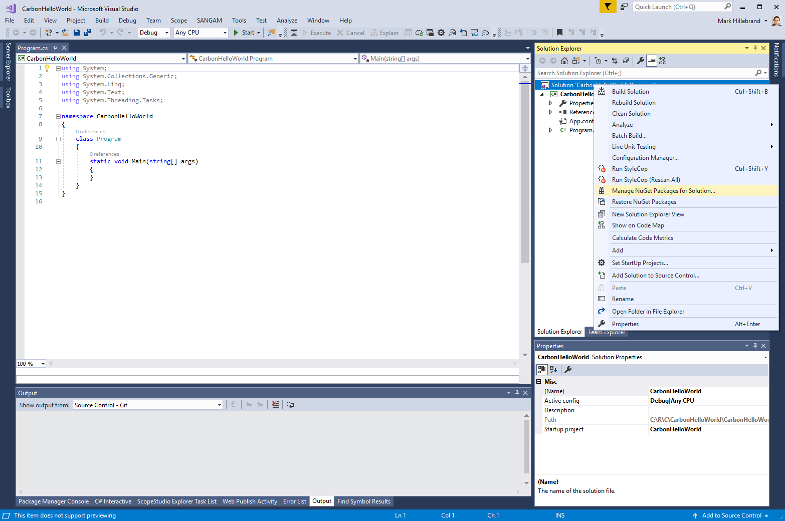

3. In the upper-right corner, in the **Package Source** field, select **Nuget.org**. Search for and install the `Microsoft.CognitiveServices.Speech` package and install it into the **CsharpHelloSpeech** project.

    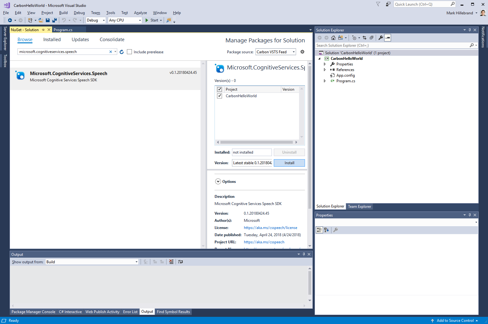

4. In the license screen that pops up, accept the license:

    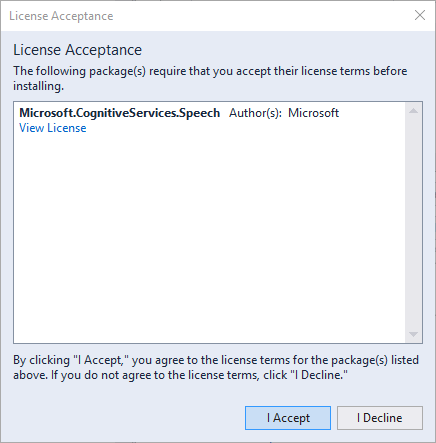

## Create a platform configuration matching your PC architecture

In this section, you add a new platform to the configuration that matches your processor architecture.

1. Start the Configuration Manager. Select **Build** > **Configuration Manager**.

    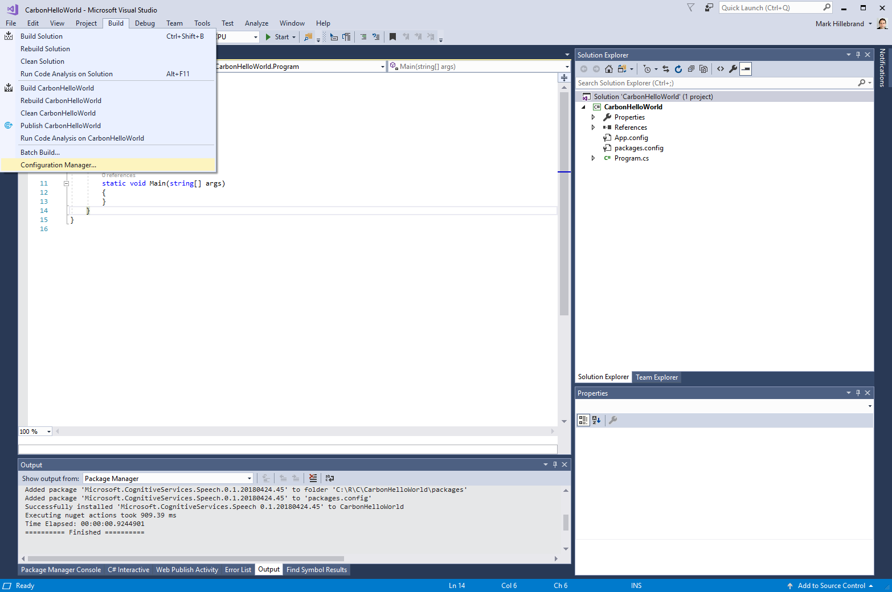

2. In the **Configuration Manager** dialog box, add a new platform. From the **Active solution platform** drop-down list, select **New**.

    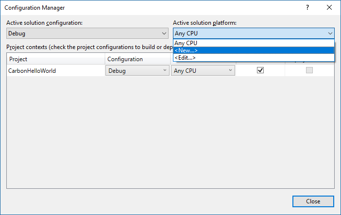

3. If you are running 64-bit Windows, create a new platform configuration named `x64`. If you are running 32-bit Windows, create a new platform configuration named `x86`. In this article, you create an `x64` platform configuration. 

    

## Add the sample code

1. In the `Program.cs` for your Visual Studio project, replace the body of the `Program` class with the following. Make sure you replace the subscription key and region with one that you obtained for the service.

    [!code-csharp[Quickstart Code](~/samples-cognitive-services-speech-sdk/Windows/quickstart-csharp/Program.cs#code)]

2. After pasting the code, the `Main()` method must resemble as shown in the following screenshot:

    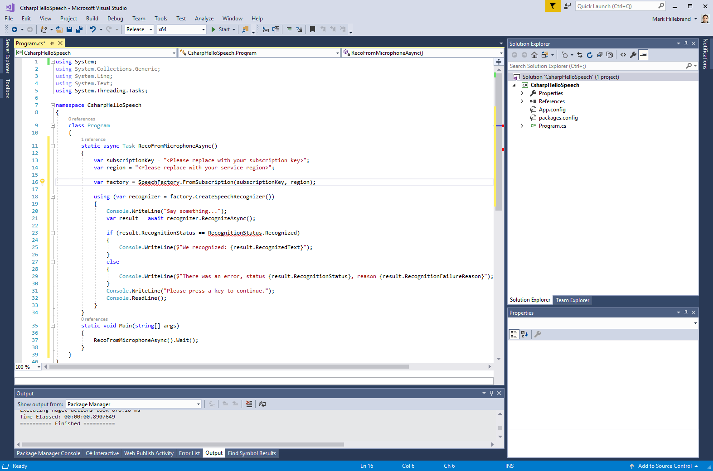

3. Visual Studio's IntelliSense highlights the references to the Speech SDK's classes that could not be resolved. To fix this error, add the following `using` statement to the beginning of the code (either manually, or using Visual Studio's [quick actions](https://docs.microsoft.com/visualstudio/ide/quick-actions)).

    [!code-cpp[Quickstart Code](~/samples-cognitive-services-speech-sdk/Windows/quickstart-csharp/Program.cs#usingstatement)]

    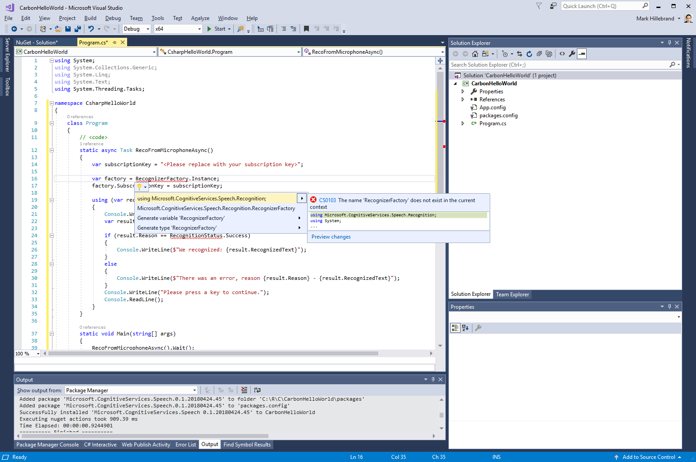

4. Make sure that the IntelliSense highlighting is resolved and save changes to the project.

## Build and run the sample

1. Build the application. From the menu bar, select **Build** > **Build Solution**. The code should compile without errors now:

    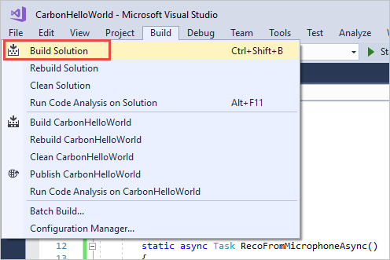

2. Start the application. From the menu bar, select **Debug** > **Start Debugging**, or press **F5**. 

    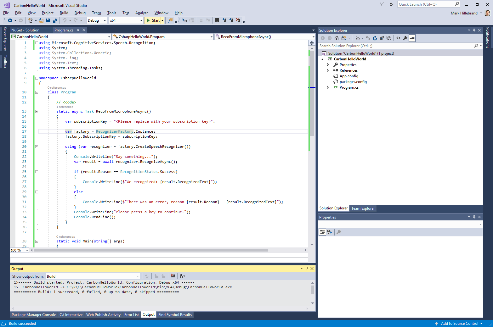

3. A console window pops up, prompting you to say something (in English).
The result of the recognition is displayed on screen.

    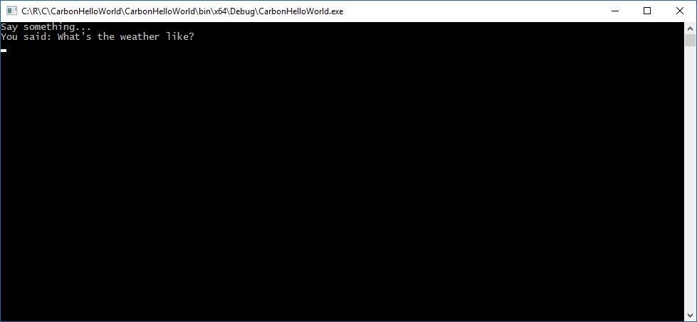

## Download code

For the latest set of samples, see the [Cognitive Services Speech SDK Sample GitHub repository](https://aka.ms/csspeech/samples).

## Next steps

- [Translate speech](how-to-translate-speech.md)
- [Customize acoustic models](how-to-customize-acoustic-models.md)
- [Customize language models](how-to-customize-language-model.md)
