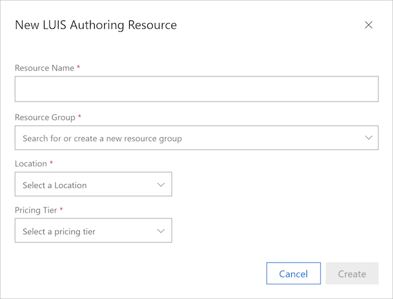
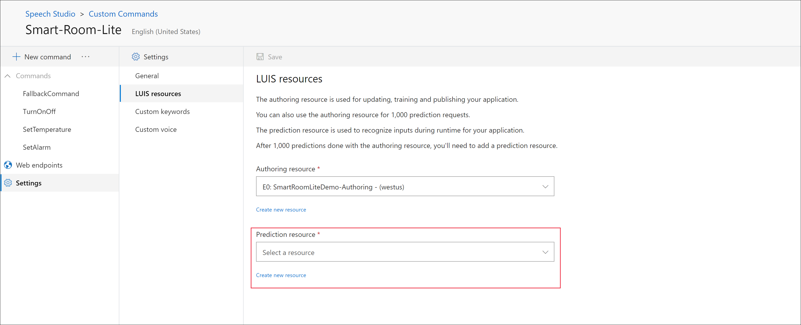

# Create an end to end voice assistant using Custom Commands
In this article you will create and test Custom Commands application using Speech Studio. You will also be able to access this application from a UWP client.

## Prerequisites

> [!div class="checklist"]
> * <a href="https://ms.portal.azure.com/#create/Microsoft.CognitiveServicesSpeechServices" target="_blank">Create an Azure Speech resource </a>
> * Download the sample
[Smart Room Lite](https://aka.ms/customcommands-documentation-smartroomlite).
> * Download the latest version of [Windows Voice Assistant Client](https://aka.ms/customcommands-voice-assistant-client).

  > [!NOTE]
  > At this time, Custom Commands only supports speech subscriptions in the westus, westus2 and neur regions.

## Go to the Speech Studio for Custom Commands

1. In a web browser, go to [Speech Studio](https://speech.microsoft.com/).
1. Enter your credentials to sign in to the portal.

   The default view is your list of Speech subscriptions.
   > [!NOTE]
   > If you don't see the select subscription page, you can navigate there by choosing "Speech resources" from the settings menu on the top bar.

1. Select your Speech subscription, and then select **Go to Studio**.
1. Select **Custom Commands**.

   The default view is a list of the Custom Commands applications you have under your selected subscription.

## Import an existing application as a new Custom Commands project
1. Select **New project** to create a project.

1. In the **Name** box, enter a project name.
1. In the **Language** list, select a language.
1. Select **Browse files** and in the browse window, select the **Smart-Room-Lite.json** file.

    > [!div class="mx-imgBorder"]
   > 

1.  In the **LUIS authoring resource** list, select an authoring resource. If there are no valid authoring resources,    create one by selecting  **Create new LUIS authoring resource**.

       > [!div class="mx-imgBorder"]
       > 

       1. In the **Resource Name** box, enter the name of the resource.
       1. In the **Resource Group** list, select a resource group.
       1. In the **Location** list, select a location.
       1. In the **Pricing Tier** list, select a tier.

      > [!NOTE]
      > You can create resource groups by entering the desired resource group name into the "Resource Group" field. The resource group will be created when **Create** is selected.

1. Next, select **Create** to create your project.
1. After the project is created, select your project.
You should now see overview of your new Custom Commands application.

## Try out some voice commands
1. Select **Train** present at the top of the right pane.
1. Once training is completed, select **Test**.
    - Turn on the tv
    - Set the temperature to 80 degrees
    - Turn it off
    - Set an alarm

## Integrate Custom Commands application in an assistant
Before you can access this application from outside Speech Studio, you need to publish the application. For publishing an application, you will need to configure prediction Luis resource.  

### Update prediction Luis resource

1. Select **Settings** in the left pane and select  **LUIS resources** in the middle pane.
1. Select a prediction resource, or create one by selecting **Create new resource**.
1. Select **Save**.
    
    > [!div class="mx-imgBorder"]
    > 

> [!NOTE]
> Because the authoring resource supports only 1,000 prediction endpoint requests per month, you will mandatorily need to set a LUIS prediction resource before publishing your Custom Commands application.

### Publish the application

Select  **Publish** present on the top of right panel. Once publish completes, a new window will appear. Note down the **Application id** and **Speech resource key** value from it. You will need these two values to be able to access the application from outside Speech Studio.

Alternatively, you can also get these values by selecting **Settings** > **General** section.

### Access application from client

In the scope of this article, we will be using the windows voice assistant client you downloaded as part of the pre-requisites. Unzip the folder.
1. Launch **VoiceAssistantClient.exe**.
1. Create a new publish profile and enter value for **Connection Profile**. In the **General Settings** section, enter values **Subscription Key**, **Subscription key region** and **Custom commands app Id**.
  > [!div class="mx-imgBorder"]
  > 
1. Select **Save and Apply Profile**.
1. Now try out the following inputs via speech/text
    > [!div class="mx-imgBorder"]
  > 

> [!TIP]
> You can click on entries in **Activity Log** to inspect the raw responses being sent from the Custom Commands service.

## Next steps

In this article, you used existing application. Next, in the How-To sections, you will learn how to design, develop, debug, test and integrate a Custom Commands application from scratch.
