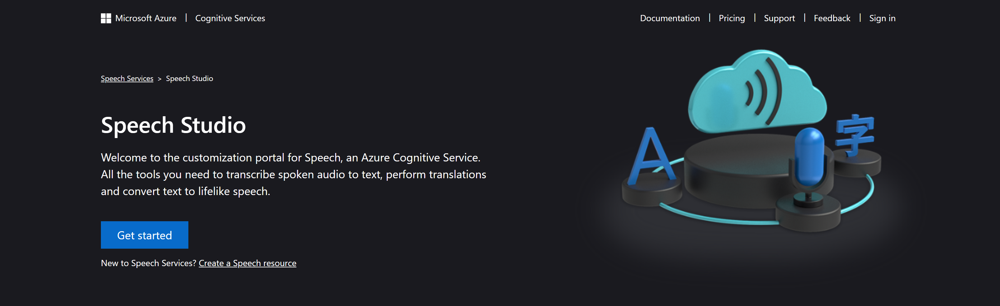
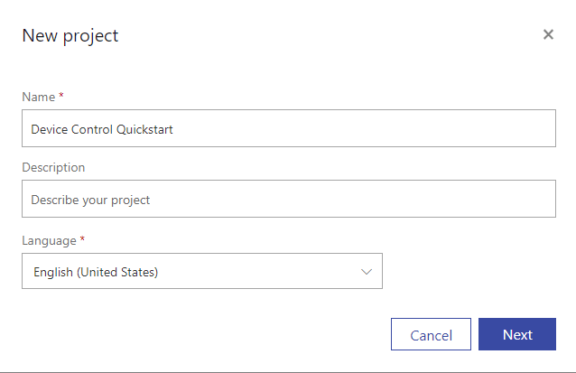
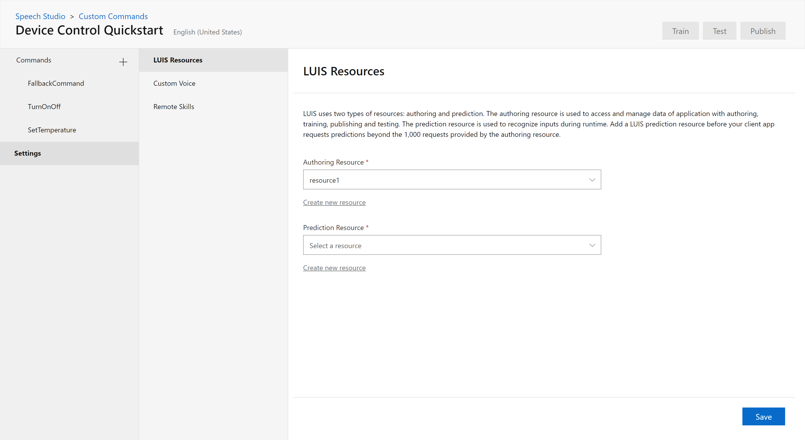
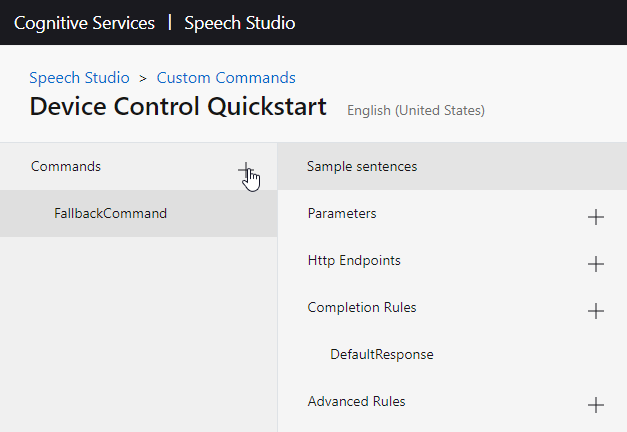
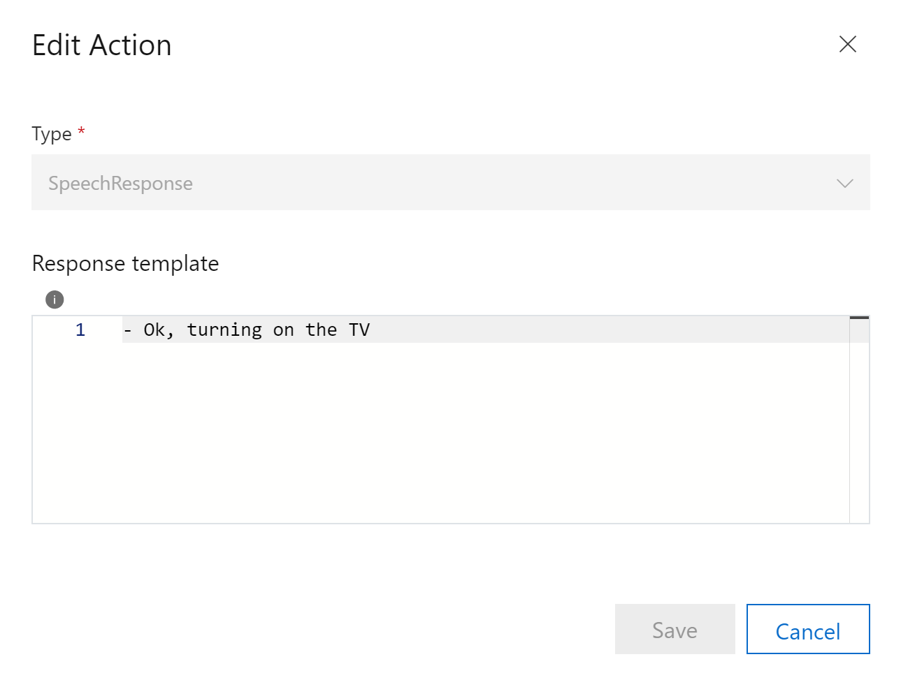
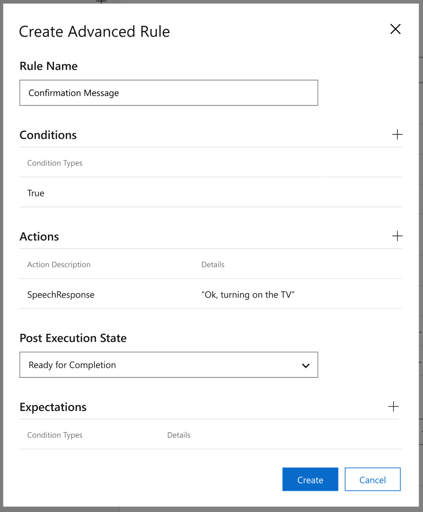
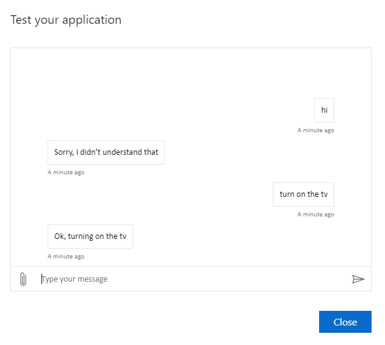

# Quickstart: Create a Custom Command (Preview)

In this article, you'll learn how to create and test a hosted Custom Commands application.
The application will recognize an utterance like "turn on the tv" and respond with a simple message "Ok, turning on the tv".

## Prerequisites

- A Speech subscription.

If you don't have a speech subscription, you can create one by navigating to the [Speech Studio](https://speech.microsoft.com/) and selecting **Create a Speech Resource**.

  > [!div class="mx-imgBorder"]
  > [  ](media/custom-speech-commands/create-new-subscription.png#lightbox)

  > [!NOTE]
  > During preview, only the westus2 region is supported.

## Go to the Speech Studio for Custom Commands

1. Open your web browser, and navigate to the [Speech Studio](https://speech.microsoft.com/)
1. Enter your credentials to sign in to the portal

   - The default view is your list of Speech subscriptions
     > [!NOTE]
     > If you don't see the select subscription page, you can navigate there by choosing "Speech resources" from the settings menu on the top bar.

1. Select your Speech subscription, then select **Go to Studio**
1. Select **Custom Commands (Preview)**

The default view is a list of the Custom Commands applications you created.

## Create a Custom Commands project

1. Select **New project** to create a new project

   > [!div class="mx-imgBorder"]
   > 

1. Enter the project name and language.
1. Select an authoring resource. If there are no valid authoring resources, create one by selecting  **Create new resource**.

   > [!div class="mx-imgBorder"]
   > 

   1. Enter the resource name, group, location, and pricing tier.

         > [!NOTE]
         > You can create resource groups by entering the desired resource group name into the "Resource Group" field. The resource group will be created when **Create** is selected.

1. Click **Create** to create your project.
1. Once created, select your project.

Your view should now be an overview of your Custom Commands application.

## Update LUIS Resources (Optional)

You can update the authoring resource set in the new project window, and set a prediction resource used to recognize inputs during runtime.

> [!NOTE]
> You will need to set a prediction resource before your application requests predictions beyond the 1,000 requests provided by the authoring resource.

> [!div class="mx-imgBorder"]
> 

1. Navigate to the LUIS Resources pane by selecting **Settings** from the left pane, and then **LUIS Resources** from the middle pane.
1. Select a prediction resource, or create one by selecting **Create new resource**
1. Select **Save**

## Create a new Command

Now you can create a Command. Let's use an example that will take a single utterance, `turn on the tv`, and respond with the message `Ok, turning on the TV`.

1. Create a new Command by selecting the `+` icon next to commands and give it the name `TurnOn`
1. Select **Save**

> [!div class="mx-imgBorder"]
> 

A Command is a set of:

| Group            | Description                                                                                                                 |
| ---------------- | --------------------------------------------------------------------------------------------------------------------------- |
| Sample Sentences | Example utterances the user can say to trigger this Command                                                                 |
| Parameters       | Information required to complete the Command                                                                                |
| Completion Rules | The actions to be taken to fulfill the Command. For example, to respond to the user or communicate with another web service |
| Advanced Rules   | Additional rules to handle more specific or complex situations                                                              |

### Add a Sample Sentence

Let's start with Sample Sentences and provide an example of what the user can say:

```
turn on the tv
```

For now, we have no parameters so we can move on to Completion Rules.

### Add a Completion Rule

Now add a Completion Rule to respond to the user indicating that an action is being taken.

1. Create a new Completion Rule by selecting the `+` icon next to Completion Rules
1. Enter the rule name
1. Add an action
   1. Create a new Speech Response Action by selecting the `+` icon next to Actions and select `SpeechResponse`
   1. Enter the response

   > [!NOTE]
   > Regular text must start with a dash. For more details, go [here](https://aka.ms/sc-lg-format)

   > [!div class="mx-imgBorder"]
   > 

1. Click **Save** to save the rule

> [!div class="mx-imgBorder"]
> 

| Setting    | Suggested value                          | Description                                        |
| ---------- | ---------------------------------------- | -------------------------------------------------- |
| Rule Name  | "ConfirmationResponse"                   | A name describing the purpose of the rule          |
| Conditions | None                                     | Conditions that determine when the rule can run    |
| Actions    | SpeechResponse "- Ok, turning on the TV" | The action to take when the rule condition is true |

## Try it out

Test the behavior using the Test chat panel.

> [!div class="mx-imgBorder"]
> 

- You type: "turn on the tv"
- Expected response: "Ok, turning on the tv"

## Next steps

> [!div class="nextstepaction"]
> [Quickstart: Create a Custom Command with Parameters (Preview)](./quickstart-custom-speech-commands-create-parameters.md)
