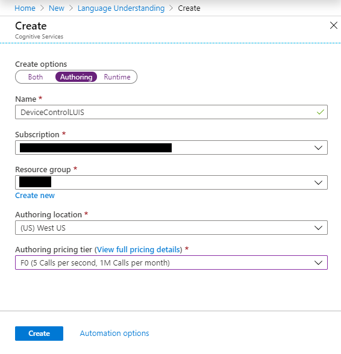

# Quickstart: Create a Custom Command (Preview)

In this article, you'll learn how to create and test a hosted Custom Commands application.
The application will recognize an utterance like "turn on the tv" and respond with a simple message "Ok, turning on the tv".

## Prerequisites

- A Speech subscription. [Try the speech service for free](~/articles/cognitive-services/speech-service/get-started.md).

  > [!NOTE]
  > During preview, only the westus2 region is supported for subscription keys.

- A [Language Understanding](https://www.luis.ai/home) (LUIS) authoring key:
  1. Open a web browser and navigate to the [Azure portal](https://portal.azure.com)
  1. Select Create a resource
  1. Search for and select [Language Understanding](https://aka.ms/sc-luis-all)
  1. Select Authoring in the create options
  1. After the resource is deployed, go to the resource and copy the key from the Quickstart or Keys section

      > [!div class="mx-imgBorder"]
      > 

## Go to the Speech Studio for Custom Commands

1. Open your web browser, and navigate to the [Speech Studio](https://speech.microsoft.com/)
1. Enter your credentials to sign in to the portal

   - The default view is your list of Speech subscriptions
     > [!NOTE]
     > If you don't see the select subscription page, you can navigate there by choosing "Speech resources" from the settings menu on the top bar.

1. Select your Speech subscription, then select **Go to Studio**
1. Select **Custom Commands (Preview)**

The default view is a list of the Custom Commands applications you created.

## Create a Custom Commands project

1. Select **New project** to create a new project

   > [!div class="mx-imgBorder"]
   > 

1. Enter the project name and language, then select **Next** to continue
1. Enter your LUIS authoring key
1. Once created, select your project

Your view should now be an overview of your Custom Commands application.

## Create a new Command

Now you can create a Command. Let's use an example that will take a single utterance, `turn on the tv`, and respond with the message `Ok, turning on the TV`.

1. Create a new Command by selecting the `+` icon next to commands and give it the name `TurnOn`
1. Select **Save**

> [!div class="mx-imgBorder"]
> 

A Command is a set of:

| Group            | Description                                                                                                                 |
| ---------------- | --------------------------------------------------------------------------------------------------------------------------- |
| Sample Sentences | Example utterances the user can say to trigger this Command                                                                 |
| Parameters       | Information required to complete the Command                                                                                |
| Completion Rules | The actions to be taken to fulfill the Command. For example, to respond to the user or communicate with another web service |
| Advanced Rules   | Additional rules to handle more specific or complex situations                                                              |

### Add a Sample Sentence

Let's start with Sample Sentences and provide an example of what the user can say:

```
turn on the tv
```

For now, we have no parameters so we can move on to Completion Rules.

### Add a Completion Rule

Now add a Completion Rule to respond to the user indicating that an action is being taken.

> [!div class="mx-imgBorder"]
> 

| Setting    | Suggested value                        | Description                                        |
| ---------- | -------------------------------------- | -------------------------------------------------- |
| Rule Name  | "ConfirmationResponse"                 | A name describing the purpose of the rule          |
| Conditions | None                                   | Conditions that determine when the rule can run    |
| Actions    | SpeechResponse "Ok, turning on the TV" | The action to take when the rule condition is true |

## Try it out

Test the behavior using the Test chat panel.

> [!div class="mx-imgBorder"]
> 

- You type: "turn on the tv"
- Expected response: "Ok, turning on the tv"

## Next steps
> [!div class="nextstepaction"]
> [Quickstart: Create a Custom Command with Parameters (Preview)](./quickstart-custom-speech-commands-create-parameters.md)
