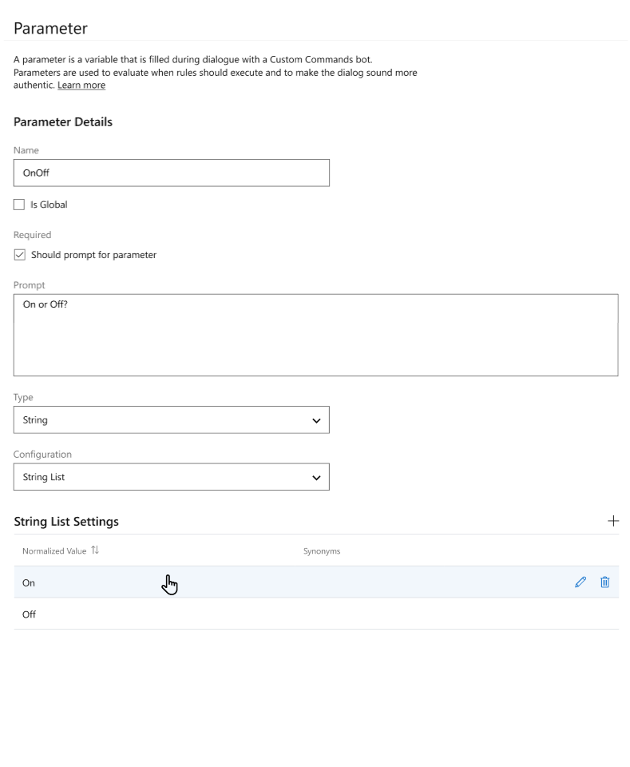
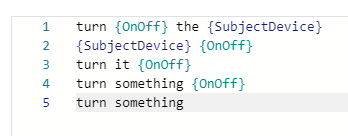

# Quickstart: Create a Custom Command with parameters (Preview)

In the [previous article](./quickstart-custom-speech-commands-create-new.md), we created a new Custom Commands project to respond to commands without parameters.

In this article, we will extend this application with parameters so that it can handle turning on and turning off multiple devices.

## Create Parameters

1. Open the project [we created previously](./quickstart-custom-speech-commands-create-new.md)
1. Because the Command will now handle on and off, rename the Command to "TurnOnOff"
   - Hover over the name of the Command and select the edit icon to change the name
1. Create a new parameter to represent whether the user wants to turn the device on or off
   - Select the `+` icon next to the Parameters section

   > [!div class="mx-imgBorder"]
   > 

   | Setting            | Suggested value     | Description                                                                                               |
   | ------------------ | ------------------- | --------------------------------------------------------------------------------------------------------- |
   | Name               | OnOff               | A descriptive name for your parameter                                                                     |
   | Is Global          | unchecked           | Checkbox indicating whether a value for this parameter is globally applied to all Commands in the project |
   | Required           | checked             | Checkbox indicating whether a value for this parameter is required before completing the Command          |
   | Response template  | "- On or off?"      | A prompt to ask for the value of this parameter when it isn't known                                       |
   | Type               | String              | The type of parameter, such as Number, String, or Date Time                                               |
   | Configuration      | String List         | For Strings, a String List limits inputs to a set of possible values                                      |
   | String list values | on, off             | For a String List parameter, the set of possible values and their synonyms                                |

   - Next, select the `+` icon again to add a second parameter to represent the name of the devices. For this example, a tv and a fan

   | Setting            | Suggested value       | Description                                                                                               |
   | ------------------ | --------------------- | --------------------------------------------------------------------------------------------------------- |
   | Name               | SubjectDevice         | A descriptive name for your parameter                                                                     |
   | Is Global          | unchecked             | Checkbox indicating whether a value for this parameter is globally applied to all Commands in the project |
   | Required           | checked               | Checkbox indicating whether a value for this parameter is required before completing the Command          |
   | Response template  | "- Which device?"     | A prompt to ask for the value of this parameter when it isn't known                                       |
   | Type               | String                | The type of parameter, such as Number, String, or Date Time                                               |
   | Configuration      | String List           | For Strings, a String List limits inputs to a set of possible values                                      |
   | String list values | tv, fan               | For a String List parameter, the set of possible values and their synonyms                                |
   | Synonyms (tv)      | television, telly     | Optional synonyms for each possible value of a String List Parameter                                      |

## Add Sample Sentences

With parameters, it's helpful to add sample sentences that cover all possible combinations. For example:

1. Full parameter information - `"turn {OnOff} the {SubjectDevice}"`
1. Partial parameter information - `"turn it {OnOff}"`
1. No parameter information - `"turn something"`

Sample sentences with different amounts of information allow the Custom Commands application to resolve both one-shot resolutions and multi-turn resolutions with partial information.

With that in mind, edit the Sample Sentences to use the parameters as suggested below.

> [!TIP]
> In the Sample Sentences editor use curly braces to refer to your parameters. - `turn {OnOff} the {SubjectDevice}`
> Use tab completion to refer to previously created parameters.

> [!div class="mx-imgBorder"]
> 

```
turn {OnOff} the {SubjectDevice}
{SubjectDevice} {OnOff}
turn it {OnOff}
turn something {OnOff}
turn something
```

## Add parameters to Completion rule

Modify the Completion rule that you created in [the previous quickstart](./quickstart-custom-speech-commands-create-new.md):

1. Add a new Condition and select Required parameter. Select both `OnOff` and `SubjectDevice`
1. Edit the Speech Response action to use `OnOff` and `SubjectDevice`:

   ```
   Ok, turning {OnOff} the {SubjectDevice}
   ```

## Try it out

Open the Test chat panel and try a few interactions.

- Input: turn off the tv
- Output: Ok, turning off the tv

- Input: turn off the television
- Output: Ok, turning off the tv

- Input: turn it off
- Output: Which device?
- Input: the tv
- Output: Ok, turning off the tv

## Next steps
> [!div class="nextstepaction"]
> [Quickstart: Connect to a Custom Command application with the Speech SDK (Preview)](./quickstart-custom-speech-commands-speech-sdk.md)
