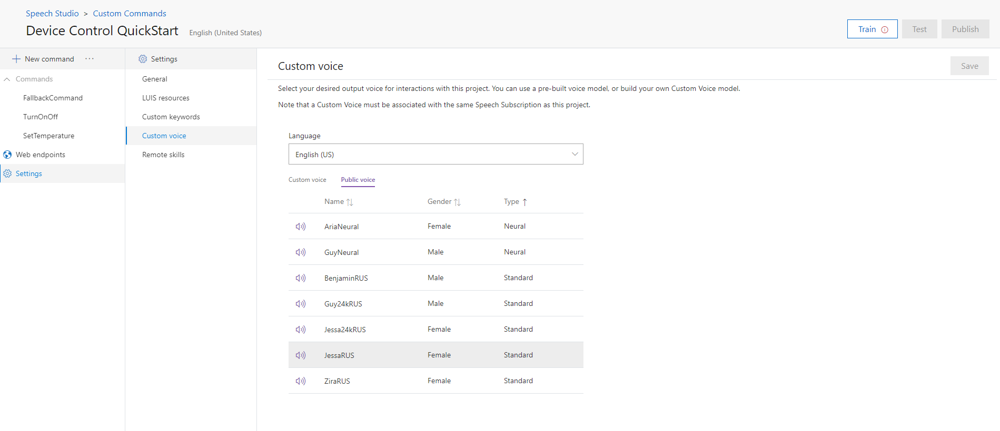

# Quickstart: Use Custom Commands with Custom Voice (Preview)

In the [previous article](./quickstart-custom-speech-commands-create-parameters.md), we created a new Custom Commands project to respond to commands with parameters.

In this article, we'll select a custom output voice for the application we created.

## Select a Custom Voice

1. Open the project [we created previously](./quickstart-custom-speech-commands-create-parameters.md)
1. Select **Settings** from the left pane
1. Select **Custom Voice** from the middle pane
1. Select the desired custom or public voice from the table
1. Select **Save**

> [!div class="mx-imgBorder"]
> 

> [!NOTE]
> - For **Public voices**, **Neural types** are only available for specific regions. To check availability, see [standard and neural voices by region/endpoint](https://docs.microsoft.com/azure/cognitive-services/speech-service/regions#standard-and-neural-voices).
> - For **Custom voices**, they can be created from the Custom Voice project page. See [Get Started with Custom Voice](./how-to-custom-voice.md).

Now the application will respond in the selected voice, instead of the default voice.

## Next steps
> [!div class="nextstepaction"]
> [Quickstart: Connect to a Custom Command application with the Speech SDK (Preview)](./quickstart-custom-speech-commands-speech-sdk.md)

