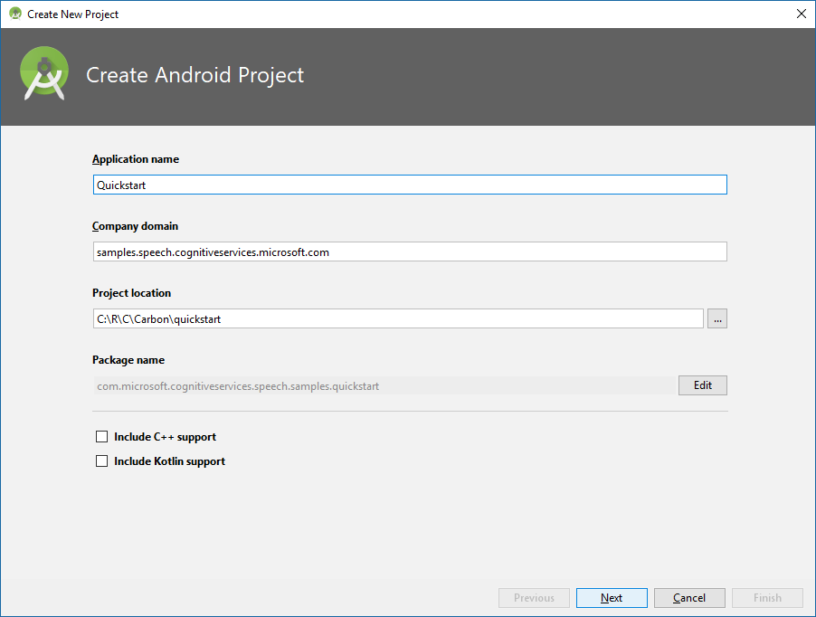
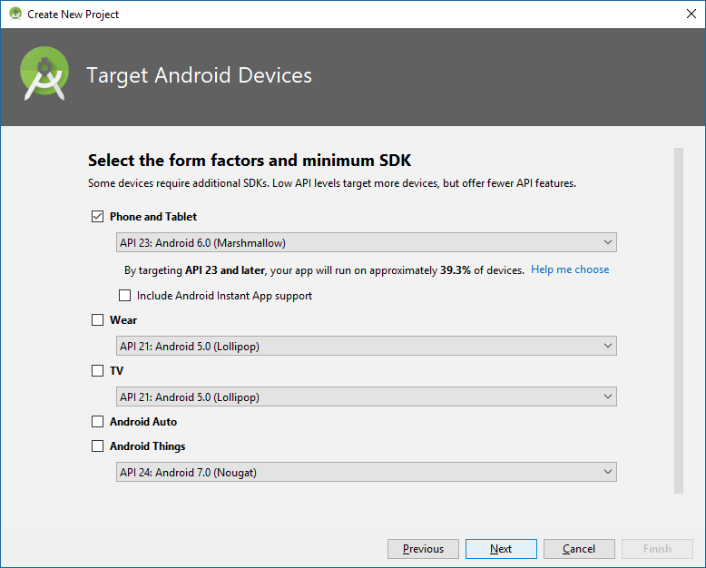
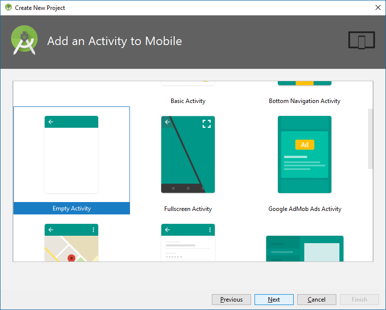
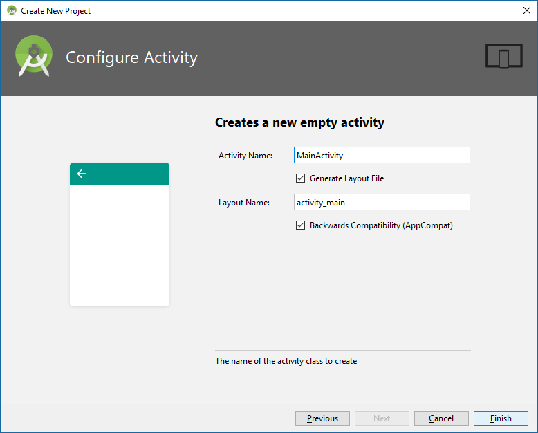
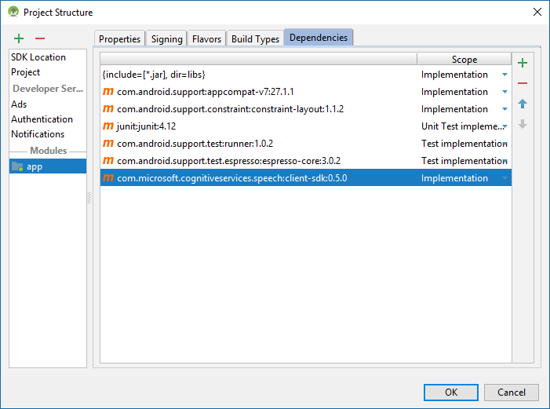
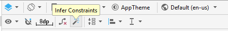
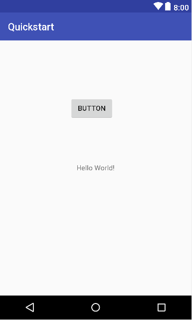
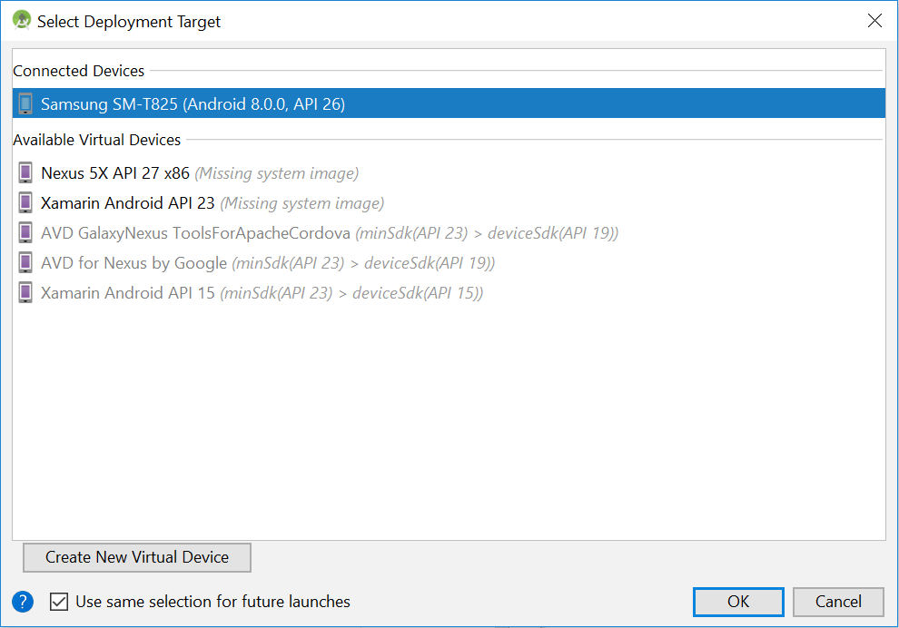
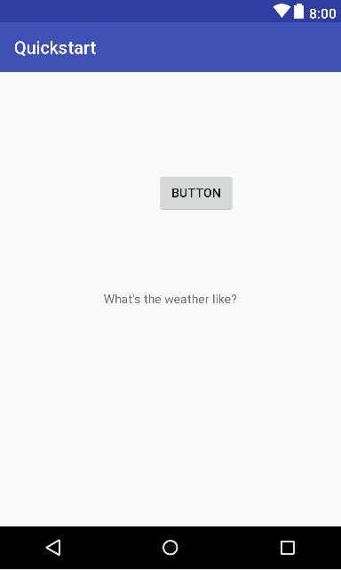

# Quickstart: Recognize speech in Java on Android by using the Speech SDK

[!INCLUDE [Selector](../../../includes/cognitive-services-speech-service-quickstart-selector.md)]

In this article, you create a Java application for Android 6.0 Marshmallow (API 23) or later by using the Cognitive Services [Speech SDK](speech-sdk.md). You transcribe speech to text in real time from your device's microphone. The application is built with the Speech SDK Maven package and [Android Studio](https://developer.android.com/studio/) 3.1 running on a PC. The Speech SDK libraries are currently compatible with Android devices that have 64-bit ARM processors.

> [!NOTE]
> For the Speech Devices SDK and the Roobo device, see [Speech Devices SDK](speech-devices-sdk.md).

## Prerequisites

You need a Speech service subscription key to complete this Quickstart. You can get one for free. See [Try the Speech service for free](get-started.md) for details.

## Create and configure a project

1. Launch Android Studio, and choose **Start a new Android Studio project** in the Welcome window.

    

1. The **Create New Project** wizard appears. In the **Create Android Project** screen, under **Application name**, enter **Quickstart**. Under **Company domain**, enter **samples.speech.cognitiveservices.microsoft.com**. Then choose a project directory. Leave the C++ and Kotlin check boxes unselected, and select **Next**.

   

1. In the **Target Android Devices** screen, select only **Phone and Tablet**. In the drop-down list below it, choose **API 23: Android 6.0 (Marshmallow)**, and select **Next**.

   

1. In the **Add an Activity to Mobile** screen, select **Empty Activity**, and click **Next**.

   

1. In the **Configure Activity** screen, use **MainActivity** as the activity name and **activity\_main** as the layout name. Select both check boxes, and select **Finish**.

   

Android Studio takes a moment to prepare your new Android project. Next, configure the project to know about the Speech SDK and to use Java 8.

[!INCLUDE [License Notice](../../../includes/cognitive-services-speech-service-license-notice.md)]

The Speech SDK for Android is packaged as an [AAR (Android Library)](https://developer.android.com/studio/projects/android-library), which includes the necessary libraries and the Android permissions needed to use it. It is hosted in a Maven repository, and so is automatically downloaded by Android Studio for use in your application.

Set up your project to use the Speech SDK. Open the Project Structure window by choosing **File** > **Project Structure** from the Android Studio menu bar. In the Project Structure window, make the following changes: 

1. In the list on the left side of the window, select **Project**. Edit the **Default Library Repository** settings by appending a comma and our Maven repository URL enclosed in single quotes. 'https://csspeechstorage.blob.core.windows.net/maven/'

   

1. In the same screen, on the left side, select **app**. Then select the **Dependencies** tab at the top of the window. Select the green plus sign (+), and choose **Library dependency** from the drop-down menu.

   

1. In the window that appears, enter the name and version of the Speech SDK for Android in the expected format, `com.microsoft.cognitiveservices.speech:client-sdk:0.6.0`. Then select **OK**. The Speech SDK is added to the list of dependencies, as shown here.

   

1. Select the **Properties** tab. For both **Source Compatibility** and **Target Compatibility**, select **1.8**.

   

1. Select **OK** to close the Project Structure window and apply your changes to the project.

## Create user interface

We will create a basic user interface for the application. Edit the layout for your main activity, `activity_main.xml`. Initially, the layout includes a title bar with your application's name, and a TextView containing the text "Hello World!"

* Click the TextView element. Change its ID attribute in the upper-right corner to `hello`.

* From the Palette in the upper left of the `activity_main.xml` window, drag a button into the empty space above the text.

* In the button's attributes on the right, in the value for the `onClick` attribute, enter `onSpeechButtonClicked`. We'll write a method with this name to handle the button event.  Change its ID attribute in the upper-right corner to `button`.

* Use the magic wand icon at the top of the designer to infer layout constraints.

  

The text and graphical representation of your UI should now look like this.

<table>
<tr>
<td valign="top">

</td>
<td valign="top">
[!code-xml]
</td>
</tr>
</table>

## Add sample code

1. Open the source file `MainActivity.java`. Replace all the code following the `package` statement with the following.

   [!code-java]

   * The `onCreate` method includes code that requests microphone and internet permissions, and initializes the native platform binding. Configuring the native platform bindings is only required once. It should be done early during application initialization.
   
   * The method `onSpeechButtonClicked` is, as noted earlier, the button click handler. A button press triggers speech to text transcription.

1. In the same file, replace the string `YourSubscriptionKey` with your subscription key.

1. Also replace the string `YourServiceRegion` with the [region](regions.md) associated with your subscription (for example, `westus` for the free trial subscription).

## Build and run the app

1. Connect your Android device to your development PC. Make sure you have enabled [development mode and USB debugging](https://developer.android.com/studio/debug/dev-options) on the device.

1. To build the application, press Ctrl+F9, or choose **Build** > **Make Project** from the menu bar.

1. To launch the application, press Shift+F10, or choose **Run** > **Run 'app'**.

1. In the deployment target window that appears, choose your Android device.

   

Press the button in the application to begin a speech recognition section. The next 15 seconds of English speech will be sent to the Speech service and transcribed. The result appears in the Android application, and in the logcat window in Android Studio.

[!INCLUDE [Download this sample](../../../includes/cognitive-services-speech-service-speech-sdk-sample-download-h2.md)]
Look for this sample in the `quickstart/java-android` folder.

## Next steps

> [!div class="nextstepaction"]
> [Recognize intents from speech by using the Speech SDK for C#](how-to-recognize-intents-from-speech-csharp.md)

## See also

- [Translate speech](how-to-translate-speech-csharp.md)
- [Customize acoustic models](how-to-customize-acoustic-models.md)
- [Customize language models](how-to-customize-language-model.md)
