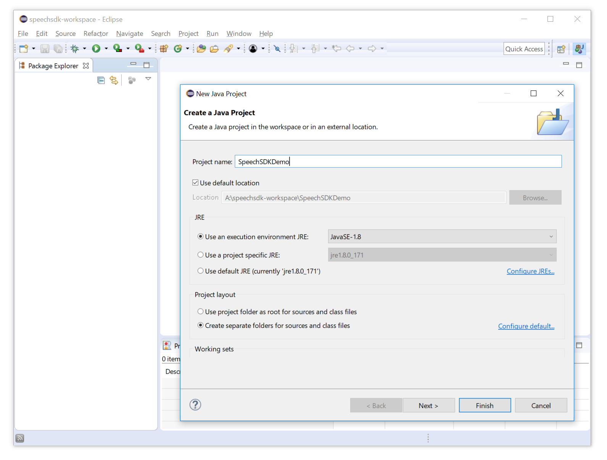
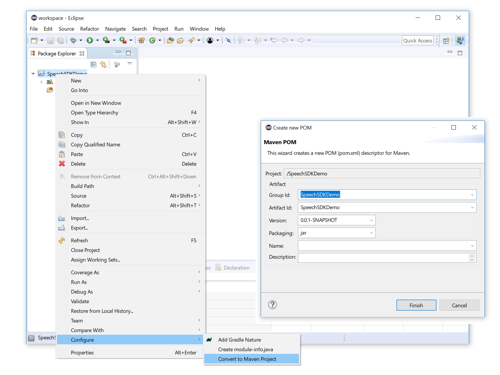
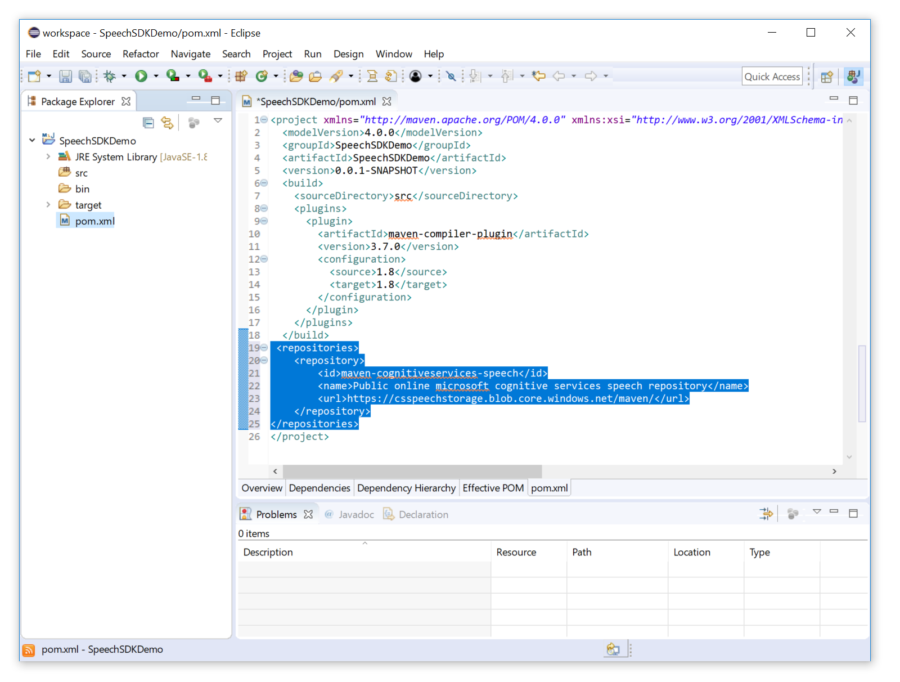
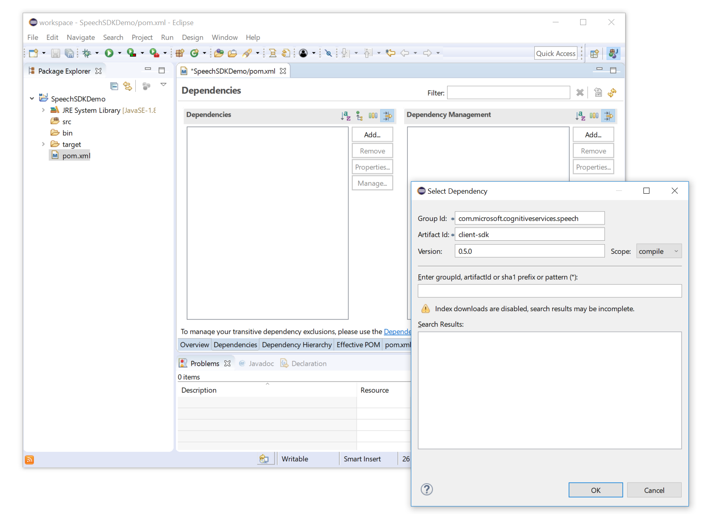
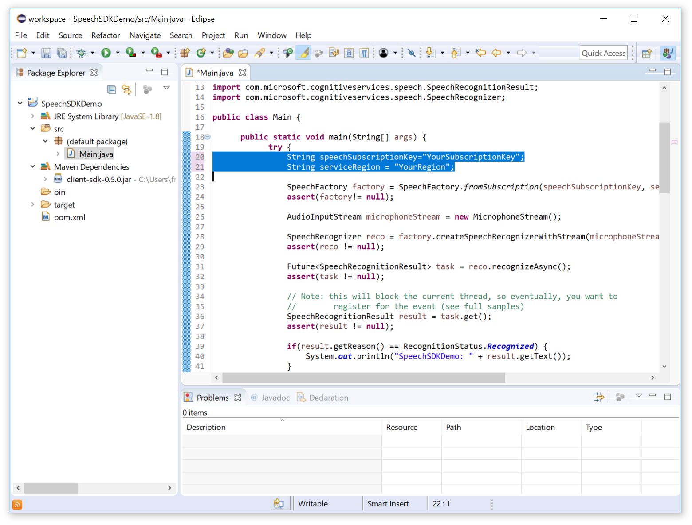
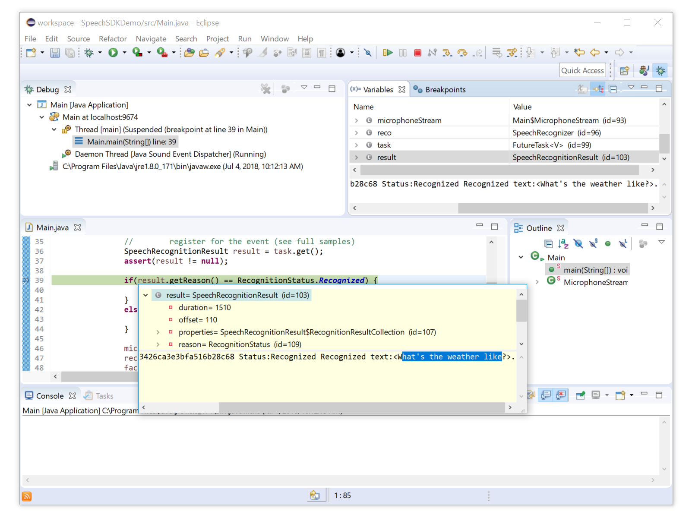

# Quickstart: Recognize speech in Java in the Java Run-Time Environment

[!include[Selector](../../../includes/cognitive-services-speech-service-quickstart-selector.md)]

This document describes how to create a Java-based console application for the Java Run-Time Environment (JRE) that makes use of the Speech SDK.
The application is based on the Microsoft Cognitive Services SDK Maven Package.
We use Eclipse as an Integrated Development Environment (IDE).

## Prerequisites

* A subscription key for the Speech service. See [Try the speech service for free](get-started.md).
* A PC (Windows x64, Ubuntu 16.04 x64) capable to run Eclipse, with a working microphone.
* 64-bit JRE/JDK for Java 8 or higher.
* Version 4.8 of [Eclipse](https://www.eclipse.org), 64-bit.

## Creating an empty workspace

Start Eclipse, and create an empty workspace:


## Creating a new project

Create a new Java project in the empty workspace.



Convert the Java project to use the Maven build system.



Double-click on the pom.xml, switch to the xml tab and add a reference to the maven repository for the speech sdk libraries to the pom.

<!-- TODO include -->
```xml
<project xmlns="http://maven.apache.org/POM/4.0.0" xmlns:xsi="http://www.w3.org/2001/XMLSchema-instance" xsi:schemaLocation="http://maven.apache.org/POM/4.0.0 http://maven.apache.org/xsd/maven-4.0.0.xsd">
 <repositories>
    <repository>
        <id>maven-cognitiveservices-speech</id>
        <name>Public online microsoft cognitive services speech repository</name>
        <url>https://csspeechstorage.blob.core.windows.net/maven/</url>
    </repository>
</repositories>
</project>
```



Once the maven repository reference has been added, add a dependency to the speech client sdk to your pom.

```xml
<project xmlns="http://maven.apache.org/POM/4.0.0" xmlns:xsi="http://www.w3.org/2001/XMLSchema-instance" xsi:schemaLocation="http://maven.apache.org/POM/4.0.0 http://maven.apache.org/xsd/maven-4.0.0.xsd">
 <dependencies>
     <dependency>
         <groupId>com.microsoft.cognitiveservices.speech</groupId>
         <artifactId>client-sdk</artifactId>
         <version>0.5.0</version>
     </dependency>
 </dependencies>
</project>
```



At this point, the workspace has been set up successfully and you should not see any build issues.

## Add the sample code

After the workspace setup is completed, add code to the java project created. Start by creating a new, empty class, named "Main".


Replace your default Main code with the following code:



The first part is code to perform a speech recognition:

<!-- TODO include -->
```java
import java.util.concurrent.Future;

import javax.sound.sampled.AudioFormat;
import javax.sound.sampled.AudioSystem;
import javax.sound.sampled.DataLine;
import javax.sound.sampled.LineUnavailableException;
import javax.sound.sampled.TargetDataLine;

import com.microsoft.cognitiveservices.speech.AudioInputStream;
import com.microsoft.cognitiveservices.speech.AudioInputStreamFormat;
import com.microsoft.cognitiveservices.speech.RecognitionStatus;
import com.microsoft.cognitiveservices.speech.SpeechFactory;
import com.microsoft.cognitiveservices.speech.SpeechRecognitionResult;
import com.microsoft.cognitiveservices.speech.SpeechRecognizer;

public class Main {
    public static void main(String[] args) {
        try {
            String speechSubscriptionKey="0ab1c14633d04ee4828cb899bfcefe5f";
            String serviceRegion = "westus";

            SpeechFactory factory = SpeechFactory.fromSubscription(speechSubscriptionKey, serviceRegion);
            assert(factory!= null);

            AudioInputStream microphoneStream = new MicrophoneStream();

            SpeechRecognizer reco = factory.createSpeechRecognizerWithStream(microphoneStream);
            assert(reco != null);

            Future<SpeechRecognitionResult> task = reco.recognizeAsync();
            assert(task != null);

            // Note: this will block the current thread, so eventually, you want to
            //        register for the event (see full samples)
            SpeechRecognitionResult result = task.get();
            assert(result != null);

            if(result.getReason() == RecognitionStatus.Recognized) {
                System.out.println("SpeechSDKDemo: " + result.getText());
            }
            else {
                System.out.println("Error recognizing. Did you update the subscription info?" + System.lineSeparator() + result.toString());
            }

            microphoneStream.close();
            reco.close();
            factory.close();

            System.exit(0);
        } catch (Exception ex) {
            System.out.println("unexpected " + ex.getMessage());
            assert(false);
        }
    }
}
```


> [!IMPORTANT]
> Replace the subscription key with one that you obtained. <br>
> Replace the region with your region from the [Speech Service REST API](https://docs.microsoft.com/azure/cognitive-services/speech-service/rest-apis), e.g. replace with 'westus'.

## Build and run the sample

Launch the program under the debugger. The next 15 seconds will be recognized and logged in the console  window.



[!include[Download the sample](../../../includes/cognitive-services-speech-service-speech-sdk-sample-download-h2.md)]
Look for this sample in the `quickstart/java-jre` folder.

## Next steps

* [Get our samples](speech-sdk.md#get-the-samples)
