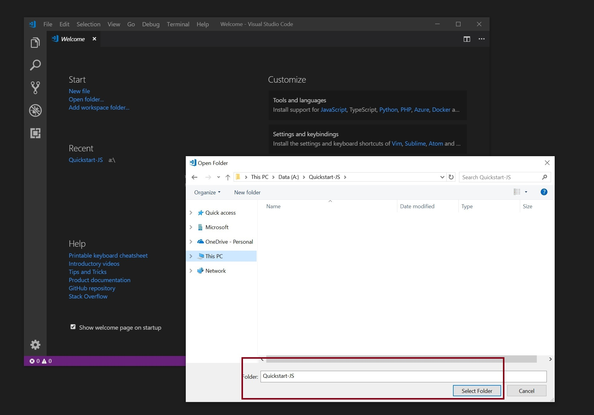
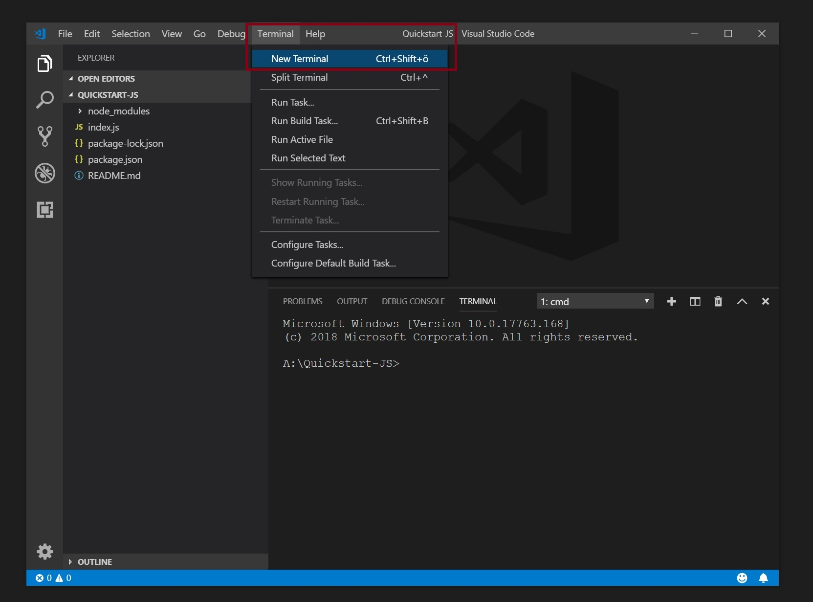
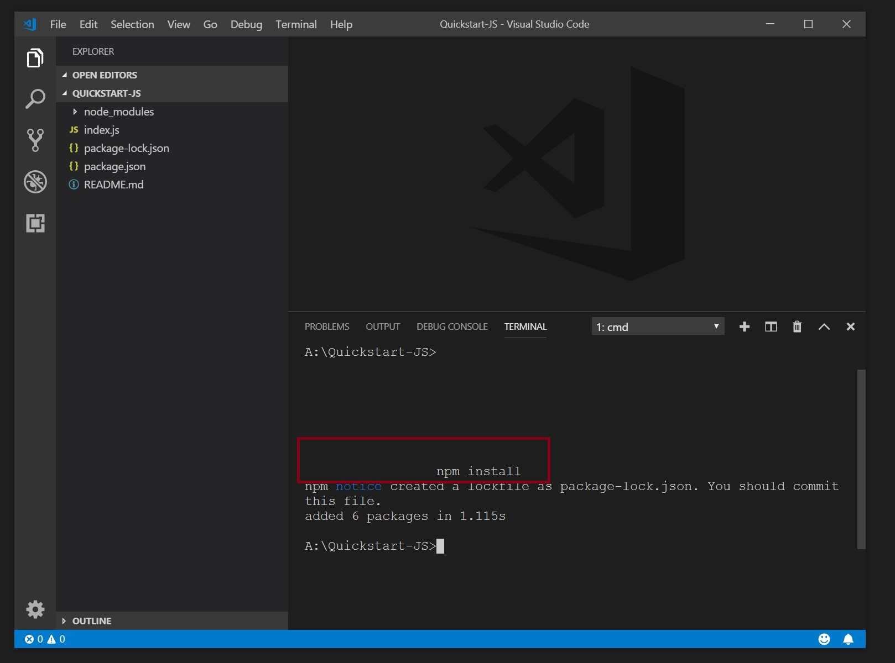
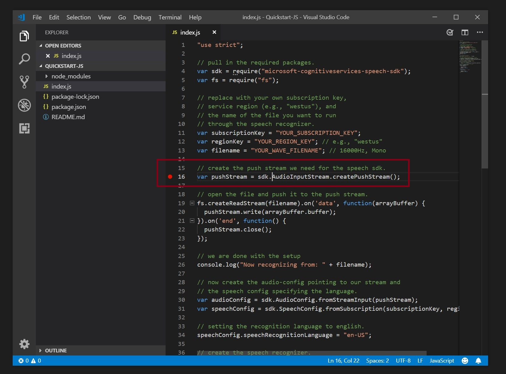
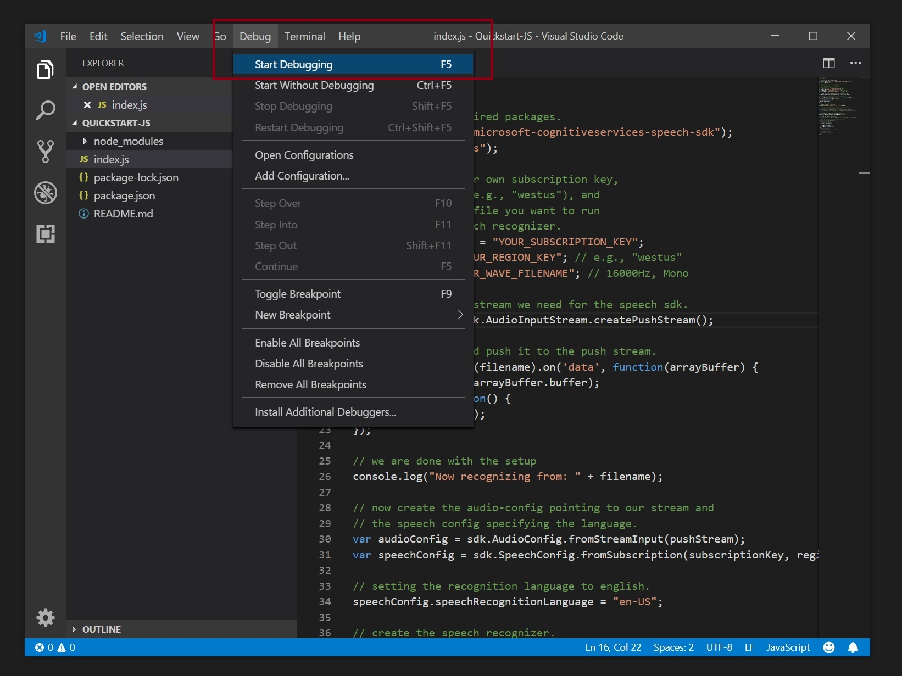
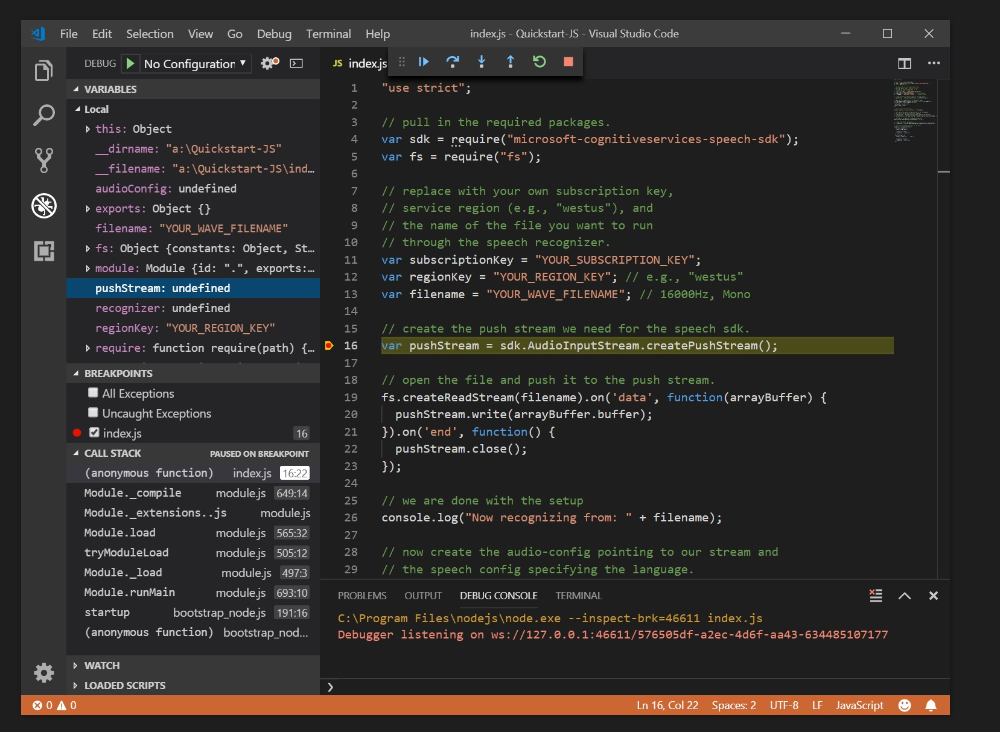
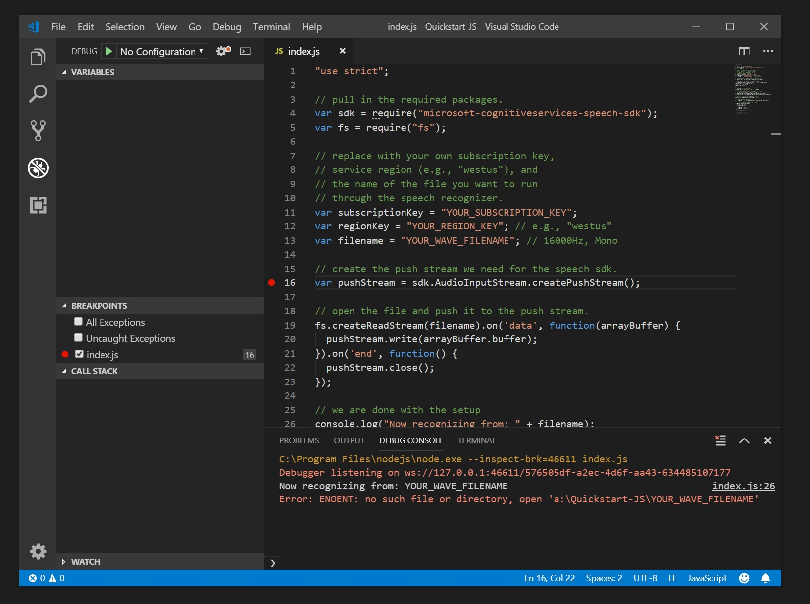

# Quickstart: Recognize speech in JavaScript in Node.js using the Speech Service SDK

[!INCLUDE [Selector](../../../includes/cognitive-services-speech-service-quickstart-selector.md)]

In this article, you'll learn how to create a Node.js project using the JavaScript binding of the Cognitive Services Speech SDK to transcribe speech to text.
The application is based on the Microsoft [Cognitive Services Speech SDK](https://aka.ms/csspeech/npmpackage).

## Prerequisites

* A subscription key for the Speech service. See [Try the Speech Service for free](get-started.md).
* A current version of [Node.js](https://nodejs.org).

## Create a new project folder

Create a new, empty folder and initialize it as a new Javascript and Node.js project.

```nodejs
npm init -f
```

This will init the package.json files with default values. You will probably want to edit this file later.

## Install the Speech SDK for JavaScript into that folder

Add the Speech SDK via `npm install microsoft-cognitiveservices-speech-sdk` to your Node.js project.

This will download and install the latest version of the Speech SDK and any required prerequisites from npmjs. The SDK will be installed in the `node_modules\microsoft-cognitiveservices-speech-sdk` directory inside your project folder.

## Using the Speech SDK

Create a new file in the folder, named `index.js` and open this file with a text editor.

> [!NOTE]
> Please note that in Node.js the Speech SDK does not support the microphone or the File data type. Both are only supported on browsers. Instead, use the Stream interface to the Speech SDK, either through `AudioInputStream.createPushStream()` or `AudioInputStream.createPullStream()`.

In this example, we will use the `PushAudioInputStream` interface.

Create the following JavaScript skeleton:

```javascript
"use strict";

var sdk = require("microsoft-cognitiveservices-speech-sdk");

var fs = require("fs"); // provides access to the file system

var filename = "whatstheweatherlike.wav"; // 16000Hz, Mono support only.
var fileContents = fs.readFileSync(filename);
var arrayBuffer = Uint8Array.from(fileContents).buffer;

var audioStream = sdk.AudioInputStream.createPushStream();
audioStream.write(arrayBuffer);
audioStream.close();

var audioConfig = sdk.AudioConfig.fromStreamInput(audioStream);
var speechConfig = sdk.SpeechConfig.fromSubscription("YOUR_SUBSCRIPTION", "YOUR_REGION");

var recognizer = new sdk.SpeechRecognizer(speechConfig, audioConfig);

recognizer.recognizeOnceAsync(
    function (result) {
      console.log(result);

      recognizer.close();
      recognizer = undefined;
    },
    function (err) {
      console.trace("err - " + err);

      recognizer.close();
      recognizer = undefined;
    });
```

## Running the sample from command line

To launch the app, adapt `YOUR_SUBSCRIPTION`, `YOUR_REGION` (and `whatstheweatherlike.wav`, if necessary). The you can execute it by calling

```nodejs
node index.js
```

It will trigger a recognition using the provided filename and present the output on the console.

Here is a sample output of running main.java after updating the subscription key and using the file `whatstheweatherlike.wav`.

```json
SpeechRecognitionResult {
  "privResultId": "9E30EEBD41AC4571BB77CF9164441F46",
  "privReason": 3,
  "privText": "What's the weather like?",
  "privDuration": 15900000,
  "privOffset": 300000,
  "privErrorDetails": null,
  "privJson": {
    "RecognitionStatus": "Success",
    "DisplayText": "What's the weather like?",
    "Offset": 300000,
    "Duration": 15900000
  },
  "privProperties": null
}
```

## Running the sample from Visual Studio Code

You can run the sample from Visual Studio Code as well. Follow these steps to install, open, and execute the quickstart:

1. Start Visual Studio Code and click on "Open Folder", then navigate to the quickstart folder

   

1. Open a terminal in Visual Studio Code

   

1. Run npm to install the dependencies

   

1. Now you are ready to open `index.js`and set a breakpoint

   

1. To start debugging, either hit F5 or select Debug/Start Debugging from the menu

   

1. When a breakpiont is hit, you can inspect the callstack and variables

   

1. Any output will be shown in the debug console window

   


For the complete quickstart code and more samples, please visit our Samples Repository.

[!INCLUDE [Download the sample](../../../includes/cognitive-services-speech-service-speech-sdk-sample-download-h2.md)]
Look for this sample in the `quickstart/js-node` folder.

## Next steps

> [!div class="nextstepaction"]
> [Get our samples](speech-sdk.md#get-the-samples)
