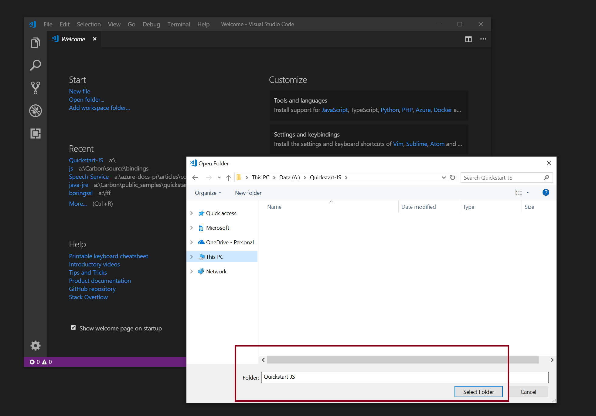
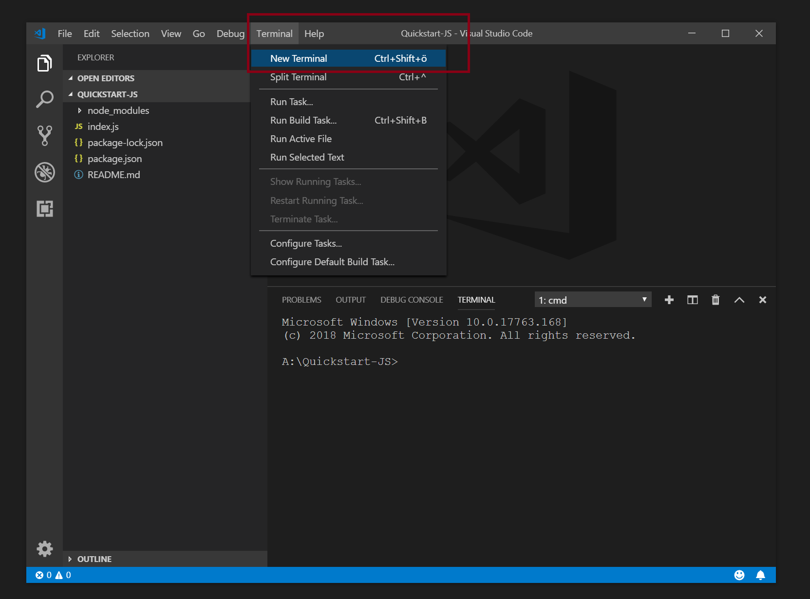
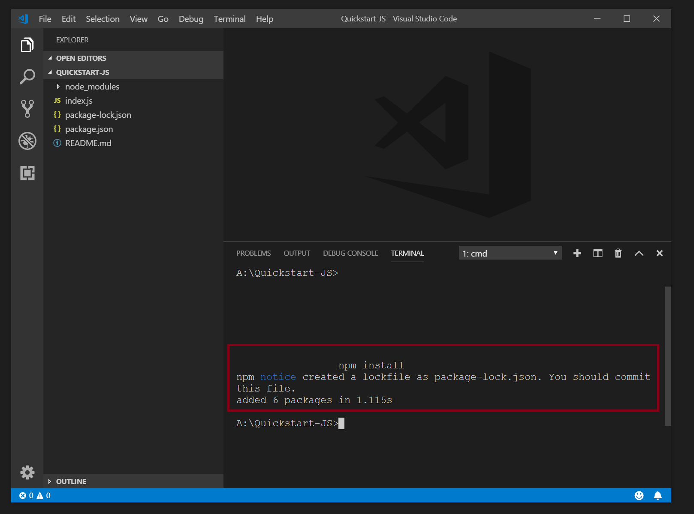
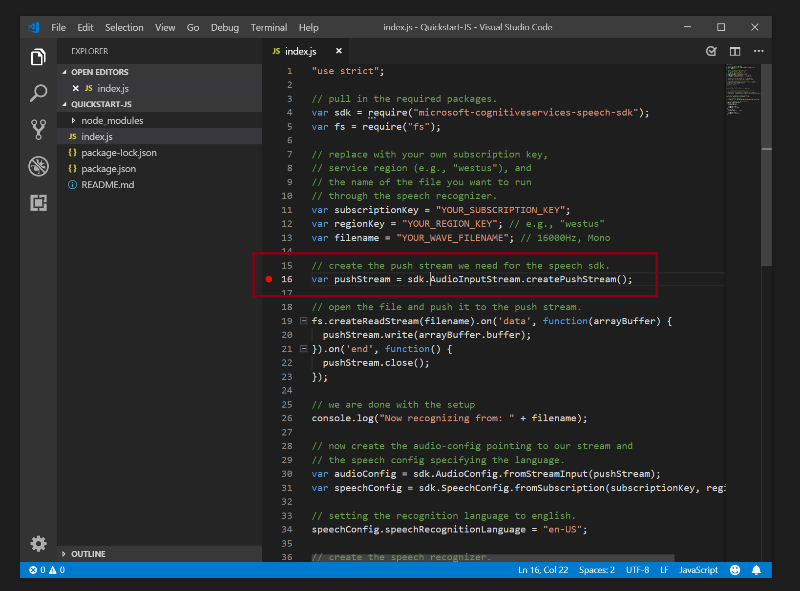
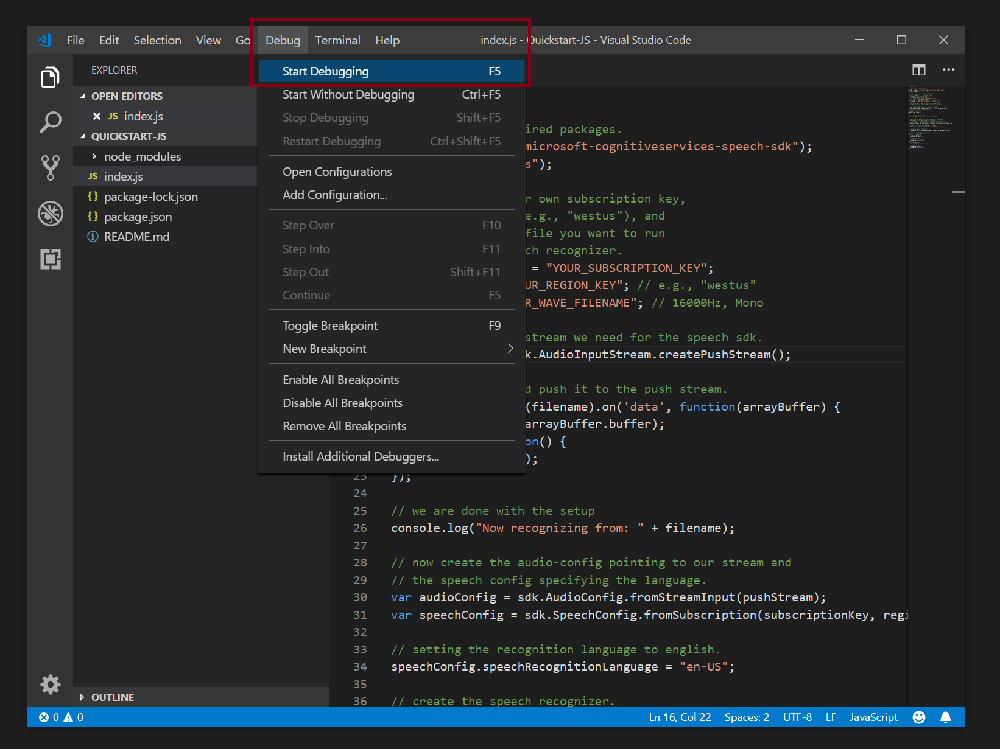
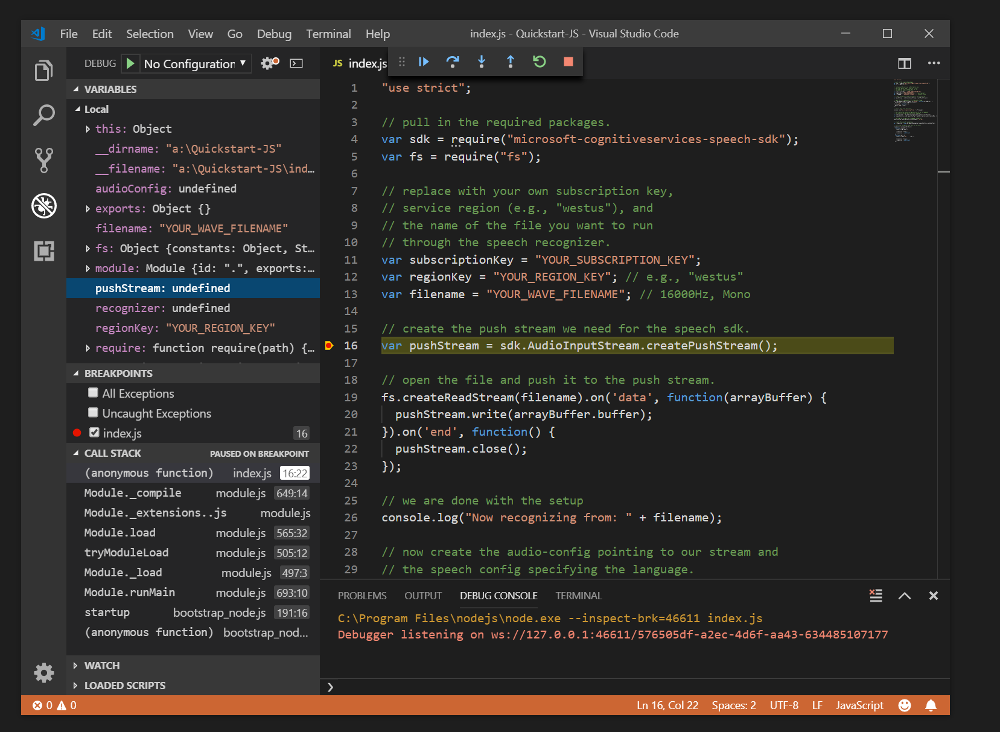
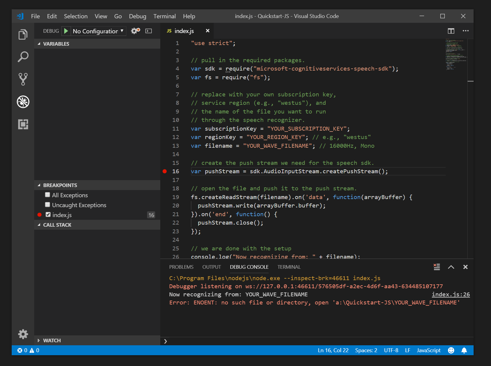

# Quickstart: Recognize speech with the Speech SDK for Node.js

[!INCLUDE [Selector](../../../includes/cognitive-services-speech-service-quickstart-selector.md)]

This article shows you how to create a Node.js project by using the JavaScript binding of the Speech SDK for Azure Cognitive Services to transcribe speech to text.
The application is based on the [Speech SDK for JavaScript](https://aka.ms/csspeech/npmpackage).

## Prerequisites

* An Azure subscription key for the Speech service. [Get one for free](get-started.md).
* A current version of [Node.js](https://nodejs.org).

## Create a new project

Create a new folder and initialize the project:

```sh
npm init -f
```

This command initializes the **package.json** files with default values. You'll probably want to edit this file later.

## Install the Speech SDK

Add the Speech SDK to your Node.js project:

```
npm install microsoft-cognitiveservices-speech-sdk
```

This command downloads and installs the latest version of the Speech SDK and any required prerequisites from **npmjs**. The SDK installs in the `node_modules` directory inside your project folder.

## Use the Speech SDK

Create a new file in the folder, named `index.js`, and open this file with a text editor.

> [!NOTE]
> In Node.js, the Speech SDK doesn't support the microphone or the **File** data type. Both are only supported on browsers. Instead, use the **Stream** interface to the Speech SDK, either through `AudioInputStream.createPushStream()` or `AudioInputStream.createPullStream()`.

In this example, we use the `PushAudioInputStream` interface.

Add this JavaScript code:

[!code-javascript[Quickstart Code](~/samples-cognitive-services-speech-sdk/quickstart/js-node/index.js#code)]

## Run the sample

To open the app, adapt `YourSubscriptionKey`, `YourServiceRegion`, and `YourAudioFile.wav` to your configuration. Then run it by calling this command:

```sh
node index.js
```

It triggers a recognition by using the provided filename. And it presents the output on the console.

This sample is the output when you run `index.js` after you update the subscription key and use the file `whatstheweatherlike.wav`:

```json
SpeechRecognitionResult {
  "privResultId": "9E30EEBD41AC4571BB77CF9164441F46",
  "privReason": 3,
  "privText": "What's the weather like?",
  "privDuration": 15900000,
  "privOffset": 300000,
  "privErrorDetails": null,
  "privJson": {
    "RecognitionStatus": "Success",
    "DisplayText": "What's the weather like?",
    "Offset": 300000,
    "Duration": 15900000
  },
  "privProperties": null
}
```

## Install and use the Speech SDK with Visual Studio Code

You can also run the sample from Visual Studio Code. Follow these steps to install, open, and run the quickstart:

1. Start Visual Studio Code. Select **Open Folder**. Then browse to the quickstart folder.

   

1. Open a terminal in Visual Studio Code.

   

1. Run `npm` to install the dependencies.

   

1. Now you're ready to open `index.js`and set a breakpoint.

   

1. To start debugging, either select F5 or select **Debug/Start Debugging** from the menu.

   

1. When a breakpoint is hit, you can inspect the call stack and variables.

   

1. Any output shows in the debug console window.

   

## Next steps

> [!div class="nextstepaction"]
> [Explore Node.js samples on GitHub](https://aka.ms/csspeech/samples)
