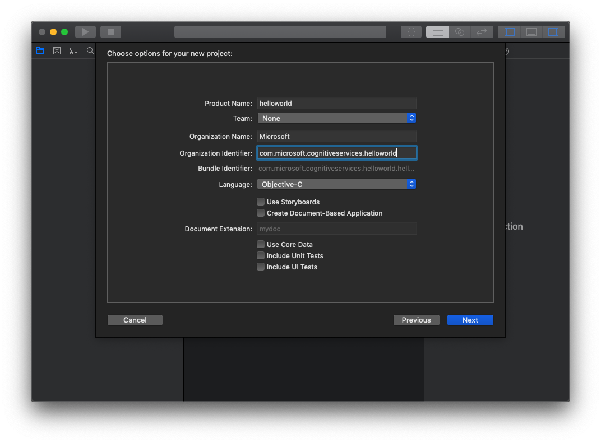
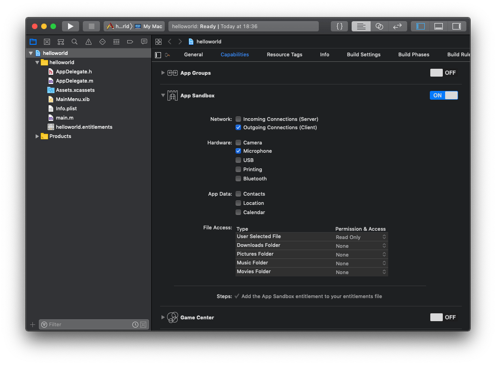
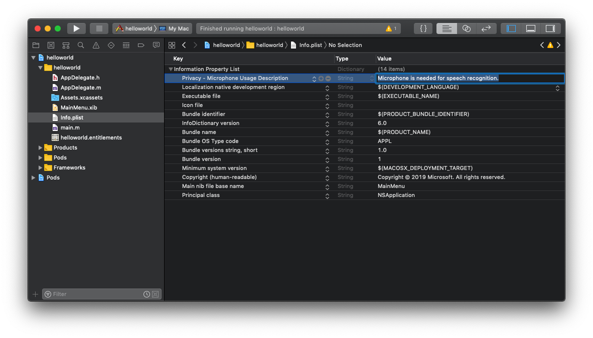

# Quickstart: Recognize speech in Objective-C on macOS using the Speech SDK

[!INCLUDE [Selector](../../../includes/cognitive-services-speech-service-quickstart-selector.md)]

In this article, you learn how to create a macOS app in Objective-C using the Cognitive Services Speech SDK to transcribe speech recorded from a microphone to text.

## Prerequisites

Before you get started, here's a list of prerequisites:

* A [subscription key](get-started.md) for the Speech Service
* A macOS machine with [Xcode 9.4.1](https://geo.itunes.apple.com/us/app/xcode/id497799835?mt=12) or later and macOS 10.13 or later

## Get the Speech SDK for macOS

[!INCLUDE [License Notice](../../../includes/cognitive-services-speech-service-license-notice.md)]

The current version of the Cognitive Services Speech SDK is `1.6.0`.

The Cognitive Services Speech SDK for Mac is distributed as a framework bundle.
It can be used in Xcode projects as a [CocoaPod](https://cocoapods.org/), or downloaded from https://aka.ms/csspeech/macosbinary and linked manually. This guide uses a CocoaPod.

## Create an Xcode project

Start Xcode, and start a new project by clicking **File** > **New** > **Project**.
In the template selection dialog, choose the "Cocoa App" template.

In the dialogs that follow, make the following selections:

1. Project Options Dialog
    1. Enter a name for the quickstart app, for example `helloworld`.
    1. Enter an appropriate organization name and an organization identifier, if you already have an Apple developer account. For testing purposes, you can just pick any name like `testorg`. To sign the app, you need a proper provisioning profile. Refer to the [Apple developer site](https://developer.apple.com/) for details.
    1. Make sure Objective-C is chosen as the language for the project.
    1. Disable the checkboxes to use storyboards and to create a document-based application. The simple UI for the sample app will be created programmatically.
    1. Disable all checkboxes for tests and core data.
    
1. Select project directory
    1. Choose a directory to put the project in. This creates a `helloworld` directory in your home directory that contains all the files for the Xcode project.
    1. Disable the creation of a Git repo for this example project.
1. Set the entitlements for network and microphone access. Click the app name in the first line in the overview on the left to get to the app configuration, and then choose the "Capabilities" tab.
    1. Enable the "App sandbox" setting for the app.
    1. Enable the checkboxes for "Outgoing Connections" and "Microphone" access.
    
1. The app also needs to declare use of the microphone in the `Info.plist` file. Click on the file in the overview, and add the "Privacy - Microphone Usage Description" key, with a value like "Microphone is needed for speech recognition".
    
1. Close the Xcode project. You will use a different instance of it later after setting up the CocoaPods.

## Install the SDK as a CocoaPod

1. Install the CocoaPod dependency manager as described in its [installation instructions](https://guides.cocoapods.org/using/getting-started.html).
1. Navigate to the directory of your sample app (`helloworld`). Place a text file with the name `Podfile` and the following content in that directory:
   [!code-objectivec[Quickstart Code](~/samples-cognitive-services-speech-sdk/quickstart/objectivec-macos/helloworld/Podfile)]
1. Navigate to the `helloworld` directory in a terminal and run the command `pod install`. This will generate a `helloworld.xcworkspace` Xcode workspace containing both the sample app and the Speech SDK as a dependency. This workspace will be used in the following.

## Add the sample code

1. Open the `helloworld.xcworkspace` workspace in Xcode.
1. Replace the contents of the autogenerated `AppDelegate.m` file by:  
   [!code-objectivec[Quickstart Code](~/samples-cognitive-services-speech-sdk/quickstart/objectivec-macos/helloworld/helloworld/AppDelegate.m#code)]
1. Replace the string `YourSubscriptionKey` with your subscription key.
1. Replace the string `YourServiceRegion` with the [region](regions.md) associated with your subscription (for example, `westus` for the free trial subscription).

## Build and run the sample

1. Make the debug output visible (**View** > **Debug Area** > **Activate Console**).
1. Build and run the example code by selecting **Product** > **Run** from the menu or clicking the **Play** button.
1. After you click the button and say a few words, you should see the text you have spoken on the lower part of the screen. When you run the app for the first time, you should be prompted to give the app access to your computer's microphone.

## Next steps

> [!div class="nextstepaction"]
> [Explore Objective-C samples on GitHub](https://aka.ms/csspeech/samples)
