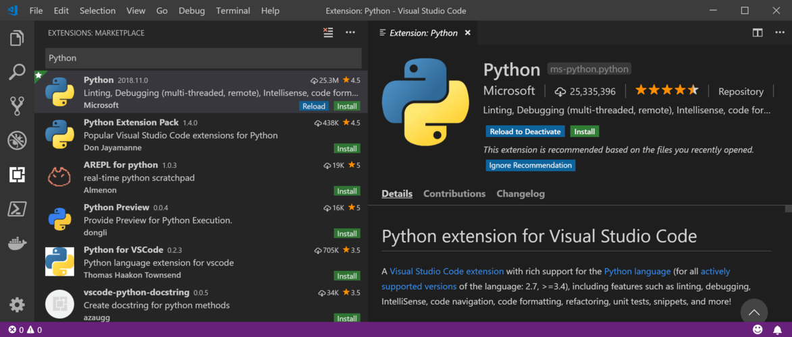
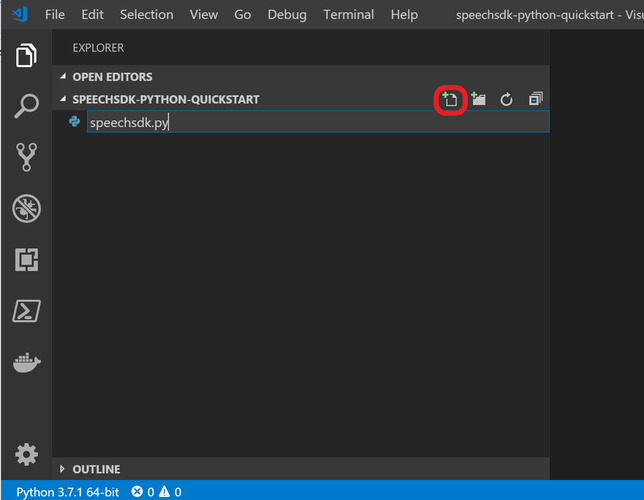
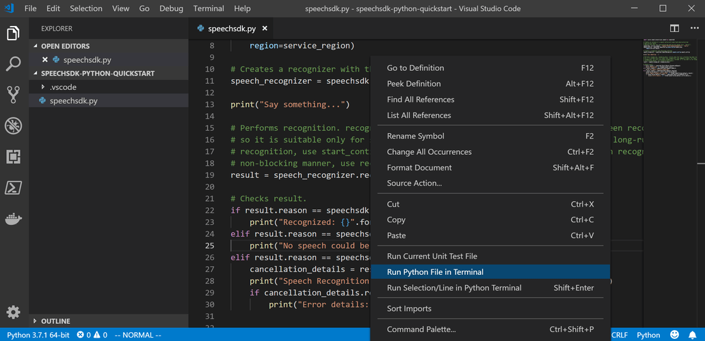

# Quickstart: Recognize speech with the Speech SDK for Python

[!INCLUDE [Selector](../../../includes/cognitive-services-speech-service-quickstart-selector.md)]

This article shows how to use the Speech Services through the Speech SDK for Python. It illustrates how to recognize speech from microphone input.

## Prerequisites

* An Azure subscription key for the Speech Services. [Get one for free](get-started.md).
* [Python 3.5 or later](https://www.python.org/downloads/).
* The Python Speech SDK package is available for these operating systems:
    * Windows: x64 and x86.
    * Mac: macOS X version 10.12 or later.
    * Linux: Ubuntu 16.04, Ubuntu 18.04, Debian 9 on x64.
* On Linux, run these commands to install the required packages:

  * On Ubuntu:

    ```sh
    sudo apt-get update
    sudo apt-get install build-essential libssl1.0.0 libasound2
    ```

  * On Debian 9:

    ```sh
    sudo apt-get update
    sudo apt-get install build-essential libssl1.0.2 libasound2
    ```

* On Windows, you need the [Microsoft Visual C++ Redistributable for Visual Studio 2019](https://support.microsoft.com/help/2977003/the-latest-supported-visual-c-downloads) for your platform.

## Install the Speech SDK

[!INCLUDE [License Notice](../../../includes/cognitive-services-speech-service-license-notice.md)]

This command installs the Python package from [PyPI](https://pypi.org/) for the Speech SDK:

```sh
pip install azure-cognitiveservices-speech
```

## Support and updates

Updates to the Speech SDK Python package are distributed via PyPI and announced in the [Release notes](./releasenotes.md).
If a new version is available, you can update to it with the command `pip install --upgrade azure-cognitiveservices-speech`.
Check which version is currently installed by inspecting the `azure.cognitiveservices.speech.__version__` variable.

If you have a problem, or you're missing a feature, see [Support and help options](./support.md).

## Create a Python application that uses the Speech SDK

### Run the sample

You can copy the [sample code](#sample-code) from this quickstart to a source file `quickstart.py` and run it in your IDE or in the console:

```sh
python quickstart.py
```

Or you can download this quickstart tutorial as a [Jupyter](https://jupyter.org) notebook from the [Speech SDK sample repository](https://github.com/Azure-Samples/cognitive-services-speech-sdk/) and run it as a notebook.

### Sample code

[!code-python[Quickstart Code](~/samples-cognitive-services-speech-sdk/quickstart/python/quickstart.py#code)]

### Install and use the Speech SDK with Visual Studio Code

1. Download and install a 64-bit version of [Python](https://www.python.org/downloads/), 3.5 or later, on your computer.
1. Download and install [Visual Studio Code](https://code.visualstudio.com/Download).
1. Open Visual Studio Code and install the Python extension. Select **File** > **Preferences** > **Extensions** from the menu. Search for **Python**.

   

1. Create a folder to store the project in. An example is by using Windows Explorer.
1. In Visual Studio Code, select the **File** icon. Then open the folder you created.

   

1. Create a new Python source file, `speechsdk.py`, by selecting the new file icon.

   

1. Copy, paste, and save the [Python code](#sample-code) to the newly created file.
1. Insert your Speech Services subscription information.
1. If selected, a Python interpreter displays on the left side of the status bar at the bottom of the window.
   Otherwise, bring up a list of available Python interpreters. Open the command palette (Ctrl+Shift+P) and enter **Python: Select Interpreter**. Choose an appropriate one.
1. You can install the Speech SDK Python package from within Visual Studio Code. Do that if it's not installed yet for the Python interpreter you selected.
   To install the Speech SDK package, open a terminal. Bring up the command palette again (Ctrl+Shift+P) and enter **Terminal: Create New Integrated Terminal**.
   In the terminal that opens, enter the command `python -m pip install azure-cognitiveservices-speech` or the appropriate command for your system.
1. To run the sample code, right-click somewhere inside the editor. Select **Run Python File in Terminal**.
   Speak a few words when you're prompted. The transcribed text displays shortly afterward.

   

If you have issues following these instructions, refer to the more extensive [Visual Studio Code Python tutorial](https://code.visualstudio.com/docs/python/python-tutorial).

## Next steps

> [!div class="nextstepaction"]
> [Explore Python samples on GitHub](https://aka.ms/csspeech/samples)
