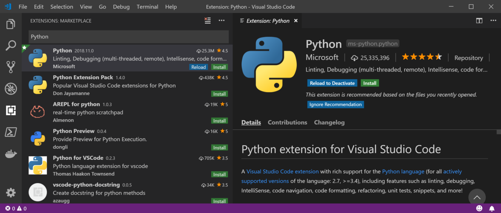
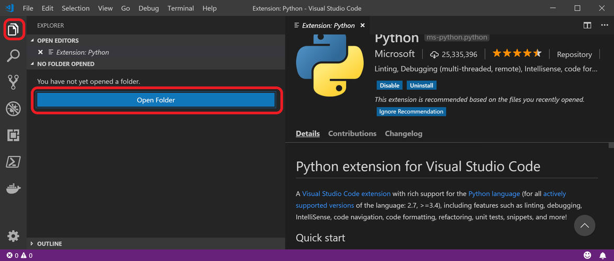
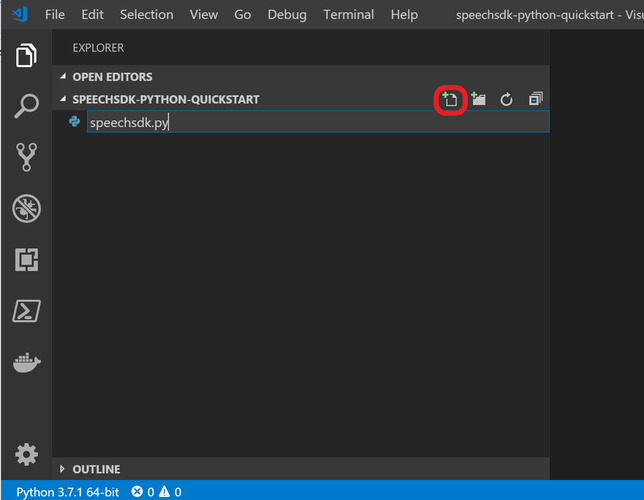

# Quickstart: Using the Speech Service from Python

This document shows how to use the Speech Service through its Python API. It illustrates how the SDK can be used to recognize speech from microphone input.

## Prerequisites

Before you get started, here's a list of prerequisites:

* A [subscription key](get-started.md) for the Speech Service
* Python 3.5 (64 bit) or later needs to be installed. Downloads are available [here](https://www.python.org/downloads/).
* The Python Speech SDK package is available for Windows(x64), Mac (macOS X version 10.12 or later), and Linux (x64)

## Get the Speech SDK Python Package

[!INCLUDE [License Notice](../../../includes/cognitive-services-speech-service-license-notice.md)]

The Cognitive Services Speech SDK Python package can be installed from [PyPI](https://pypi.org/project/azure-cognitiveservices-speech/) using this command on the command line:

    pip install azure-cognitiveservices-speech

The current version of the Cognitive Services Speech SDK is `1.2.0`.

## Create a Python Application using the SDK

### Installing the Speech SDK Python Package and Running the Sample in Visual Studio Code

1. [Download](https://www.python.org/downloads/) and install a 64-bit version (3.5 or later) of Python on your computer.
1. [Download](https://code.visualstudio.com/Download) and install Visual Studio Code.
1. Open Visual Studio Code and install the Python extension by selecting **File** > **Preferences** > **Extensions** from the menu and searching for "Python".
   
1. Create a folder to store the project in, for example using Windows Explorer.
1. In Visual Studio Code, click on the **File** icon, and then open the folder you created.
   
1. Create a new Python source file `speechsdk.py`, by clicking on the new file icon.
   
1. Copy, paste, and save the Python code below to the newly created file.
1. Insert your Speech Service subscription information.
1. A Python interpreter may already be selected; if so, it will be displayed on the left side of the status bar at the bottom of the window.
   If not, you can bring up a list of available Python interpreters by opening the **Command Palette** (`Ctrl+Shift+P`) and typing **Python: Select Interpreter**, and choose an appropriate one.
1. To install the Speech SDK package, open a terminal by bringing up the Command Palette again (`Ctrl+Shift+P`) and typing **Terminal: Create New Integrated Terminal**.
   In the terminal that is opened, enter the command `python -m pip install azure-cognitiveservices-speech`, or the appropriate command for your system.
1. To run the sample code, right-click somewhere inside the editor and select **Run Python File in Terminal**.
   Say a few words once prompted, and the transcribed text should be displayed shortly afterwards.
   

If there are issues following these instructions, please refer to the more extensive [Visual Studio Code Python tutorial](https://code.visualstudio.com/docs/python/python-tutorial).

### Other Ways of Running the Sample

You can either copy the code from this quickstart to a source file `speech.py` and run it in your IDE or in the console

    python speech.py

or you can download this quickstart tutorial as a [Jupyter](https://jupyter.org) notebook from the [Cognitive Services Speech samples repository](https://github.com/Azure-Samples/cognitive-services-speech-sdk/) and run it as a notebook.

```python
import azure.cognitiveservices.speech as speechsdk

# Creates an instance of a speech config with specified subscription key and service region.
# Replace with your own subscription key and service region (e.g., "westus").
speech_key, service_region = "YourSubscriptionKey", "YourServiceRegion"
speech_config = speechsdk.SpeechConfig(subscription=speech_key, region=service_region)

# Creates a recognizer with the given settings
speech_recognizer = speechsdk.SpeechRecognizer(speech_config=speech_config)

print("Say something...")

# Performs recognition. recognize_once() returns when the first utterance has been recognized,
# so it is suitable only for single shot recognition like command or query. For long-running
# recognition, use start_continuous_recognition() instead, or if you want to run recognition in a
# non-blocking manner, use recognize_once_async().
result = speech_recognizer.recognize_once()

# Checks result.
if result.reason == speechsdk.ResultReason.RecognizedSpeech:
    print("Recognized: {}".format(result.text))
elif result.reason == speechsdk.ResultReason.NoMatch:
    print("No speech could be recognized")
elif result.reason == speechsdk.ResultReason.Canceled:
    cancellation_details = result.cancellation_details
    print("Speech Recognition canceled: {}".format(cancellation_details.reason))
    if cancellation_details.reason == speechsdk.CancellationReason.Error:
        print("Error details: {}".format(cancellation_details.error_details))

```

## Support

If you have a problem or are missing a feature, please have a look at our [support page](https://docs.microsoft.com/en-us/azure/cognitive-services/speech-service/support).

## Next steps

> [!div class="nextstepaction"]
> [Get our samples](speech-sdk.md#get-the-samples)

