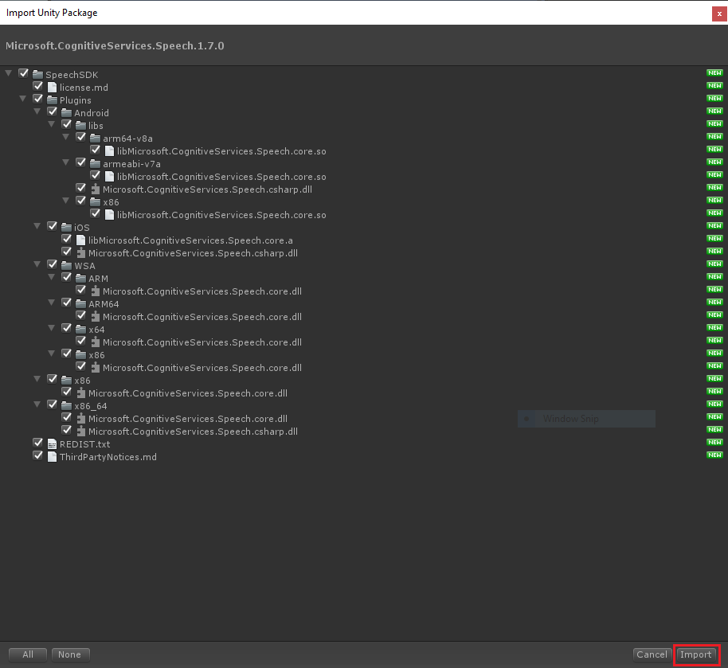
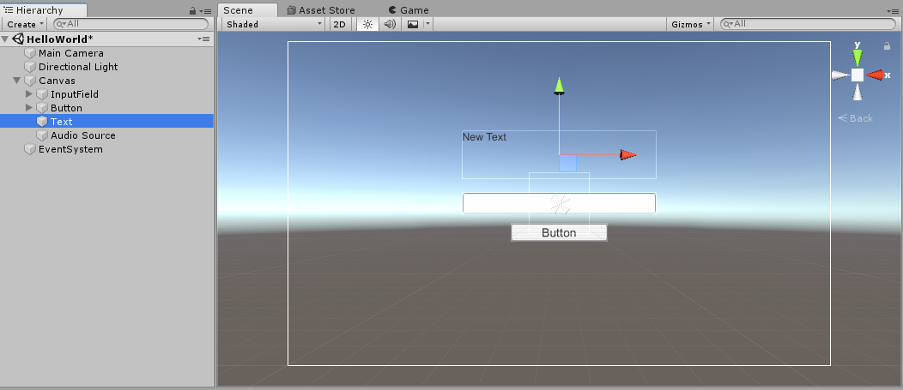
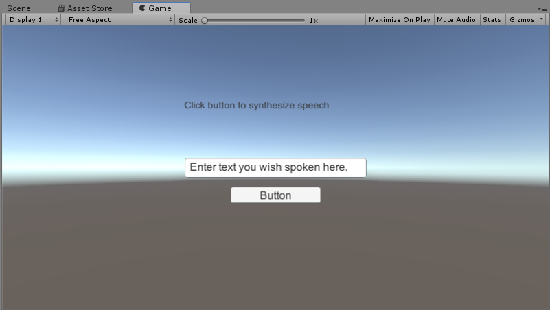

# Quickstart: Synthesize speech with the Speech SDK for Unity (Beta)

Quickstarts are also available for [speech-recognition](quickstart-csharp-unity.md).

Use this guide to create a text-to-speech application using [Unity](https://unity3d.com/) and the Speech SDK for Unity (Beta).
When finished, you can synthesize speech from text in real time to your device's speaker.
If you are not familiar with Unity, it is recommended to study the [Unity User Manual](https://docs.unity3d.com/Manual/UnityManual.html) before starting your application development.

> [!NOTE]
> The Speech SDK for Unity is currently in beta.
> It supports Windows Desktop (x86 and x64) or Universal Windows Platform (x86, x64, ARM/ARM64), and Android (x86, ARM32/64).

## Prerequisites

To complete this project, you'll need:

* [Unity 2018.3 or later](https://store.unity.com/) with [Unity 2019.1 adding support for UWP ARM64](https://blogs.unity3d.com/2019/04/16/introducing-unity-2019-1/#universal)
* [Visual Studio 2017](https://visualstudio.microsoft.com/downloads/)
     * For ARM64 support, install the [optional build tools for ARM64, and the Windows 10 SDK for ARM64](https://blogs.windows.com/buildingapps/2018/11/15/official-support-for-windows-10-on-arm-development/) 
* A subscription key for the Speech Service. [Get one for free](get-started.md).

## Create a Unity project

* Start Unity and under the **Projects** tab select **New**.
* Specify **Project name** as **csharp-unity**, **Template** as **3D** and pick a location.
  Then select **Create project**.
* After a bit of time, the Unity Editor window should pop up.

## Install the Speech SDK

[!INCLUDE [License Notice](../../../includes/cognitive-services-speech-service-license-notice.md)]

* The Speech SDK for Unity (Beta) is packaged as a Unity asset package (.unitypackage).
  Download it from [here](https://aka.ms/csspeech/unitypackage).
* Import the Speech SDK by selecting **Assets** > **Import Package** > **Custom Package**.
  Check out the [Unity documentation](https://docs.unity3d.com/Manual/AssetPackages.html) for details.
* In the file picker, select the Speech SDK .unitypackage file that you downloaded above.
* Ensure that all files are selected and click **Import**:

  

## Add UI

We add a minimal UI to our scene, consisting of an input field to enter the text for synthesis, a button to trigger speech synthesis and a text field to display the result.

* In the [Hierarchy Window](https://docs.unity3d.com/Manual/Hierarchy.html) (by default on the left), a sample scene is shown that Unity created with the new project.
* Click the **Create** button at the top of the Hierarchy Window, and select **UI** > **Input Field**.
* This creates three game objects that you can see in the Hierarchy Window: an **Input Field** object nested within a **Canvas** object, and an **EventSystem** object.
* [Navigate the Scene View](https://docs.unity3d.com/Manual/SceneViewNavigation.html) so you have a good view of the canvas and the input field in the [Scene View](https://docs.unity3d.com/Manual/UsingTheSceneView.html).
* Click the **Input Field** object in the Hierarchy Window to display its settings in the [Inspector Window](https://docs.unity3d.com/Manual/UsingTheInspector.html) (by default on the right).
* Set the **Pos X** and **Pos Y** properties to **0**, so the input field is centered in the middle of the canvas.
* Click the **Create** button at the top of the Hierarchy Window again, and select **UI** > **Button** to create a button.
* Click the **Button** object in the Hierarchy Window to display its settings in the [Inspector Window](https://docs.unity3d.com/Manual/UsingTheInspector.html) (by default on the right).
* Set the **Pos X** and **Pos Y** properties to **0** and **-48**, and set the **Width** and **Height** properties to **160** and **30** to ensure that the button and the input field do not overlap.
* Click the **Create** button at the top of the Hierarchy Window again, and select **UI** > **Text** to create a text field.
* Click the **Text** object in the Hierarchy Window to display its settings in the [Inspector Window](https://docs.unity3d.com/Manual/UsingTheInspector.html) (by default on the right).
* Set the **Pos X** and **Pos Y** properties to **0** and **80**, and set the **Width** and **Height** properties to **320** and **80** to ensure that the text field and the input field do not overlap.
* Click the **Create** button at the top of the Hierarchy Window again, and select **Audio** > **Audio Source** to create an audio source.

When you're done, the UI should look similar to this screenshot:

## Add the sample code

1. In the [Project Window](https://docs.unity3d.com/Manual/ProjectView.html) (by default on the left bottom), click the **Create** button and then select **C# script**. Name the script `HelloWorld`.

1. Edit the script by double-clicking it.

   > [!NOTE]
   > You can configure which code editor will be launched under **Edit** > **Preferences**, see the [Unity User Manual](https://docs.unity3d.com/Manual/Preferences.html).

1. Replace all code with the following:

   [!code-csharp[Quickstart Code](~/samples-cognitive-services-speech-sdk/quickstart/text-to-speech/csharp-unity/Assets/Scripts/HelloWorld.cs#code)]

1. Locate and replace the string `YourSubscriptionKey` with your Speech Services subscription key.

1. Locate and replace the string `YourServiceRegion` with the [region](regions.md) associated with your subscription. For example, if you're using the free trial, the region is `westus`.

1. Save the changes to the script.

1. Back in the Unity Editor, the script needs to be added as a component to one of your game objects.

   * Click on the **Canvas** object in the Hierarchy Window. This opens up the setting in the [Inspector Window](https://docs.unity3d.com/Manual/UsingTheInspector.html) (by default on the right).
   * Click the **Add Component** button in the Inspector Window, then search for the HelloWorld script we create above and add it.
   * Note that the Hello World component has four uninitialized properties, **Output Text**, **Input Field**, **Speak Button** and **Audio Source**, that match public properties of the `HelloWorld` class.
     To wire them up, click the Object Picker (the small circle icon to the right of the property), and choose the text and button objects you created earlier.

     > [!NOTE]
     > The input field and button also have a nested text object. Make sure you do not accidentally pick it for text output (or
     > rename the text objects using the Name field in the Inspector
     > Window to avoid that confusion).

## Run the application in the Unity Editor

* Press the **Play** button in the Unity Editor toolbar (below the menu bar).

* After the app launches, enter some text into the input field and click the button. Your text is transmitted to the Speech Services and synthesized to speech, which plays on your speaker.

  

* Check the [Console Window](https://docs.unity3d.com/Manual/Console.html) for debug messages.

* When you're done synthesizing speech, click the **Play** button in the Unity Editor toolbar to stop the app.

## Additional options to run this application

This application can also be deployed to Android, as a Windows stand-alone app, or UWP application.
Refer to our [sample repository](https://aka.ms/csspeech/samples) in the quickstart/csharp-unity folder that describes the configuration for these additional targets.

## Next steps

> [!div class="nextstepaction"]
> [Explore C# samples on GitHub](https://aka.ms/csspeech/samples)

## See also

- [Customize voice fonts](how-to-customize-voice-font.md)
- [Record voice samples](record-custom-voice-samples.md)
