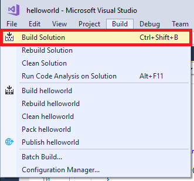
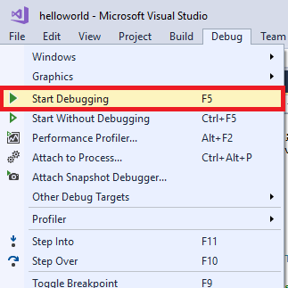
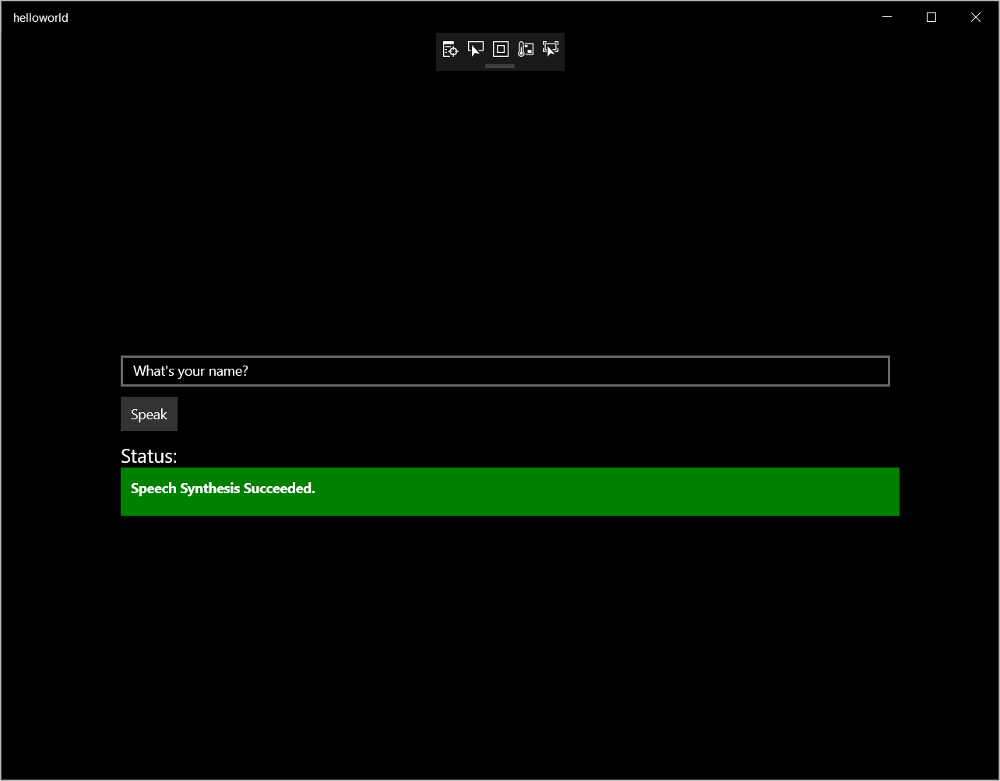

# Quickstart: Synthesize speech in a UWP app by using the Speech SDK

Quickstarts are also available for [speech-recognition](quickstart-csharp-uwp.md), [speech-translation](quickstart-translate-speech-uwp.md) and [voice-first virtual assistant](quickstart-virtual-assistant-csharp-uwp.md).

In this article, you develop a C# Universal Windows Platform (UWP; Windows version 1709 later) application by using the Cognitive Services [Speech SDK](speech-sdk.md). The program will synthesize speech from text in real time to your device's speaker. The application is built with the [Speech SDK NuGet Package](https://aka.ms/csspeech/nuget) and Microsoft Visual Studio 2017 (any edition).

> [!NOTE]
> The Universal Windows Platform lets you develop apps that run on any device that supports Windows 10, including PCs, Xbox, Surface Hub, and other devices.

## Prerequisites

This quickstart requires:

* [Visual Studio 2017](https://visualstudio.microsoft.com/downloads/)
* An Azure subscription key for the Speech Service. [Get one for free](get-started.md).

## Create a Visual Studio project

[!INCLUDE ]

## Add sample code

1. The application's user interface is defined by using XAML. Open `MainPage.xaml` in Solution Explorer. In the designer's XAML view, insert the following XAML snippet into the Grid tag (between `<Grid>` and `</Grid>`).

   [!code-xml[UI elements](~/samples-cognitive-services-speech-sdk/quickstart/text-to-speech/csharp-uwp/helloworld/MainPage.xaml#StackPanel)]

1. Open the code-behind source file `MainPage.xaml.cs` (find it grouped under `MainPage.xaml`). Replace all the code in it with the following.

   [!code-csharp[Quickstart Code](~/samples-cognitive-services-speech-sdk/quickstart/text-to-speech/csharp-uwp/helloworld/MainPage.xaml.cs#code)]

1. In the `Speak_ButtonClicked` handler in this file, replace the string `YourSubscriptionKey` with your subscription key.

1. In the `Speak_ButtonClicked` handler, replace the string `YourServiceRegion` with the [region](regions.md) associated with your subscription (for example, `westus` for the free trial subscription).

1. Save all changes to the project.

## Build and run the app

1. Build the application. From the menu bar, select **Build** > **Build Solution**. The code should compile without errors now.

    

1. Start the application. From the menu bar, select **Debug** > **Start Debugging**, or press **F5**.

    

1. Enter some text into the textbox, and click **Speak**. Your text is transmitted to the Speech Services and synthesized to speech, which plays on your speaker.

    

## Next steps

> [!div class="nextstepaction"]
> [Explore C# samples on GitHub](https://aka.ms/csspeech/samples)

## See also

- [Customize voice fonts](how-to-customize-voice-font.md)
- [Record voice samples](record-custom-voice-samples.md)
